本文记录了我在过去五年所探索的时间管理方案理念和实际操作

旨在为了帮助大家更好的成为想要成为的人

来到正文，首先来思考一个问题

> 如果让你保留现在的记忆，再从头来一遍！你会对你的人生做出什么改变？

思考完后，我打开了知乎，随意点开了一个类似这样的问题。在我意料之中的，最多评论的是 "**要好好学习！**"

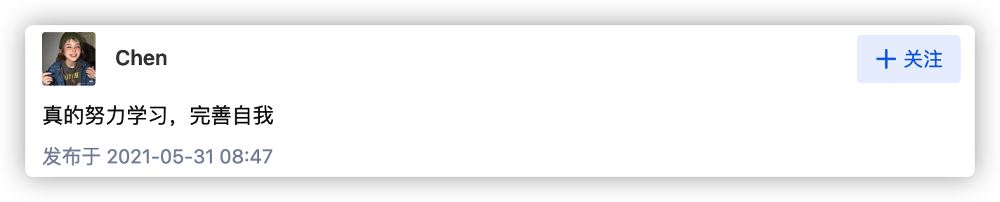

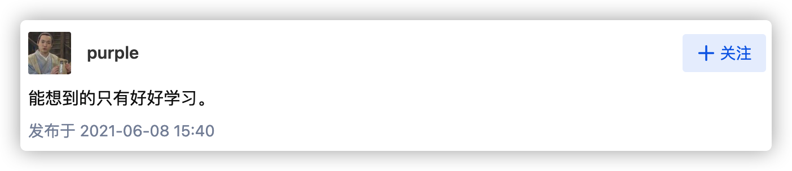

是的，学习，一句从小就耳濡目染的词，但好似重来没有真正在意过。以前我们想的，只是为了要让自己更舒服一些所以忽略了学习，或者可能想了，但是实际上还是躺平让自己更舒服一些所以忽略了学习。

渐渐的，我们长大了，**责任和担当**成为了我们不可避免却无人谈及的话题。浅聊谈笑间的无意触及，不免还是会神情黯淡。

我们再回到原来这个问题，让我们从头来一遍，为什么就会选择要好好学习。可能有些人不在乎高等学位、学术成果。

但是呀，无论你是从政，从商、从医或是像我一样做一个勤勤恳恳的搬砖人，都离不开学习，都需要从一个一无所知的小白慢慢的成长为业界顶尖大佬，这一切都离不开坚持不懈的学习，这也是为什么，如果能重来，我们会**想要好好学习**。

读到这里，大家可能就不买账了，讲半天，和时间管理有什么关系呢？

阅读这篇文章的朋友，可能是刚步入大学，或是走向社会，亦或是已为人父母。我所说的学习，不是课堂。而是学习我们的生存之道，也可以是兴趣爱好，为的就是成为更好的自己。学习生存之道可以给自己带来更好的物质生活，提升自己的核心竞争力，绽放自己的光彩。学习兴趣爱好，可以陶冶情操，保持自身的心境，有些人以运动作为爱好，令体魄野蛮。有些人以音乐为爱好，使提升魅力。

>文明其精神，野蛮其体魄 
>
>​					----  习总书记借鉴毛主席发表的《体育之研究》中体育思想

**那既然学习如此的重要，我们每天都在干什么呢？**

大多数时候都是加班到很晚才回家，或者早点到家也是短视频各种的刷，伴随着外卖快餐，然后依旧是微信各种app之间来回刷。好不容易躺下来，又打开了一部剧，直到凌晨两三点才睡下。早上又起不来，起来了也没时间吃早餐。急急忙忙就卷入社会滚滚洪流中，车流、人流、信息流。然后到公司东搞西搞，因为睡眠不好，状态不佳，啥也干不好，重要的事情就拖到中午，午饭过后拖到下午，重要的事情没做完，心情变得不好，开始焦虑，最后无奈且低效率的加班，浑浑噩噩的度过这一天。最后躺下又不想早睡，因为我们没有勇气去结束这一天，结果又是熬夜。

不要问我为什么知道的这么清楚！

很多时候我们的思想就像是一场博弈，在“正义”和“邪恶”之间来回徘徊，但大多数时候站在了“邪恶”的一边。

既然如此，我们要想一个办法，避免我们与“邪恶”为伍

我认为，那就是养成一个较好的习惯，并且**掌握时间的主动权**。

那如何掌控时间呢？

最传统的办法：**计划、总结、反思 周而复始**。

>  没有反思没有计划，你就无法对过去很好的完结，你也无法对未来进行展开，以至于你无法活在当下
>
> ​																																		——苏格拉底

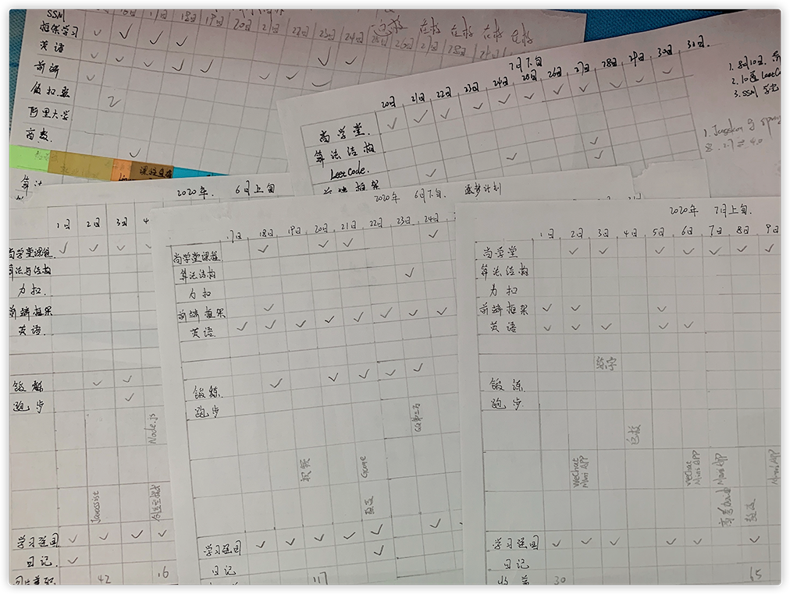

起初我是通过纯手记的方式，自己绘制表格，填写想要完成的计划，只要完成了，就打个勾，还预留了一些自己玩游戏、学习其他技术的空格，也方便记录一些自己没有预测到的事情。

方法使用初期，我的生活感受到了前所未有的充实感。虽然偶尔也会刷剧、玩游戏。但我可以清楚的知道今天还有哪些重要的事情没有完成，便会优先处理那些我认为更重要的事情。

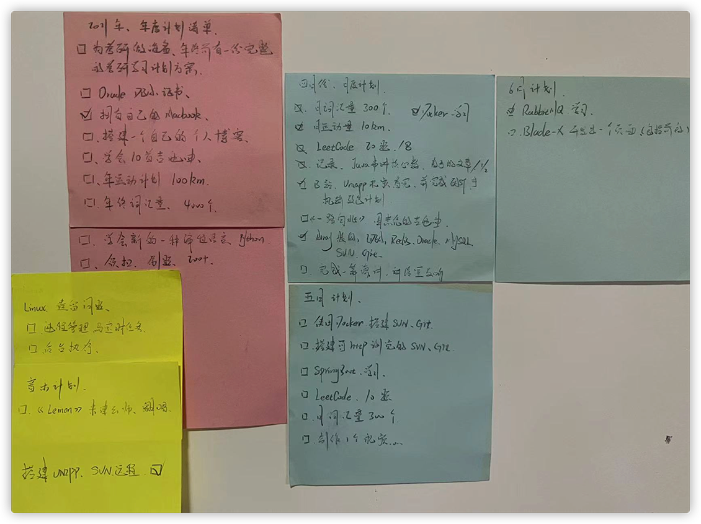

再到后来，这种纸质记录的方法，也渐渐的暴露出了他的弊端，如果不在家里，我就无法进行记录，如果连续几天不在家，我甚至担心会忘了自己这几天干了什么。

所以我就尝试各自不同的工具。最终还是选择了系统自带的 日历、提醒

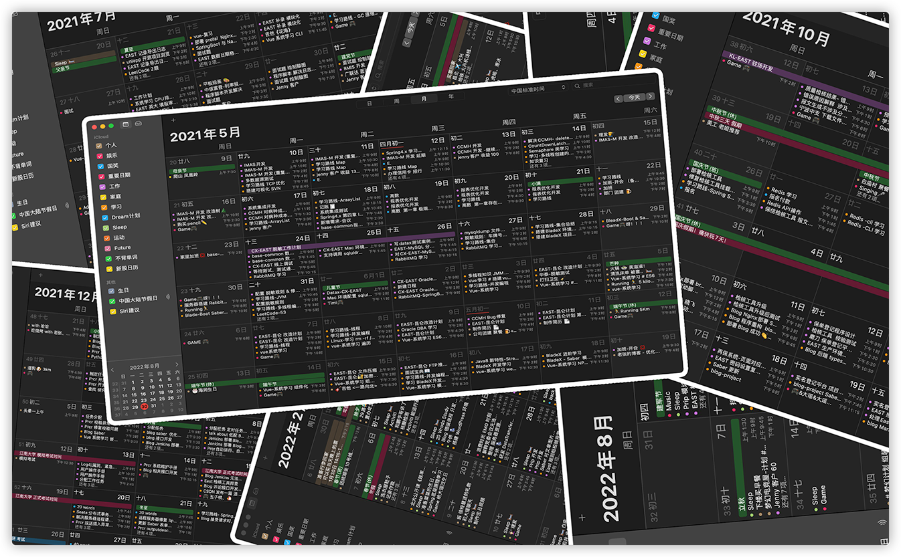

这是IOS自带的日历工具，密密麻麻的事件，都是在事情发生之后，晚上再进行回顾，一一录下。

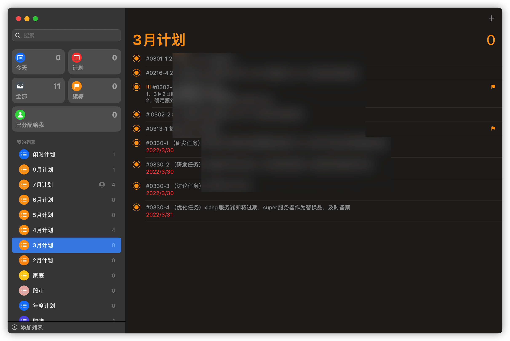

慢慢的，会有一些自己的计划、目标，也会一一记录，这样在自己觉得无所事事的时候，看一眼，就知道自己要干什么了。

更多时候是自己某一瞬间的突发奇想。但想不代表立刻要去做，因为当下还有其他更重要的事情，所以就通过这种记录的方式，让他暂且排在列表里，等到有空了，再去处理它。

除了每天短时间的一个总结，每过一周或一个月，我会再复盘一次，虽然大多数都不准点，有时甚至玩忘了。

这种复盘的方式，不需要很死板的，就像是和自己在聊天一样，给他分享你最近的心得，言语间，计划下一周或是下个月或是更为长久的想法。

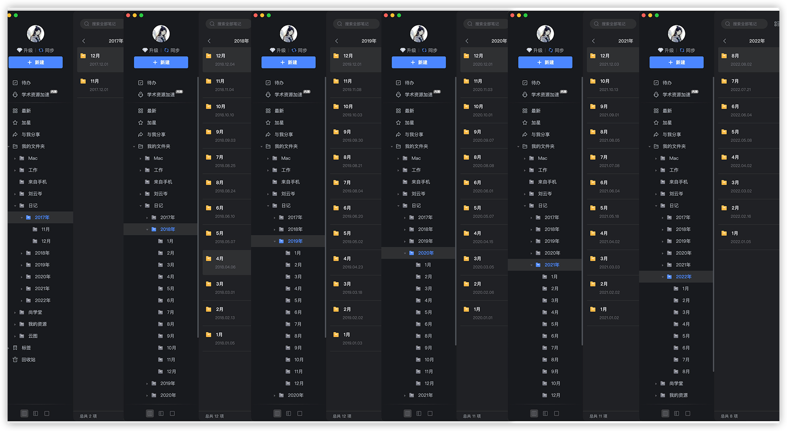

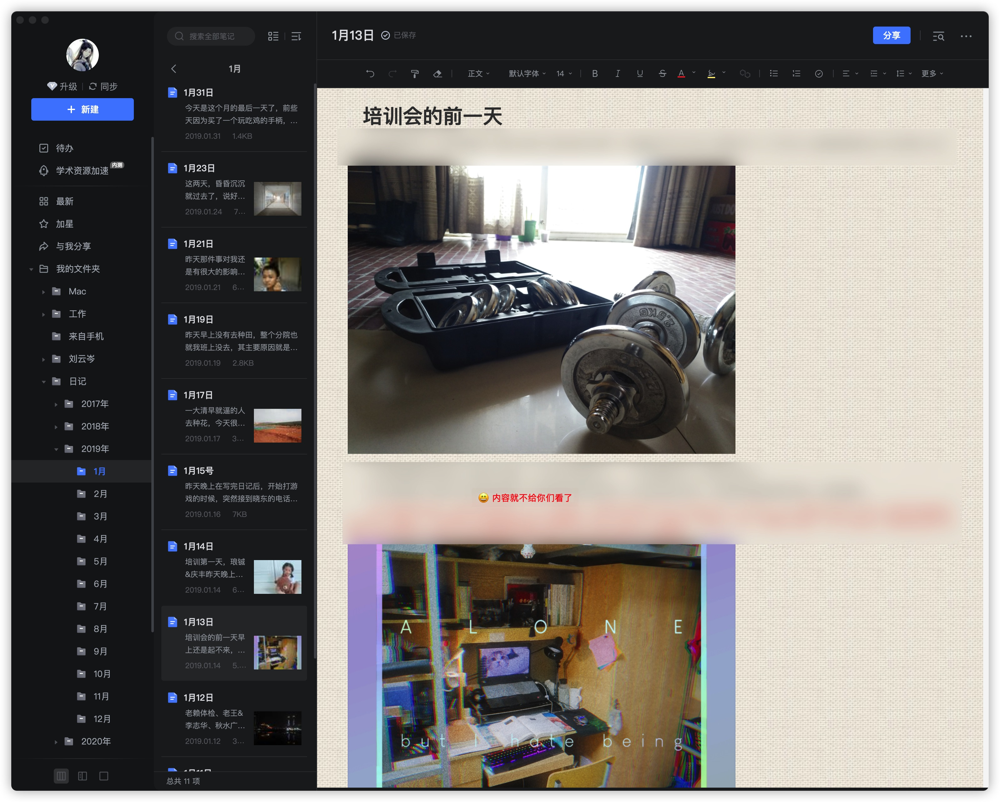

回想起最开始记日记的时候，我也是使用的本子，内容不是很好，但能写不少东西。

我也曾和朋友们进行探讨

很多同学一开始就在研究各种软件，我认为形式不是很重要，重要的是内容。当然工具也很重要，可以更好的保存我们的日记。但是最重要的一定是我们的内容

> 知道自己，忘记自己，觉悟与万物，活在当下，如果我们不能够知道自己，我就不能够忘记自己，如果我不能够忘记自己，我就不能够觉悟与万物，如果我们不能觉悟与万物，我们就不能够活在当下     												——道德经

我使用有道云笔记写日记已经五年了，我现在比较懊悔的是，没有把当初写在本子上的日记转到这里来，以至于现在远在他乡的我都无法轻易找到。

能让我坚持一直往下走的原因是过去断断续续的坚持，所以我会劝身边的朋友也这样坚持，断断续续没有关系，重点在于你愿不愿意继续坚持。今天分享给你，你也会加入，这就引发我把自己的日记写的更好，变成榜样。因为我信奉一个观点，用生命信奉生命，重要的不是我现在做的怎么样，重要的是我愿不愿意去努力。

这个软件很方便，手机、iPad、电脑都可以写。可以插入图片、录音、视频、文件。我在写的时候做了很多检索，所以可以很快的找到。

但是现在回过头来看，我认为这是我人生中的一大宝藏。

时常还会翻阅翻阅，读起来别有一番风味。

长时间的写作，我能感觉到我文案功底在逐渐提升，慢慢进而转化为语言上的沟通能力。而长时间的坚持会**令人感到自信**。这种自信不能理解为对自身实力的自信，而是对自己的**执行力**、对自己计划要做的事情感到自信。

**有了计划，有了执行，那就差总结了**

既然有了前面的铺垫

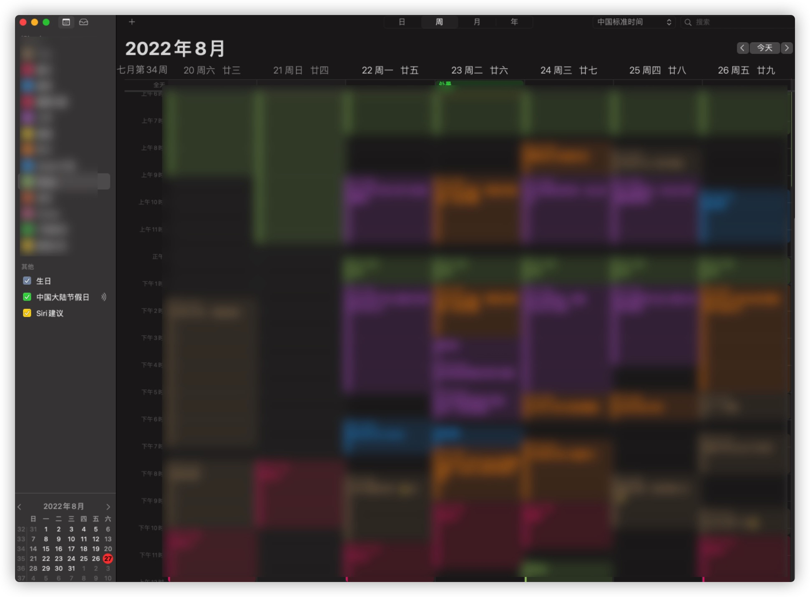

这样我就可以很轻松的统计到我这一周每件事花了多少时间，然后在周末做个总结，捎带脚对下一周要做的事情做一个规划。

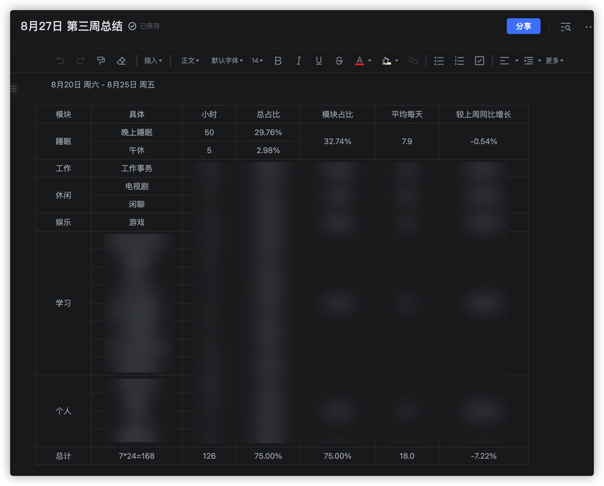

因为每一次到了周末我都得计算一下，我想有没有一种办法能一劳永逸，所以，我在年初的假期里特地做了一个系统

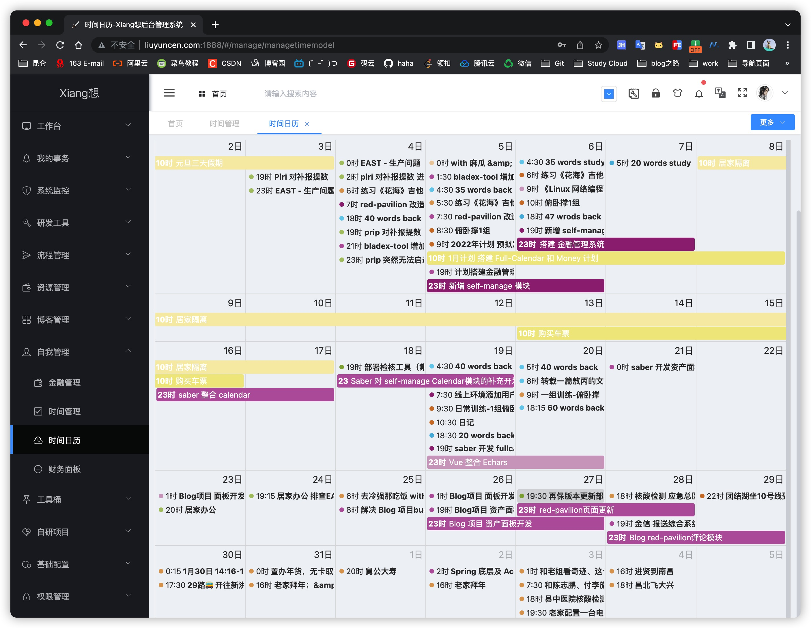

这样就可以一劳永逸，帮我解决时间总结的问题。但是伴随着另一个问题，也就说一件事情我要么选择在系统自带的日历上记录一次，要么在我自己开发的系统上录入一遍，甚至两头都录一遍。直到用了几个月，我实在受不了这种两头重复记录一件事情的操作了。果断放弃了。

所以说在探索的道路中，还是会碰壁的。

好在天无绝人之处。我在系统日历的备份文件中发现还有一线改造的可能。

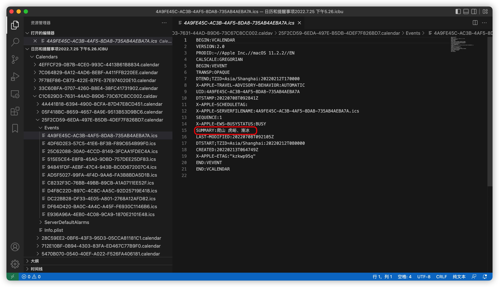

通过解析日历备份的文件，可以获取到我在系统日历中记录的所有数据。但苦于没有时间安排开发计划。我更希望市面上能有一款软件对接系统日历从而获取到数据，这样我就可以避免这种毫无技术可言的解析操作了。

如果哪位读者朋友有更好的工具。还请砸向我，在此深表感谢！

我们重新回到标题，**时间管理**

主要还是在于管理者个人，一天十分钟，一周一小时，一个月四个小时，一年大致2-3天的时间。你就可以较好的规划自己全年。到了年底，回顾去年，对比前年。我相信你可以体会到这种意境。

其中的好处我不再一一罗列。我相信体验者自有其妙可言。

在写下这篇文章之前，我一直对记事这一件事上抱有偏见，认为这是只写给自己看的悄悄话。我也一直是这样认为的。所有我不曾给任何人看过。但这段时间以来，我认识、了解到了很多很优秀的大佬们。他们对技术、生活都抱有乐观且积极向上的态度。相互借鉴、相互成长。目的旨在成为那个想要成为的人！

引借罗翔老师的话：

> ​		有人问智者，一滴水如何才能永不干涸，智者说把他汇入大海，因此我们需要群体的力量，我们需要彼此成为榜样，才能让我们的心不至于干涸，当你决定去做一个正直的人，也许也能吸引那些正在犹豫是否要去正直形式的人。正是因为世界并不美好，所以美好是存在的，美好是值得期待的。有时治愈，常常帮助，总是安慰。

让我们再次回到文章开始的那个问题！

>  如果让你保留现在的记忆，再从头来一遍！你会对你的人生做出什么改变？

我希望自己每天都可以过让自己不后悔的日子，我们无法预测未来，但是我们可以去憧憬我们的未来，然后坚持不懈的去完成他，享受实现他的过程，如果可以的话！享受梦想完成后那种无与伦比，无比美妙成就感！

感谢

