> 步骤简介：
>
> + 借个阿里云新号（如果自己没买过也可以）
> + 掏1快点购买无影云桌面
> + 下载客户端连接桌面
> + 再购买一个互联网的扩展（第一个月免费）
> + 搭建SpringBoot + vue 环境启动前后端分离项目

这不又到了一年一度购买服务器的时候，各个大厂开始抛出折扣后的服务器，大部分一点折，甚至还有零点几折用来招新。那对于我们老客户改咋办呢...

**那当然是找个非计算机专业的朋友借号啦~（骚操作）**

就在我逛阿里云官网的时候，突然看到一个比较新颖的词

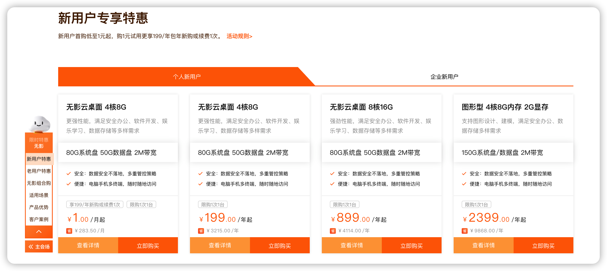

咱们就看第一个，1💰 无影云桌面 4核8G ，既然就一块钱，那不得玩玩它。

好！为了这一块钱，今天下班瞪自行车回家，不坐地铁了，把1💰给他赚回来。

回到整体，在掏钱之前，先看看这东西要怎么用，别到时候买来用不了就尴尬了。

通过指南打开 `无影客户端下载` 下载客户端

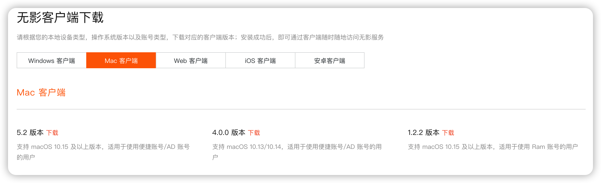

下载完之后，打开是这个样子的

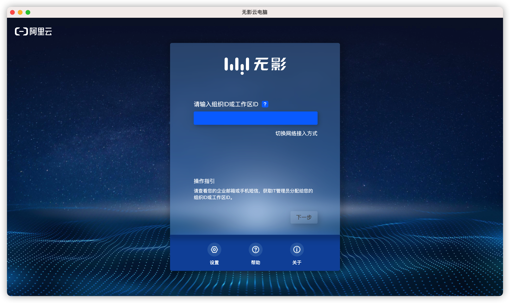

然后找了半天，也没有发现哪里有入口可以进入，在立即购买那个选项那，购买是需要填写一个账号的，就是不知道账号在哪。

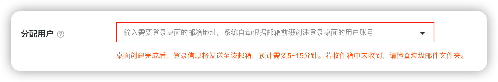

这里设计的有问题，都没有预留一个注册用户的按钮

凭借四年阿里云老用户的我，在控制台中搜索 `无影云` 找到了无影云的控制台界面

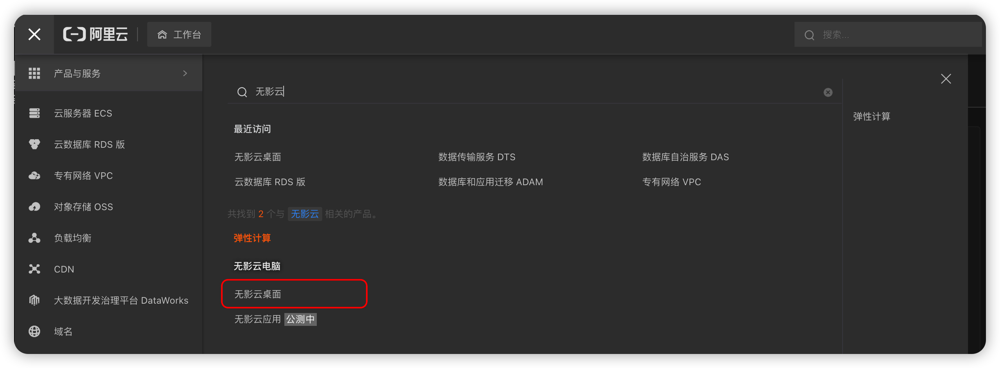

果断下单！

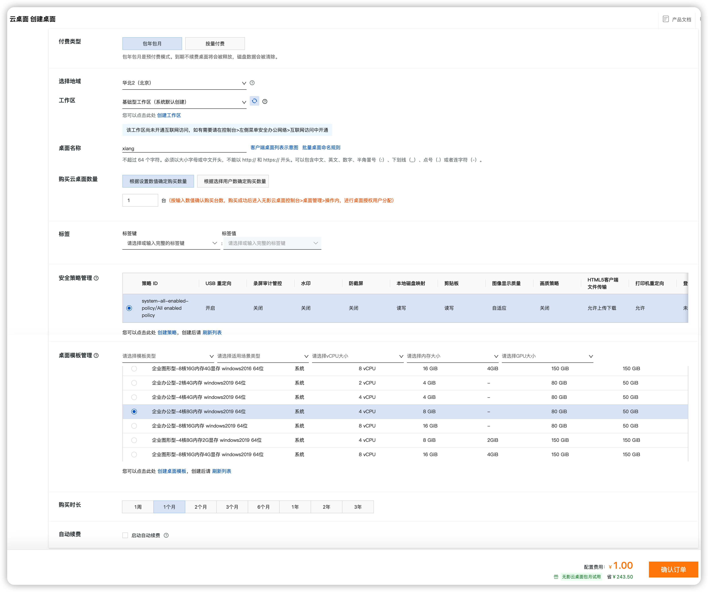

下单之后，要等个五六分钟吧，阿里云要对桌面进行分配。

看到桌面的状态为 “运行中” 之后，我们去创建用户

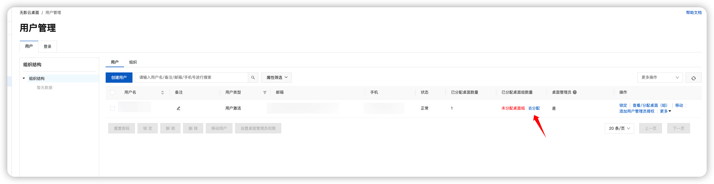

分配我们刚刚买的桌面

然后就能收到阿里云给发的邮件~

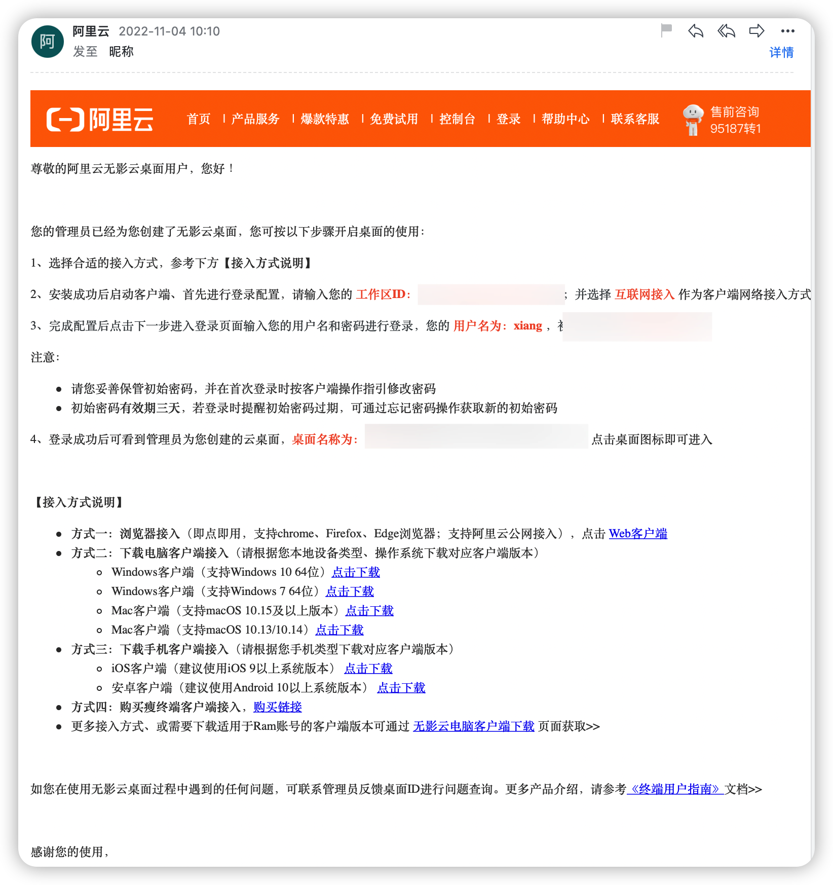

再用我们刚刚下载的应用去登录

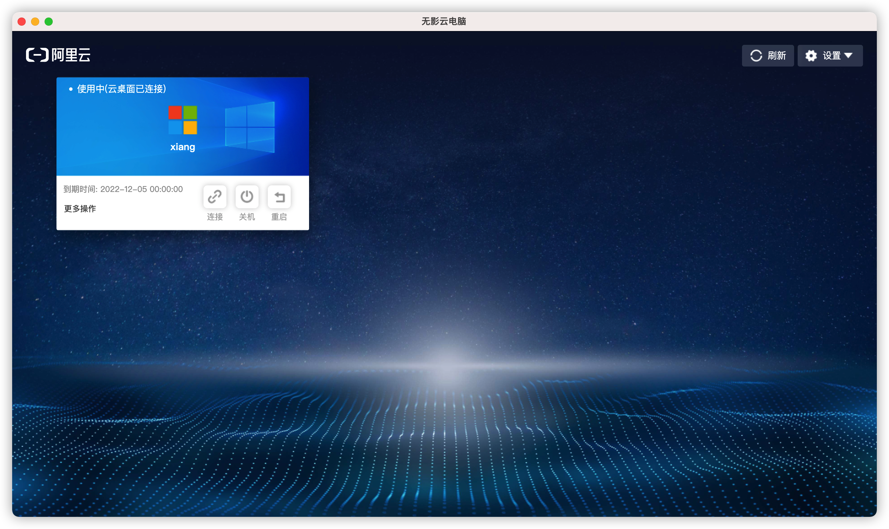

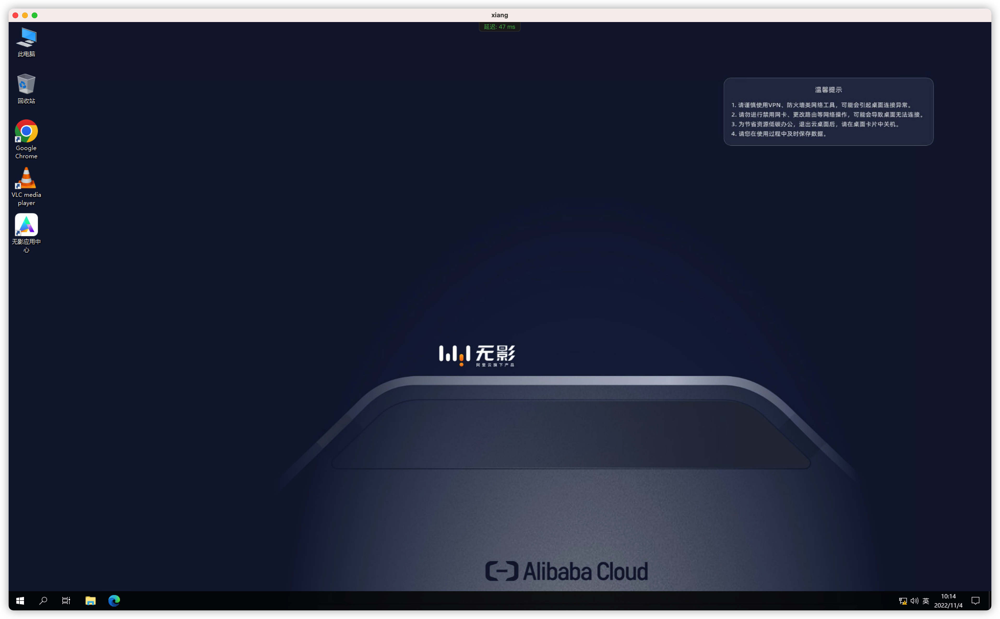

还可以直接映射到本地电脑的磁盘

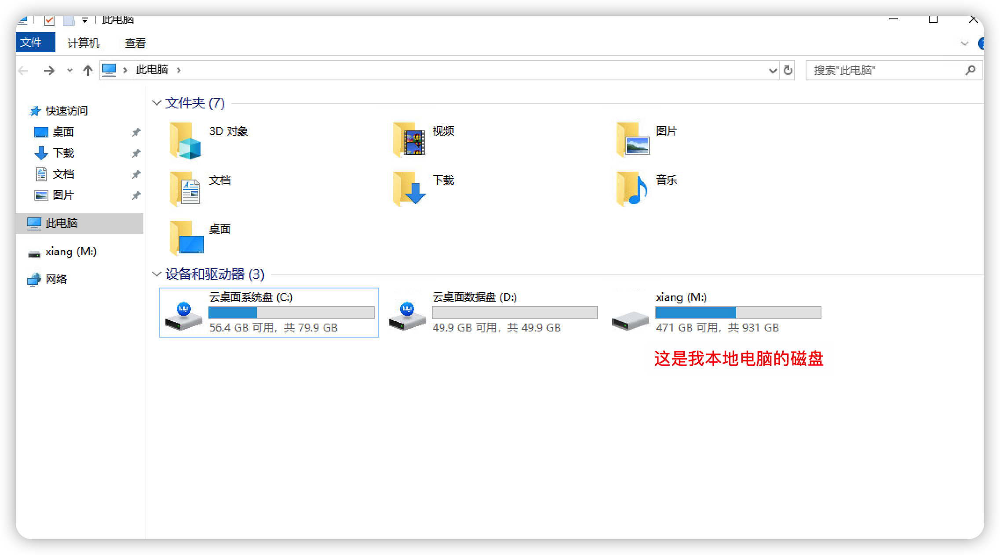

自带应用中心，里面还可以下载编程工具

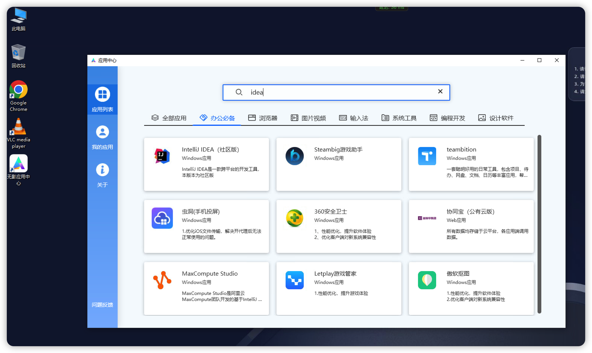

这就意味着，以后带个手机、带个平板什么的，只要能登陆这个云桌面，就可以随时随地进行开发。

无影云的联网是单独一个模块，需要额外开通，

一个月2M带宽40💰，因为第一个免费，我就直接开通了

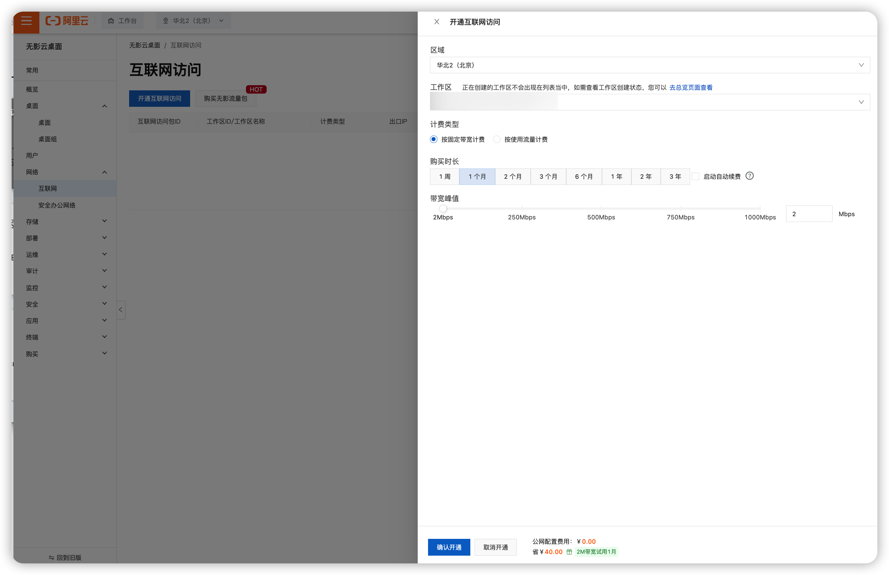

然后才能在无影云里面使用互联网

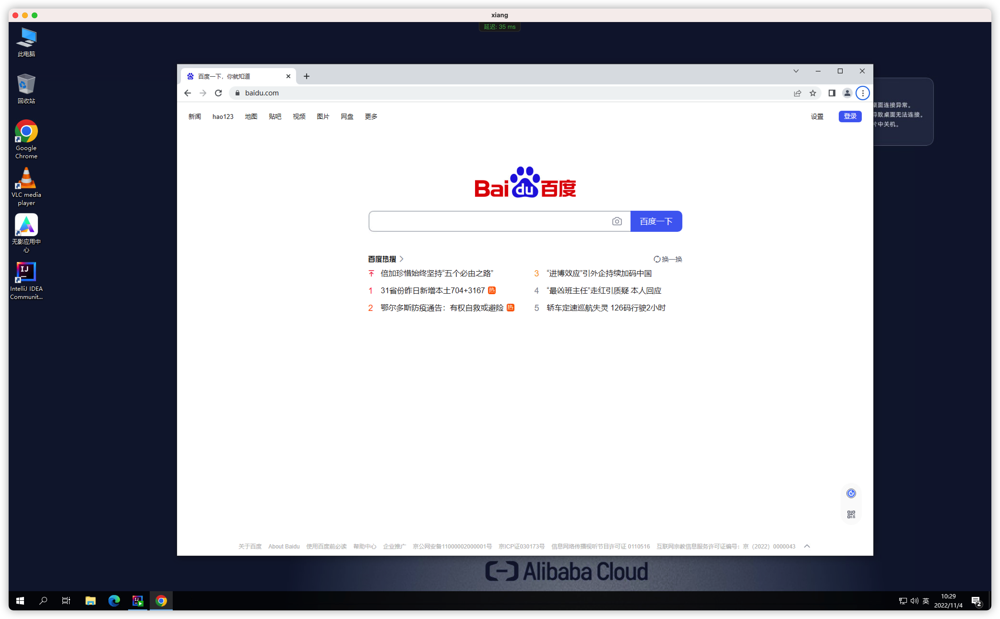

我们从gitee中拉一段代码放到 idea 中去执行一下

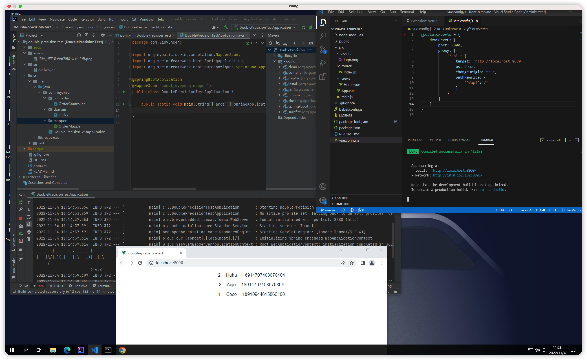

最终成功的启动了一个前后端分离的项目

总的来说，体验还是非常不错的。

选用高端的配置就比较费钱，低端的配置，就和用自己笔记本也没啥区别。

可以算是一台真正的主机。可以用一台手机、平板就可以完成电脑一样的工作。

话虽如此，但是要在有键盘鼠标的前提下。

那如果我都带键盘鼠标出门了，为何不带一个真正的笔记本呢~

ok！ 今天的分享就到这里。