Hi，我是想想

已经很久没有发表过公众号了，上一次停留还是在 2020年3月10日，那会儿还是一个小萌新，学着大佬们的模样分享自己在编程世界成长过程中的心得。但因为一些特殊缘故，不久就放弃更新，前一段时间看文章的时候，认识了几位年龄差距不大的大佬们 `Why` 和 `CoderW` 虽是同龄，但千差万别。

所以他们自然就成为了我心中标榜。我猜测更多的动力源泉来自于对技术的渴望吧！当然还有当今流量，这流量可不是为了直接获得收益，我是希望能认识到更多志同道合之人，结交到更多比我厉害的大佬，好方便抄作业😄

原有的文章因为文章技术过于粗劣，就被我一口气散干净了。

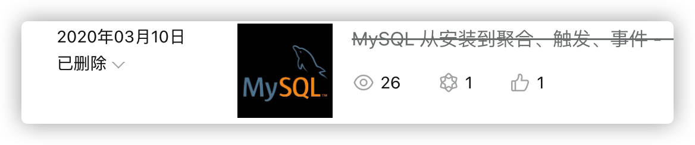

今年是我来京的第二年，技术也自以为是的成熟起来了。拿着自己学习过的笔记，战战兢兢的给大家分享分享，一来是加强我自己的记忆，二呢如果能听到不同看点那就是赚到了。


好，咱们直入主题

> 本文 适合有1年以上开发经验的朋友阅读

浅浅的聊一下 Spring5，在讲 Spring5 的新特性之前，先巩固一下 Spring 的一些知识

如果想直接看 Spring5 的新特性，就从底下往上翻

Spring 是轻量级的开源的 JavaEE 框架，Spring 有两个核心部分，IOC：控制反转，把创建对象过程交给Spring进行管理，AOP：切面编程，不修改源代码进行增强。Spring特点：1、方便解耦，简化开发。2、AOP编程支持。3、方便程序测试。4、方便进行其他框架整合。5、方便事务操作。6、降低API开发难度

> 项目源码地址：
>
> Gitee：https://gitee.com/Array_Xiang/spring5.x-study

### 使用一下 Spring 吧

创建 Maven 项目，在 pom.xml 文件中添加 Spring 坐标

```xml
<dependency>
  <groupId>org.springframework</groupId>
  <artifactId>spring-context</artifactId>
  <version>5.2.6.RELEASE</version>
</dependency>
```

创建 User 类

```java
public class User {
    public void add(){
        System.out.println("....add");
    }
}
```

在 `resource/` 目录下创建 `bean_1.xml` 文件

```xml
<!-- 配置User对象 -->
<bean id="user" class="com.liuyuncen.spring5.User"></bean>
```

创建测试类，如果不想创建测试类，可以直接 main 方法测试

``` java
@Test
public void testAdd(){
  ApplicationContext context = new ClassPathXmlApplicationContext("bean_1.xml");
  User user = context.getBean("user", User.class);
  user.add();
}
```

执行后得出结果，可得

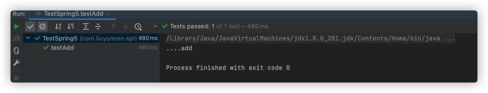

接下来我们来说说为什么通过 Spring 可以拿到 User 对象呢

### IOC 过程

IOC 核心的底层原理涉及到：XML解析、工厂模式、反射等

我们用伪代码来实现一下：

第一步，xml配置文件，创建对象

```xml
<bean id="user" class="com.liuyuncen.spring5.User"></bean>
```

第二步，有service类和dao类，创建工厂类，通过工厂返回对象

```java
class UserFactory{
  public static UserDao getDao(){
    String classValue = class属性值; // xml解析  获取得到 com.liuyuncen.spring5.User
    Class clazz = Class.forName(classValue); // 通过反射获取对象
    return (UserDao)clazz.newInstance();
  }
}
```

### IOC核心思想

1. IOC 思想就是基于 IOC 容器完成，IOC 容器底层就是对象工厂
2. （重点）Spring提供了IOC容器实现两种方式（2个接口）BeanFactory、ApplicationContext
	1. BeanFactory：IOC 容器基本实现，是Spring内部的使用接口，不提供给开发人员使用
		1. 加载配置文件时不会创建对象，在获取对象时才去创建（懒加载）
	2. ApplicationContext：BeanFacotry接口的子接口，提供更多更大的功能，一般由开发人员使用。
		1. 加载及创建		

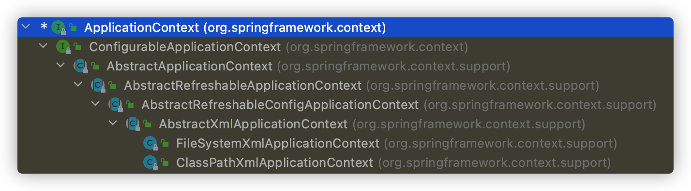

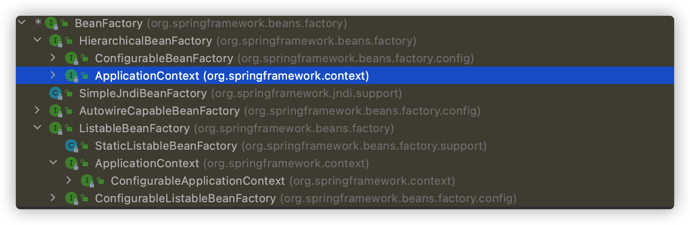

### IOC 操作 bean 进行管理

Bean管理是两个操作，创建对象，注入属性。两种操作方式：1、基于XML配置。2、基于注解实现

注入这一块，我们到时候再分一期详细讲解，这里就忽略过了

### Bean 作用域

在Spring里面，设置创建bean实例是但是单实例还是多实例，在Spring默认情况是单利。用对象地址值来判断实例是否单利还是多例，当 `scope="prototype"` 时为多例，默认不写或者 `scope="singleton"`

```xml
<bean id="Coco" class="xxx" scope="prototype">
</bean>
```

单利时，在加载Spring配置文件的时候，就会创建单利实例对象，当为多利情况下，在调用此对象时，才会创建他。（request、session等值作为扩展）

### Bean 生命周期

1. 通过构造器创建bean实例（无参构造）
2. 为bean的属性设置值或对其他bean引用（调用set方法）
3. ==把Bean实例传给Bean前置处理器的方法==
4. 调用bean的初始化方法（需要进行配置）
5. ==把Bean实例传给Bean后置处理器的方法==
6. bean 可以使用了（对象获取到了）
7. 当容器关闭，调用bean的销毁方法（需要配置销毁方法）

```xml
<bean id="Coco" class="xxx" init-method="init" destory-method="destory">
</bean>
```

初始化会调用 `init()` 方法，销毁时 执行 `ClassPathXmlApplication.close()` 时才会真正销毁，在销毁前调用 `destory()` 方法

### 配置后置处理器

我们来演示一下如何配置后置处理器

创建一个 Hello 类，实现 `BeanPostProcessor` 接口，实现 `postProcessBeforeInitialization`、 `postProcessAfterInitialization`就是这两个方法在初始化之前那个之后，执行的方法。

```xml
<!-- 配置后置处理器 -->
<bean id="myBeanPost" class="com.liuyuncen.Hello"></bean>
```

### 自动装配

先看看手动装配

```xml
<bean id="emp" class="xxx">
  <property name="dept" ref="dept"></property>
</bean>
<bean id="dept" class="xxx">
```

下面是自动装配

```xml
<bean id="emp" class="xxx" autowire="byName">
</bean>
<bean id="dept" class="xxx">
```

实现自动装配，bean标签属性 `autowire` ，配置自动装配 `autowire`属性常用两个值，`byName`根据属性名称注入，`byType` 根据类型注入

### 通过参数注入bean的方式配置数据库链接池

原先XML的配置方式

```xml
<bean id="dataSource" class="com.alibaba.druid.pool.DruidDataSource">
	<property name="driveClassName" value="com.mysql.jdbc.Drive"></property>
  <property name="url" value="jdbc:mysql://localhost:3306/db"></property>
  <property name="username" value="root"></property>
  <property name="password" value="root"></property>
</bean>
```

创建 `jdbc.properties`

```properties
prop.driveClass= com.mysql.jdbc.Drive
prop.url= jdbc:mysql://localhost:3306/db
prop.username= root
prop.passwors= root
```

在 `bean.xml` 中添加命名空间 `xmlns:context="http://www.springframework.org/schema/context"`

引入外部属性文件

```xml
<context:property-placeholder location="jdbc.property"/>
```

将原先的 `value` 值改用 jstl 表达式，例如：

```xml
	<property name="driveClassName" value="${prop.driveClass}"></property>
```

### Spring常用注解

`@Component`

`@Service` 用在业务逻辑层

`@Controller` 用在控制层

`@Repository` 用在dao层

上面四个注解的功能都是一样的，都可以用来创建bean实例

需要引入 AOP 依赖，开启组件扫描

```xml
    <!-- 开启组件扫描 -->
    <context:component-scan base-package="com.liuyuncen.spring5"/>
```

`use-default-filters="false"` 加上这个后，需要自己配置规则

```xml
    <context:component-scan base-package="com.liuyuncen.spring5" use-default-filters="false">
        <context:include-filter type="annotation" expression="org.springframework.stereotype.Controller"/>
    </context:component-scan>
```

`include` 扫描包含以下内容，

`type="annotation" expression="org.springframework.stereotype.Controller"` 扫描带 Controller 的 注解

```xml
   <context:component-scan base-package="com.liuyuncen.spring5" >
        <context:exclude-filter type="annotation" expression="org.springframework.stereotype.Controller"/>
    </context:component-scan>
```

`context:exclude-filter`  设置以下内容不去扫描

### 基于注解方式实现属性注入

`@Autowired` 根据属性类型进行自动装配

`@Qualifier` 根据属性名称进行注入

`@Resource` 可根据类型注入，可根据名称注入，Java 原生的，`@Resource(name="")` 这样就可以根据名称注入，不写name就是默认类型注入

`@Value` 注入普通类型属性

### 完全注解开发

创建配置类，使用 `@Configuration`，可替代 xml 配置文件

```java
@Configuration
@CompoentScan(basePackages = {"com.liuyuncen"})
public class SpringConfig{
  
}
```

测试类这时候就用的是 `AnnotationConfigApplicationContext`

```java
        ApplicationContext app = new AnnotationConfigApplicationContext(SpringConfig.class);
```

### Spring 另一大核心 AOP

面向切面编程，利用AOP可以对业务逻辑的各个部分进行隔离，从而使得业务逻辑各部分之间耦合度降低，从而改变这些行为不影响业务代码。

有两种情况的动态代理

+ 有接口情况（使用 JDK 动态代理）
	+ 创建接口实现类代理对象，增强类的方法
+ 没有接口情况（使用 CGLIB 动态代理）
	+ 创建子类的代理对象，增强类的方法

我们这里讲一讲 使用 JDK 动态代理

使用 `Proxy` 的 `newProxyInstance` 方法 ，方法有3个参数

1. 类加载器
2. 增强方法所在的类，这个类实现的接口，支持多个接口
3. 实现这个接口 InvocationHandle，创建代理对象，写增强方法

代码实现

```java
public class ProxyTest{
  public static void main(String[] args){
		// 被代理的类
		Class[] interfaces = {UserService.class};
    UserService o = (UserService) Proxy.newProxyInstance(ProxyTest.class.getClassLoader(), interfaces, new UserServiceProxy(userService));
    o.sayService();
  }
}
```

创建代理对象，实现接口 `InvocationHandle`

```java
class UserServiceProxy implements InvocationHandler{
    private Object obj;
    public UserServiceProxy(Object obj){
        this.obj = obj;
    }
    @Override
    public Object invoke(Object proxy, Method method, Object[] args) throws Throwable {
        // 方法之前
        System.out.println("方法之前执行...."+method.getName()+"...传递的参数..."+ Arrays.toString(args));
        // 被增强的方法
        Object res = method.invoke(obj, args);
        // 方法之后
        System.out.println("方法执行后...."+res);
        return res;
    }
}
```

### 术语

### 1、连接点

类中具体的方法，哪个方法可以被增强，这些方法可以称为`连接点`

### 2、切入点

真正被增强的方法，称为 `切入点`

### 3、通知

增强的部分叫 `通知`，`通知` 有多种类型：前置、后置、环绕、异常、最终（finally）

### 4、切面

把通知应用到切入点的过程叫切面，这是个过程

### AspectJ

AspectJ 不是 Spring 组成部分，独立 AOP 框架，一般把 AspectJ 和 Spring 框架一起使用，进行 AOP 操作

切入点表达式

`execution（[权限修饰符][返回类型][类全路径][方法名称][参数列表]）`

### 注解实现

需要下面两个依赖

```xml
        <dependency>
            <groupId>org.springframework</groupId>
            <artifactId>spring-aop</artifactId>
            <version>5.2.6.RELEASE</version>
        </dependency>
        <dependency>
            <groupId>org.aspectj</groupId>
            <artifactId>aspectjweaver</artifactId>
            <version>1.8.14</version>
        </dependency>
```

被增强类

```java
@Component
public class UserService {

    public void sayHello(){
        System.out.println("hello");
    }
}
```

增强类

```java
@Component
@Aspect
public class AspectUser {

    @Before("execution(* com.xiang.service.*.*(..))")
    public void aspect(){
        System.out.println("before...");
    }
}
```

配置类 需要注意 `@EnableAspectJAutoProxy`

```java
@Configuration
@ComponentScan(basePackages = {"com.xiang"})
@EnableAspectJAutoProxy
public class XiangSpringConfig {

}
```

启动测试方法

```java
ApplicationContext context = new AnnotationConfigApplicationContext(XiangSpringConfig.class);
UserService userService = (UserService) context.getBean("userService");
userService.sayHello();
```

### 执行先后顺序

```java
@Component
@Aspect
public class AspectUser {

    @Before("execution(* com.xiang.service.*.*(..))")
    public void before(){
        System.out.println("before...");
    }

    @After("execution(* com.xiang.service.*.*(..))")
    public void after(){
        System.out.println("after...");
    }

    @AfterReturning("execution(* com.xiang.service.*.*(..))")
    public void afterReturning(){
        System.out.println("afterReturning...");
    }

    @Around("execution(* com.xiang.service.*.*(..))")
    public void around(ProceedingJoinPoint point) throws Throwable {
        System.out.println("Around before ");
        point.proceed();
        System.out.println("Around after ");
    }
}
```

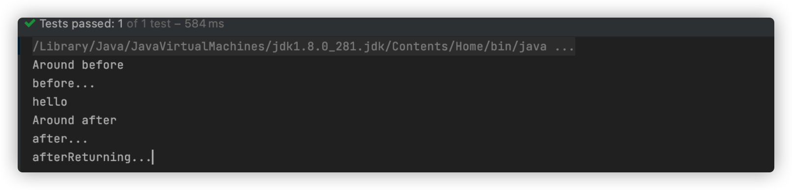

+ after 在有无异常情况下都执行，after 也可以称为最终通知（finally）
+ afterReturning 在有异常下不执行

配置切入点 `@Pointcut`

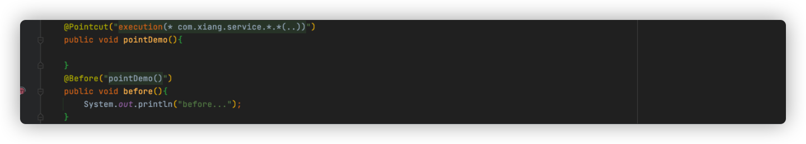

优先级

在增强类上面添加注解 `@Order(int)` 数字越小，优先级越高

### JDBCTemplate

Spring 框架对 Jdbc 进行封装，使用 JdbcTemplate 方便实现的对数据库操作

配置 JdbcTemplate 对象，注入 DataSource

我们查看源码，看到 JdbcTemplate 有个有参构造器，构造器内的参数就是

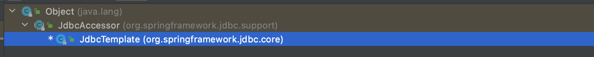

```java
	public JdbcTemplate(DataSource dataSource) {
		setDataSource(dataSource);
		afterPropertiesSet();
	}
```

但是他调的是父类  JdbcAccessor.setDataSource，所以我们直接使用 set 方法注入

```XML
    <bean id="jdbcTemplate" class="org.springframework.jdbc.core.JdbcTemplate">
        <property name="dataSource" ref="dataSource"/>
    </bean>
```

### 查询返回对象

`queryForObject` 有三个参数，1、SQL 语句，2、RowMapper 接口，3、参数值

RowMapper 是接口，针对返回不同类型数据

```java
jdbcTemplate.queryForObject("select * from user where user_id=?",new BeanPropertyRowMapper<>(User.class),id);
```

### Spring 事务

事务是数据库操作最基本单元，逻辑上一组操作，要么都成功，如果有一个失败所有操作都失败，四大特性，原子、一致、隔离、持久

声明式事务管理

`PlatformTransactionManager` 提供一个接口，代表事务管理器，这个接口针对不同的框架提供不同的实现类

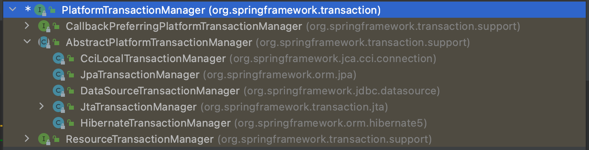

配置事务管理器

```xml
<bean id="transactionManager" class="org.springframework.jdbc.datasource.DataSourceTransactionManager">
    <property name="dataSource" ref="dataSource"/>
</bean>
```

开启声明式事务

```xml
 <tx:annotation-driven transaction-manager="transactionManager"></tx:annotation-driven>
```

在类或者方法上添加注解 `@Transactional`，在这个注解里面可以配置事务相关参数

1. propagation：事务传播行为

	1. REQUIRED：存在加入，否则创建（默认）
	2. REQUIRED_NEW：不管有没有都创建一个新的事务，如果有事务，原事务被挂起
	3. SUPPORTS：存在，加入，否则非事务运行
	4. NOT_SUPPORTES：非事务运行，存在，挂起他
	5. MANDATORY： 存在，加入，否则抛异常
	6. NEVER：非事务运行，存在，抛异常
	7. NESTED：存在就嵌套，没有就创建

2. ioslation：事务隔离级别

	1. 事务有特性成为隔离性，多事务操作之间不会产生影响，不考虑隔离性产生很多问题
	2. 有三个读问题：脏读、不可重复度、幻读
		1. 脏读：一个未提交的事务读取到了另一个事务未提交的数据（这是一种问题）
		2. 不可重复度：一个未提交的事务读取到了另一个事务提交的数据（这是一种现象）
		3. 虚度：一个未提交的事务读取到了另一个事务添加的数据
	3. 解决办法
		1. READ UNCOMMITTED 读取未提交 会有脏读、不可重复读、幻读
		2. READ COMMITED 读已提交，会有不可重复读，幻读
		3. REPEATABLE READ 可重复读，会有幻读
		4. SERIALIZABLE 串行话 解决所有问题‘

	`@Transactional(ioslation=Ioslation.SERIALIZABLE)`

3. timeout：超时时间

	1. 事务需要在一定时间内进行提交，如果不提交进行回滚
	2. 默认值是-1，设置时间以秒为单位

4. readOnly：是否只读

	1. 读：查询操作，写：添加修改删除操作
	2. 设置 readOnly默认值 false，表示可以查询，可以添加修改删除操作
	3. 设置 readOnly 为 true，只能查询

5. rollbackFor：回滚

	1. 设置出现哪些异常进行事务回滚

6. noRollbackFor：不回滚

	1. 设置出现哪些异常不进行回滚
	2. 同时设置，优先回滚


XML配置

```xml
    <!--    配置通知-->
    <tx:advice id="txadvice">
        <tx:attributes>
            <tx:method name="addMoney" propagation="REQUIRED"/>
        </tx:attributes>
    </tx:advice>
    <!--    配置切入点-->
    <aop:config>
        <aop:pointcut id="pt" expression="execution(* com.transfer.service.UserService.*(..))"/>
        <aop:advisor advice-ref="txadvice" pointcut-ref="pt"/>
    </aop:config>
```

完全注解配置

```java
@Configuration
@ComponentScan(basePackages = {"com.transfer"})
@EnableTransactionManagement
public class SpringConfig {

    @Bean
    public DruidDataSource getDruidDataSource(){
        DruidDataSource dataSource = new DruidDataSource();
        dataSource.setDriverClassName("com.mysql.jdbc.Driver");
        dataSource.setUrl("jdbc:mysql:///0429_exam");
        dataSource.setUsername("root");
        dataSource.setPassword("root");
        return dataSource;
    }

    @Bean
    public JdbcTemplate getJdbcTemplate(DataSource dataSource){
        JdbcTemplate jdbcTemplate = new JdbcTemplate();
        jdbcTemplate.setDataSource(dataSource);
        return jdbcTemplate;
    }

    @Bean
    public DataSourceTransactionManager getDataSourceTransactionManager(DataSource dataSource){
        DataSourceTransactionManager dataSourceTransactionManager = new DataSourceTransactionManager();
        dataSourceTransactionManager.setDataSource(dataSource);
        return dataSourceTransactionManager;
    }
}
```


## Spring5 的新特性

SpringFrameWork 5新特性，整个框架的代码基于 Java8.0，运行时兼容 JDK9

## 日志

Spring5.0框架自带了通用的日志封装，Spring5已经移除了 Log4jConfigListioner，官方建议使用 Log4j2，Spring框架整合 Log4j2

在 `resrouce` 中创建 `log4j2.xml` 文件

```xml
<?xml version="1.0" encoding="UTF-8"?>
<!--日志级别 OFF > FATAL > ERROR > WARN > INFO > DEBUG > TRACE > ALL -->
<!--Configuration后面的 status 用于设置 log4j2 自身内部的信息输出，可以不设置，当设置为 trace时，可以看到 log4j2 内部各种详细输出-->
<configuration status="INFO">
    <appenders>
        <console name="Console" target="SYSTEM_OUT">
            <PatternLayout pattern="%d{yyyy-MM-dd HH:mm:ss.SSS} [%t] %-5leavel %logger{36} -%msg%n"/>
        </console>
    </appenders>
    <!--    然后定义 logger，只有定义了 logger 并没有引入 appender，appender才会生效-->
    <!--    root：用于指定项目的根日志，如果没有单独指定 Logger，则会使用root作为默认的日志输出 -->
    <loggers>
        <root level="info">
            <appender-ref ref="Console"/>
        </root>
    </loggers>
</configuration>
```

### 核心容器

支持 `@Nullable` 注解，可以用在方法、属性、参数上，表示可以返回空

`GenericApplicationContext` 函数式注册对象

```java
        GenericApplicationContext context = new GenericApplicationContext();
        context.refresh();
        context.registerBean(User.class,()->new User());
        User u = (User)context.getBean("com.Spring5.entity.User");
```

### Junit4

```java
@RunWith(SpringJUnit4ClassRunner.class)
@ContextConfiguration("classpath:bean_1.xml")
public class SpringTest {

    @Autowired
    private DictService dictService;


    @Test
    public void test(){
        User user = new User("1", "Gogo", "V");
        dictService.addUser(user);
    }
}
```

使用 `@ContextConfiguration("classpath:bean_1.xml")` 代替了 ApplicationContext 获取容器部分，但是需要 Junit4 且版本至少 `4.12` 


### Spring WebFlux

1. Spring WebFlux 是 Spring5 添加新模块，用于 Web 开发，功能和 SpringMVC 类似的，WebFlux 使用当前一种比较流程响应式编程出现的框架
2. 使用传统web框架，比如 SpringMVC，这些基于 Servlet 容器，Webflux是一种异步非阻塞的框架，异步非阻塞的框架在 Servlet3.1 以后才支持，核心是基于 Reactor 相关API实现的

webflux 特点：

1. 非阻塞式，在有限资源下，提高系统吞吐量和伸缩性，以 Reactor 为基础实现响应式编程
2. 函数式编程，Spring5框架基于 java8，webFlux使用 Java8 函数式编程方式实现路由请求

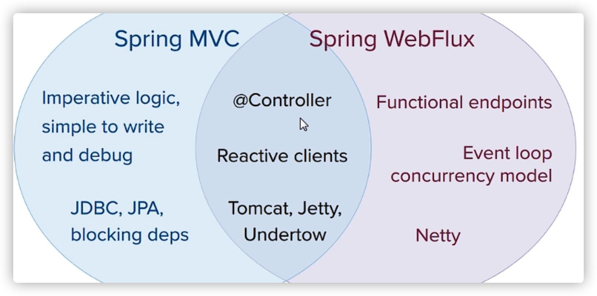

差异：

1. 两个框架都可以使用注解方式，都运行在Tomcat容器中
2. SpringMVC 采用命令式编程，WebFlux采用异步响应式编程


## 响应式编程

简称 RP，响应式编程是一种面向数据流和变化传播的编程范式。这意味着可以在编程语言中很方便地表达静态或动态的数据流，而相关的计算模型会自动将变化的值通过数据流进行传播。

响应式编程中，Reactor 是满足 Reactive 规范框架，Reactor 有两个核心类，Mono 和 Flux，这两个类实现的接口 Publisher，提供丰富操作符。Flux对象实现发布者，返回N个元素，Mono 实现发布者，返回 0或者1个元素

Flux和Mono都是数据流的发布者，使用 Flux 和 Mono 都可以发出三种数据新号：元素值，错误信号，完成信号，错误信号和完成信号都代表终止信号，终止信号用于告诉订阅者数据流结束了，错误信号终止数据流同时把错误信息传递给订阅者

```xml
        <dependency>
            <groupId>io.projectreactor</groupId>
            <artifactId>reactor-core</artifactId>
            <version>3.3.2.RELEASE</version>
        </dependency>
```

```java
public class TestReactor {
    public static void main(String[] args) {
        // just 方法直接声明
        Flux.just(1,2,3,4);
        Mono.just(1);

        // 其他的方法
        Integer[] array = {1,2,3,4};
        Flux.fromArray(array);
        List<Integer> list = Arrays.asList(array);
        Flux.fromIterable(list);
        Stream<Integer> stram = list.stream();
        Flux.fromStream(stram);
    }
}
```

### 三种信号的特点

1. 错误信号和完成信号都是终止信号，不能共存
2. 如果没有发送任何元素值，而是直接发送错误或者完成信号，表示是空数据流
3. 如果没有错误信号，没有完成信号，表示是无限数据流

```java
        Flux.just(1,2,3,4).subscribe(System.out::print);
        Mono.just(1).subscribe(System.out::print);
```

调用 just 或者其他方法只是声明数据流，数据流并没有发出，只有进行订阅之后才会触发，不订阅声明都不会发生

### 操作符

对数据流进行一道道操作，成为操作符，比如工程流水钱

1. map 元素映射为新的元素
2. flatMap 元素映射为流，把每个元素转换为流，把转换之后多个流合并大的流


## 执行流程核心API

SpringWebflux 基于 Reactor 默认使用容器是 Netty，Netty 是高性能的NIO（同步非阻塞）框架，异步非阻塞框架

SpringWebflux 执行过程和 SpringMVC 相似的，

1. SpringWebflux 核心控制器 `DispatchHander` ，接口是 `WebHandler`

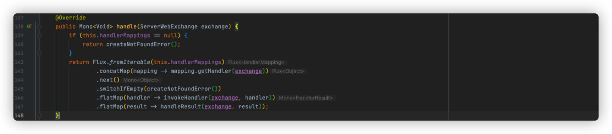

1. `ServerWebExchange` 放一些http请求响应信息
2. `getHandler` 根据请求地址获取对应 mapping
3. `invokeHanlder` 调用具体的业务方法
4. `handlerResult` 处理返回结果


SorubfWebflux 里面DispatchHandler，负责请求的处理

+ `HandlerMapping`：请求查询到处理的方法
+ `HadnlerAdapte`：真正负责请求处理
+ `HanlderResultHandler`：响应结果处理


SpringWebFlux 实现函数式编程，两个接口：RouterFunction（路由处理）和 HandlerFunction（处理函数）

SpringWebflux 基于注解编程模式，实现方式有两种：注解编程模式和编程式编程模型，使用注解编程模型方式，和之前 SpringMVC 使用相同，只需要把相关依赖配置到项目中，SpringBoot 自动配置相关运行容器，默认情况下使用Netty 服务器

1. 创建 SpringBoot 工程，引入 Webflux 依赖

	```xml
	<dependency>
	  <groupId>org.springframework.boot</groupId>
	  <artifactId>spring-boot-starter-webflux</artifactId>
	</dependency>
	```

2. 创建包和相关类 

```java
@Service
public class UserService {

    private final Map<Integer,User> users = new HashMap<>();

    public UserService(){
        this.users.put(1,new User("Coco","nan"));
        this.users.put(2,new User("Good","nan"));
        this.users.put(3,new User("Kiki","nv"));
    }


    public Mono<User> getUserById(int id){
        return Mono.justOrEmpty(this.users.get(id));
    }

    public Flux<User> getAllUser(){
        return  Flux.fromIterable(this.users.values());
    }

    public Mono<Void> saveUser(Mono<User> user){
        return user.doOnNext(person ->{
           int id = users.size()+1;
           users.put(id,person);
        }).thenEmpty(Mono.empty());
    }
}
```

```java
@RestController
public class UserController {

    @Autowired
    private UserService userService;

    @GetMapping("/user/{id}")
    public Mono<User> findById(@PathVariable int id){
        return userService.getUserById(id);
    }

    @GetMapping("/user")
    public Flux<User> getUsers(){
        return userService.getAllUser();
    }

    @PostMapping("/saveuser")
    public Mono<Void> saveUser(@RequestBody User user){
        Mono<User> userMono = Mono.just(user);
        return userService.saveUser(userMono);
    }
}
```

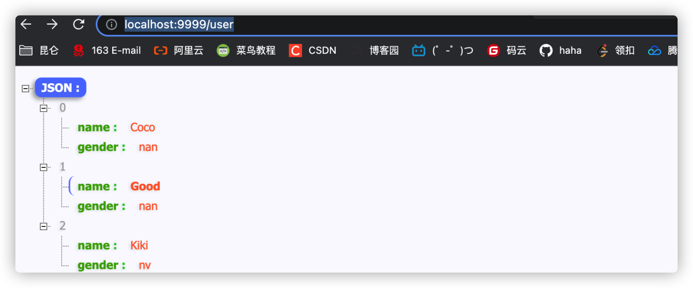

说明

SpringMVC 方式实现，同步阻塞的方式，基于 SpringMVC+Servlet+Tomcat

SpringWebflux 方式实现，异步非阻塞方式，基于 SpringWebflux+Reactor+Tomcat


### 基于函数式编程模型

1. 使用函数式编程模型操作，需要自己初始化服务器
2. 基于函数式编程模型的时候，有两个核心接口：RouterFunction( 实现路由功能，请求转发给对应的 Handle)r 和 HandleFunction(处理请求生成响应的函数)。核心任务定义两个函数式接口的实现并且启动需要服务器
3. SpringWebflux 请求和响应不再是 ServletRequest 和 ServletResponse ，而是 ServerRequest 和 ServerResponse

创建 Handler

```java
public class UserHandler {

    private final UserService userService;

    public UserHandler(UserService userService){
        this.userService = userService;
    }

    public Mono<ServerResponse> getUserById(ServerRequest request){
        int userId = Integer.parseInt(request.pathVariable("id"));
        Mono<ServerResponse> notFound = ServerResponse.notFound().build();
        Mono<User> userMono = this.userService.getUserById(userId);
        // 使用 Reactor 操作 flatMap
        return userMono.flatMap(person->ServerResponse.ok()
                .contentType(MediaType.APPLICATION_JSON)
                .body(fromObject(person)))
                .switchIfEmpty(notFound);
    }

    public Mono<ServerResponse> getAllUsers(){
        Flux<User> users = this.userService.getAllUser();
        return ServerResponse.ok().contentType(MediaType.APPLICATION_JSON).body(users,User.class);
    }

    public Mono<ServerResponse> saveUser(ServerRequest request){
        Mono<User> userMono = request.bodyToMono(User.class);
        return ServerResponse.ok().build(this.userService.saveUser(userMono));
    }
}
```

创建路由

```java
    public RouterFunction<ServerResponse> routingFunction(){
        UserService userService = new UserService();
        UserHandler userHandler = new UserHandler(userService);
        return RouterFunctions.route(
                GET("/users/{id}").and(accept(MediaType.APPLICATION_JSON)),userHandler::getUserById)
                .andRoute(GET("/users").and(accept(MediaType.APPLICATION_JSON)),userHandler::getAllUsers);
    }
```

创建服务器并完成适配

```java
    public void createReactorServer(){
        RouterFunction<ServerResponse> router = routingFunction();
        HttpHandler httpHandler = toHttpHandler(router);
        ReactorHttpHandlerAdapter adapter = new ReactorHttpHandlerAdapter(httpHandler);
        // 创建服务器
        HttpServer httpServer = HttpServer.create();
        httpServer.handle(adapter).bindNow();
    }
```

启动并测试

```java
public static void main(String[] args) throws IOException {
    Server server = new Server();
    server.createReactorServer();
    System.out.println("enter to exit");
    System.in.read();
}
```

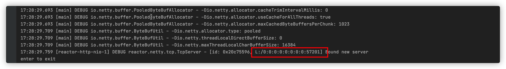

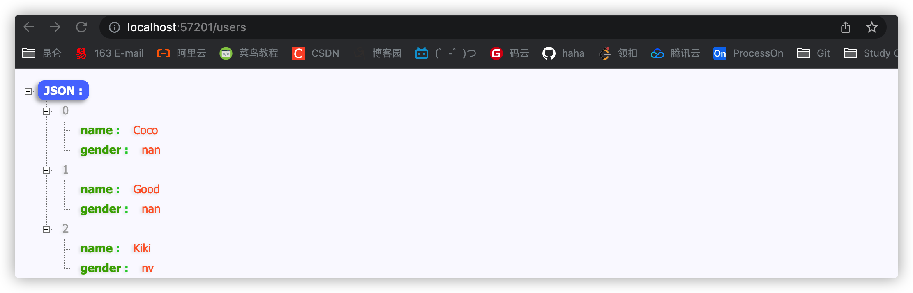

### 使用 WebClient 调用

```java
 public class Client {
 
     public static void main(String[] args) {
         WebClient webClient = WebClient.create("http://localhost:57201");
         String id = "1";
         User block = webClient.get().uri("/users/{id}", id).accept(MediaType.APPLICATION_JSON).retrieve().bodyToMono(User.class).block();
         System.out.println(block.toString());
     }
 }
```

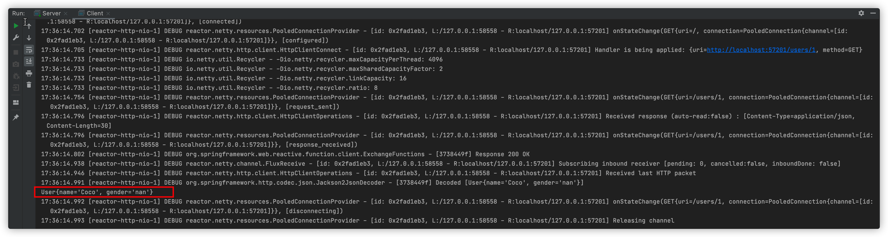

```java
 public class Client {
 
     public static void main(String[] args) {
         WebClient webClient = WebClient.create("http://localhost:57201");
         String id = "1";
         User block = webClient.get().uri("/users/{id}", id).accept(MediaType.APPLICATION_JSON).retrieve().bodyToMono(User.class).block();
         System.out.println(block.toString());
         System.out.println("------------------------");
         Flux<User> userFlux = webClient.get().uri("/users")
                 .accept(MediaType.APPLICATION_JSON).retrieve().bodyToFlux(User.class);
         userFlux.map(stu -> stu.getName()).buffer().doOnNext(System.out::println).blockFirst();
     }
 }
```

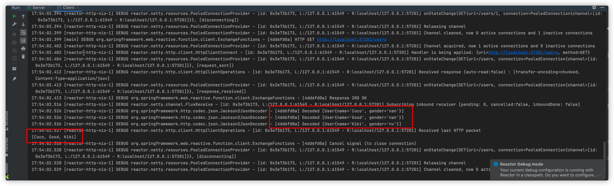

最后，我总结到一张思维导图供大家查缺补漏，如果需要 Xmind 源文件，可以直接添加作者索要哦

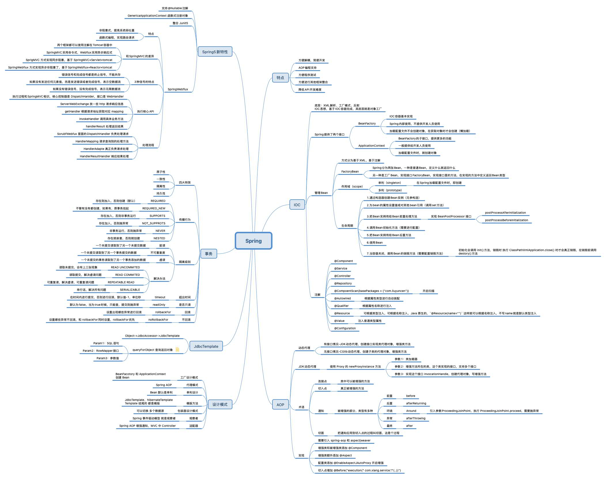

OK！这就是本次的全部内容，感谢您的点赞收藏转发！你的喜欢就是我最大的动力