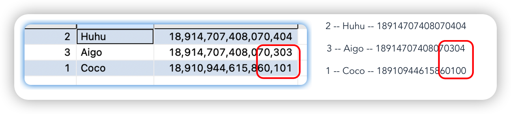
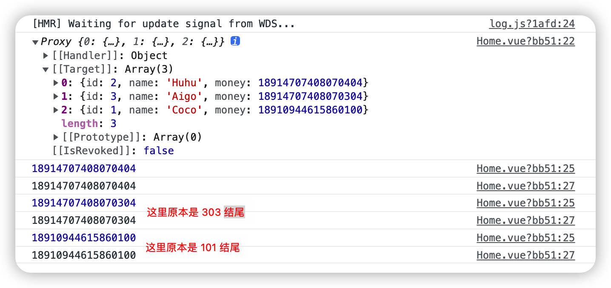
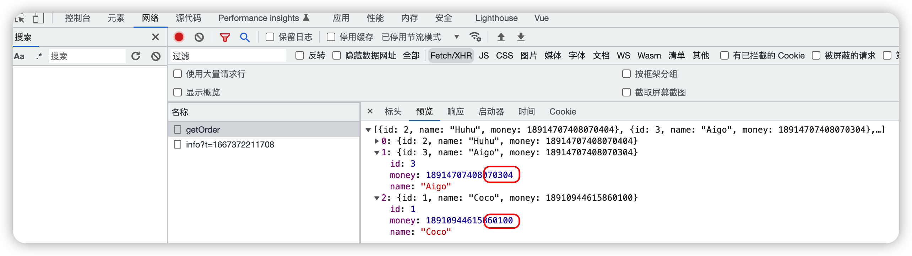
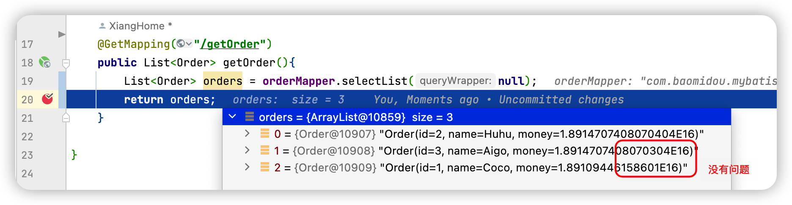
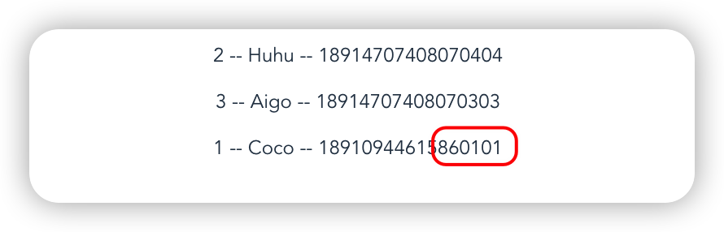
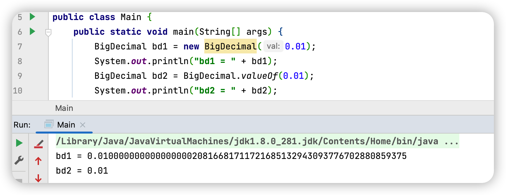
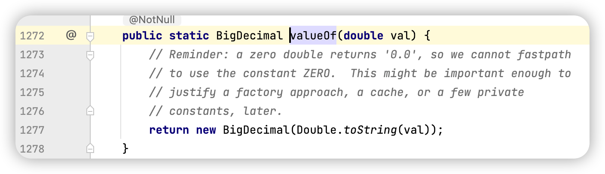
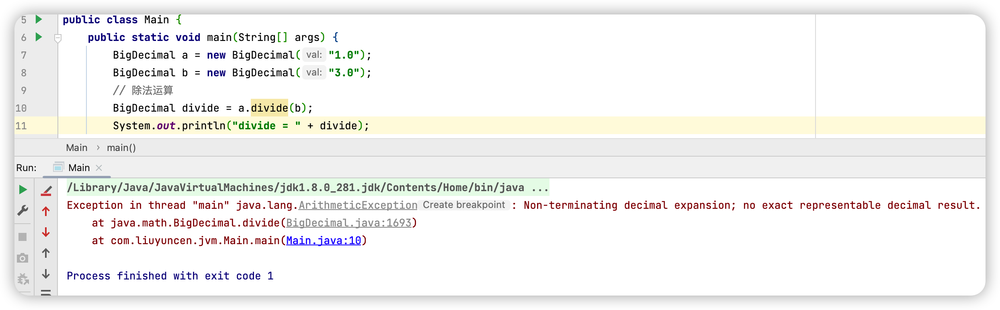
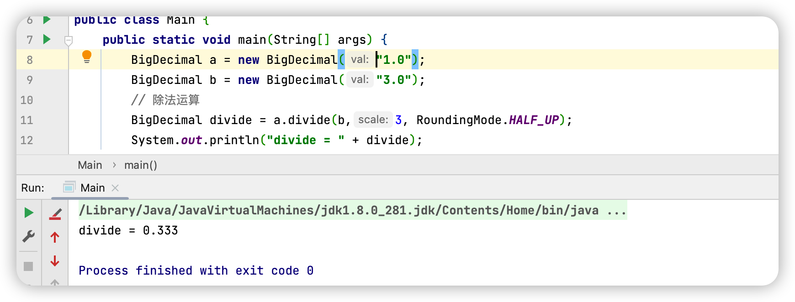

### Double精度丢失解决思路

好久没更了，之前答应说给大家分享笔记，因为这段时间其他事给耽误，在此给大家深深鞠一个躬，我也会在不久的将来给大家带来好消息！

好！罗里吧嗦完了，开始正文。

> 文章目录：
>
> + 发现因Double引起的精度问题
> + 前端排查
> + 后端排查
> + BigDecimal 解决
> + 引发 BigDecimal 相关问题


昨天早上接到一个生产线上的Bug，简单看了一下，精度丢失，原本应该显示 `18910944615860101` 的数值，却丢失了最后一个数字1展示成了 `18910944615860100` ，有经验的小伙伴看到这里，一眼知道这是精度丢失。

我把问题还原了出来，数据库表、**前后端源码均以开源，想要手动尝试的朋友，请自取**

> ```
> 后端项目地址：https://gitee.com/Array_Xiang/double-precision-test
> 前端项目地址：https://gitee.com/Array_Xiang/front-template
> ```

```sql
CREATE TABLE "ORDER_TABLE" (
  "ID" NUMBER, 
	"NAME" VARCHAR2(64), 
	"MONEY" NUMBER, 
	 PRIMARY KEY ("ID")
)
```

当时场景左边是 oracle 查询出的标准数据，右边是页面展示数据（右边是错误的）



### 问题定位

#### 前端问题

就当我天真的以为，前端获取到数据后再转换成字符串就可以完美解决，结果....





```js
//这里贴一下前端代码（我的前端真就半吊子水，手动狗头） 
axios.get("/api/getOrder").then((data) => {
        this.list = data.data
        console.log(this.list)
        for (let i = 0; i < this.list.length; i++) {
          const num = this.list[i].money;
          console.log(num);
          const numStr = num.toString();
          console.log(numStr);
        }
      })
```


我发现在前端转完字符串再后打印控制台，还是原来的那个错误，我就意识到事情远没有我当初想的那么简单，

我开始猜测是后台加工过程中丢失了精度，这个系统数据处理错综复杂，真要是加工问题，牵扯到其他功能模块，那就完犊子了。

#### 后端问题

我开始把矛头指向后端



我发现后端没有问题，只是把数值转换成了科学计数法，但是到前端为什么就只剩下一个错误的数字了呢？

这就要说到 Double 精度丢失的问题了

> Double 不是精确计算的，存在精度丢失问题，这是因为计算机在进行计算是采用二进制，需要将10进制转换成二进制，但是很多10进制数无法使用二进制来精确表示。
>
> 就比如 0.1 他对应的二进制 0.0001100110011…无限循环，只能无限逼近0.1，这就导致了精度丢失问题

要想深入理解，可以看这篇文章：[https://www.cnblogs.com/backwords/p/9826773.html](https://www.cnblogs.com/backwords/p/9826773.html)  作者：Skipper

#### 解决办法

将 Double 类型修改为 BigDecimal 类型

```java
    @JsonFormat(shape = JsonFormat.Shape.STRING)
    private BigDecimal money;
```

并且添加了 `@JsonFormat(shape = JsonFormat.Shape.STRING)` 

```xml
   			<dependency>
            <groupId>com.fasterxml.jackson.core</groupId>
            <artifactId>jackson-databind</artifactId>
            <version>2.10.0.pr3</version>
        </dependency>
```


此时页面数据展示正常




那既然这个问题解决了，又有新的问题出现了！

## BigDecimal

我们**为什么**要使用 BigDecimal，要在**什么时候使用**BigDecimal，BigDecimal还有**什么作用**？

BigDecimal 大多数用于商业计算中，通常用来存储货币类型的字段

因为 BigDecimal 的精度较高，这里的较高，并不是比较其最大值，当时我天真的认为造成精度问题是因为取值范围较小的可能，但当我查询Double的取值范围之后，就发现不太可能...

```
Double 负值取值范围为 -1.79769313486231570E+308 到 -4.94065645841246544E-324,
正值取值范围为 4.94065645841246544E-324 到 1.79769313486231570E+308
```

换个说法，就是好多个亿亿亿亿亿亿亿... 都不够他装的... 被他装到了...


那这里说的精度呢，就是那个精度

不玩文字游戏了。


BigDecimal 并不是所有的构造都是安全的。

看一段代码：



造成这种差异的原因是 0.1 这个数字计算机是无法精确表示的，送给 BigDecimal 的时候就已经丢精度了，而 `BigDecimal.valueOf` 的实现却完全不同。



```java
BigDecimal BigDecimal(double d); //不允许使用,精度不能保证
BigDecimal BigDecimal(String s); //常用,推荐使用
BigDecimal.valueOf(double d); //常用,推荐使用
```


当然，BigDecimal 并不代表无限精度



```
Non-terminating decimal expansion; no exact representable decimal result.
无穷小数扩张;没有精确可表示的小数结果。
```

大概的意思是，BigDecimal 想返回一个精确的数字，但你 1/3 让人家咋返回精确数，人家就只能给你抛出一个友谊的提示了！

那我们要告诉JVM，我们只要一个精确3位小数的精确数就可以了



除了 RoundingMode.HALF_UP 四舍五入之外还有其他一些枚举、参数

```
BigDecimal.ROUND_DOWN:直接省略多余的小数，比如1.28如果保留1位小数，得到的就是1.2
BigDecimal.ROUND_UP:直接进位，比如1.21如果保留1位小数，得到的就是1.3
BigDecimal.ROUND_HALF_UP:四舍五入，2.35保留1位，变成2.4
BigDecimal.ROUND_HALF_DOWN:舍去，2.35保留1位，变成2.3
```


往期系列推荐

- [**分享过去五年的时间管理方案**](http://mp.weixin.qq.com/s?__biz=MzUzMTk1ODU0NA==&mid=2247484789&idx=1&sn=175761342cbf953669851230709f6a5f&chksm=fabbdb0acdcc521ca49e98eab8ecb3168d51e5c231dfa65c810705b67d17157c33de39bd0394#rd)
- [**你连客户端命令都不会，还说你会Redis？**](http://mp.weixin.qq.com/s?__biz=MzUzMTk1ODU0NA==&mid=2247484961&idx=1&sn=cdedf91033c07ec1e66cf3567e6d9c80&chksm=fabbd85ecdcc51485ecc63775150a5c74d8a7d71e1f86959839e2eb2ee4d0c50bbcab0788244&token=629498555&lang=zh_CN#rd)
- [**怎么就给卖超了呢？Redis不是单线程嘛**](http://mp.weixin.qq.com/s?__biz=MzUzMTk1ODU0NA==&mid=2247485002&idx=1&sn=047bbc087618a581c9855172193fb7c3&chksm=fabbd835cdcc512332e5e68d8bea7792f74f84fb0e1f0bfb67338970b67ecd3de467a68e42a0&token=629498555&lang=zh_CN#rd)
- [**不小心drop了生产表，玩完了？**](http://mp.weixin.qq.com/s?__biz=MzUzMTk1ODU0NA==&mid=2247485131&idx=1&sn=789d18442e0355bfbd4af359476daa3d&chksm=fabbd8b4cdcc51a2a8e50d1ce1cd812ce695e758e42fa25a95d34e2b2d2eff59dd80b6cb1de5&token=629498555&lang=zh_CN#rd)
- [**一文入门图形数据库 Neo4j**](http://mp.weixin.qq.com/s?__biz=MzUzMTk1ODU0NA==&mid=2247485178&idx=1&sn=967e09057d970851dcc4f824925db511&chksm=fabbd885cdcc51933341d27f3cfc2fddc51e6749920891f4e8cbea9298ac66b2a070f990d4e5#rd)