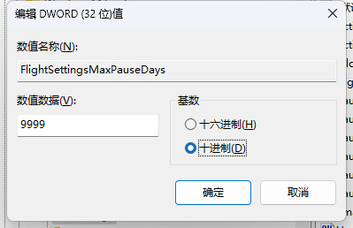
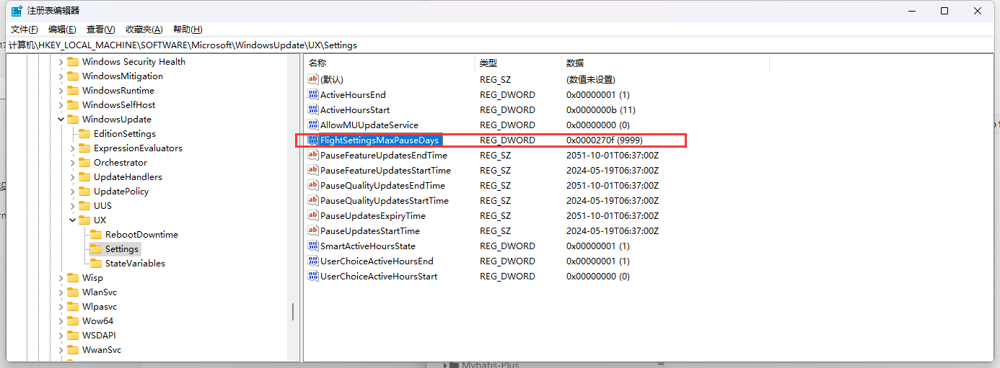
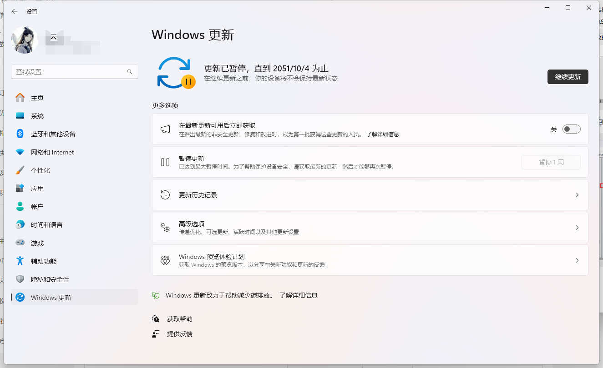

windows + r 打开运行

输入 `regedit` 打开注册表

进入到 

```sh
计算机\HKEY_LOCAL_MACHINE\SOFTWARE\Microsoft\WindowsUpdate\UX\Settings
```

路径下

在右侧新建 > DWORD（32位）值D 

数值名称为：`FlightSettingsMaxPauseDays`

先将`基数` 修改为 十进制

然后将数值数据修改为 9999 （注意不要超过4位数，听别人说容易失效，或者系统异常，我没试过，但我听劝）



最后保存，无需其他操作，看到这个样子，关闭注册表



在windows更新这一块，选择延长到 14xx 周后，就会显示直到 2051年才会更新



