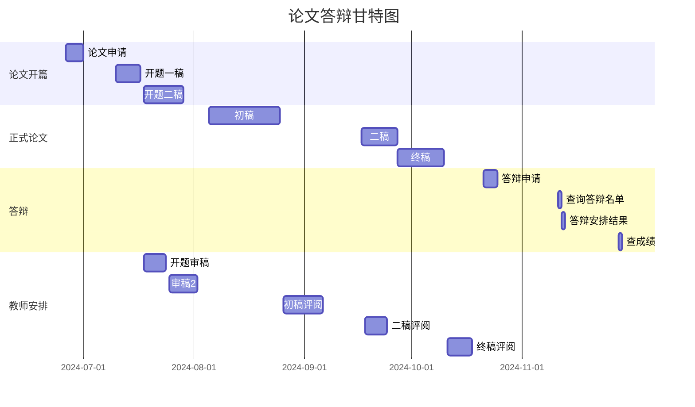

本科毕业论文(设计)文本结构为：

① 封面；
② 毕业论文(设计)中文摘要200字左右，关键词3-5个；
③ 毕业论文(设计)目录；
④ 毕业论文（设计）正文（字数不少于8000）；
⑤ 参考文献（须查阅6篇以上相关资料)；

### 论文指导教师评阅修改

之前有做过需要答辩类型的论文吗？
学习平台只有2次指导老师审阅，这个审阅

1、咱们之前做过答辩这种的论文吗？就江南大学的，因为改规则前没有答辩这种模式，即使江南大学没有，其他学院有写作这种需要参与答辩类型的论文吗？

2、看论文整个进度，教师三次评审，初审、二稿、终稿，这种实际效果大不大，有没有出现过老师不负责不给意见这种情况，咱们是怎么应对呢？

3、最后涉及到答辩，答辩的问题咱们没办法预测，但是能否就答辩给我一个简单的培训，比如会问些什么，我改如何回答这种？有没有这样一个流程？