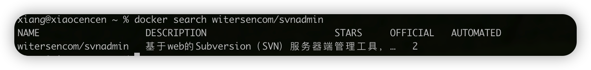

### 多服务文件同步方案

前几天云服务器欠费停机了，作为一个资深薅福利的工具人，续费是肯定不可能续费的，打死也不可能。即使我还有很多数据、配置都在服务器上，我也不会有想续费的想法（几千大洋，太贵了）。

会找资源的小朋友，找个像这样的一年五十块钱左右的服务器，还是比较划算的。

作为一个开发人员，天天要和服务器打交道的人，我认为花点小钱搭建一个线上环境还是挺不错的。那我就不一样了，我不仅仅是一个开发人员，还是一个很会搞事情的开发人员。

我的服务器上搭建了一整套微服务环境包含我的网站、消息推送、定时任务乱七八糟的，除了这套环境，我还有图床、SVN文件同步等一大堆，所以，服务器对我还是蛮有帮助的，这使得我在大一就开始用一直用到现在。


那既然停机了，就得以为着服务迁移。

找出原来的笔记 ctrl+C 、 ctrl+V 复制就可以复刻出我原先一模一样的服务了

但这样也太无聊了吧，所以！

我找了个项目：

> https://github.com/witersen/SvnAdminV2.0
>
> 31个fork，135个 Star
>
> 演示网站：[http://svnadmin.witersen.com](http://svnadmin.witersen.com/) 
>
> 用户、密码：admin、admin

这里给项目的作者点了个 Star


按照文档搭建有些问题，这里复述一下搭建过程

先搜索镜像



再拉取

```sh
docker pull witersencom/svnadmin
```


目前最后版本就是 2.4.7

如果拉取很慢，排查一下docker源，一定要用阿里的

Mac Docker 更改阿里镜像的链接：https://www.cnblogs.com/gabiandlizzy/p/16155191.html

镜像拉下来，基本就完成一半了，然后开始运行项目

先执行一个容器，这个容器是用来获取配置文件的，并不是真正执行环境，所以先按照执行就得了

```sh
docker run -d --name svnadmintemp --privileged witersencom/svnadmin /usr/sbin/init
```

执行完之后，你需要在本地、宿主机创建一个目录环境，用来挂载配置文件

我这里创建了一个  `/Users/xiang/xiang/docker/svn` 这样一个目录

确定有这个目录之后，卡卡卡一顿执行就完了

```sh
cd /Users/xiang/xiang/docker/svn
docker cp svnadmintemp:/home/svnadmin ./
docker cp svnadmintemp:/etc/httpd/conf.d ./svnadmin/
docker cp svnadmintemp:/etc/sasl2 ./svnadmin/
```


配置文件获取到了之后，就可以把原先创建的容器给删掉了

```sh
docker stop svnadmintemp && docker rm svnadmintemp
```

然后就是运行真正的服务了

```sh
docker run -d -p 13690:80 -p 3690:3690 
-v /Users/xiang/xiang/docker/svn/svnadmin/:/home/svnadmin/ 
-v /Users/xiang/xiang/docker/svn/svnadmin/conf.d/:/etc/httpd/conf.d/ 
-v /Users/xiang/xiang/docker/svn/svnadmin/sasl2/:/etc/sasl2/ 
--privileged --name svnadmin witersencom/svnadmin
```

SVN 服务的端口依旧是 3690，web 管理页面是 13690

然后授权进入到容器内对路径下授权

```sh
docker exec -it svnadmin bash
```

```sh
chown -R apache:apache /home/svnadmin/
```

ok 到这里基本上就搭建好了

浏览器访问  http://IP:13690


就可以直接访问系统了，配置什么的都很简单。

如果考虑到后期要更换服务器，只需要把挂载的文件拷贝到新的服务器里，再挂载进新的容器，这样几乎无感迁移。那是相当的舒服。

不仅美观，还方便配置

ok，今天的分享就到这里，感谢您的阅读
