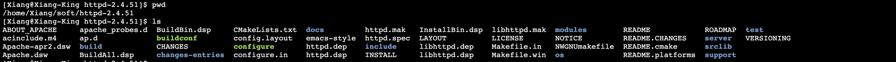
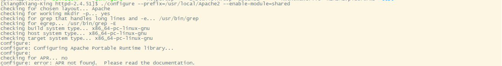
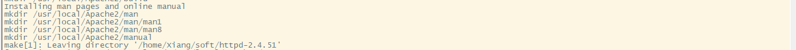
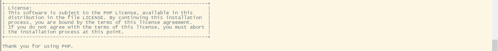

> 创建于2021年12月1日
> 作者：想想
> 转载：https://www.cnblogs.com/haw2106/p/9839655.html

[toc]

## Apache+PHP 环境搭建

### 1、安装Apache环境

```sh
weget https://mirrors.tuna.tsinghua.edu.cn/apache//httpd/httpd-2.4.51.tar.gz
```

下载完成后，解压

```sh
tar -zxvf httpd-2.4.51.tar.gz
```



创建路径、并给当前用户赋权

```sh
sudo mkdir /usr/local/Apache2
sudo chown -R Xiang:Xiang  /usr/local/Apache2
```

进入 httpd-2.4.51 路径下执行

```sh
./configure --prefix=/usr/local/Apache2 --enable-module=shared
```

==报错 error: APR not found==



解决办法

==先安装 yum install gcc==

下载所需要的包

```sh
wget http://archive.apache.org/dist/apr/apr-1.4.5.tar.gz  
wget http://archive.apache.org/dist/apr/apr-util-1.3.12.tar.gz  
wget http://jaist.dl.sourceforge.net/project/pcre/pcre/8.10/pcre-8.10.zip  
```

解决apr not found问题>>>>>>==注意使用root权限操作，因为涉及到在 usr/local 下创建文件夹==

```sh
 tar -zxf apr-1.4.5.tar.gz  
```

```sh
cd  apr-1.4.5
```

```sh
./configure --prefix=/usr/local/apr 
```

```sh
make && make install 
```

解决APR-util not found问题>>>>

```sh
tar -zxf apr-util-1.3.12.tar.gz  
```

```sh
cd apr-util-1.3.12  
```

```sh
./configure --prefix=/usr/local/apr-util --with-apr=/usr/local/apr/
```

```sh
make && make install
```

进入 httpd-2.4.51 路径下执行

```sh
./configure --prefix=/usr/local/Apache2 --enable-module=shared --with-apr=/usr/local/apr --with-apr-util=/usr/local/apr-util --with-pcre=/usr/local/pcre
```

执行成功！

### 2.启动Apache环境

进入 /usr/local/apache2/bin 中 ==需要sudo运行==

```sh
  　　  ./apachectl -k start   		# 开启
  　　  ./apachectl -k restart		# 重启
 　　   ./apachectl -k stop			# 关闭
```

修改php配置 /usr/local/Apache2/conf/httpd.conf

```conf
配置文件
　　编辑 /usr/local/apache2/conf/httpd.conf 文件     
 　　    找到：
 　　   　　AddType  application/x-compress .Z
 　　   　　AddType application/x-gzip .gz .tgz
 　　   在后面添加：
 　　  　　 AddType application/x-httpd-php .php（使Apcche支持PHP）
   　　　　 AddType application/x-httpd-php-source .php5   
    　　找到：
   　　 　　<IfModule dir_module>
   　　　　　　 DirectoryIndex index.html
   　　　　 </IfModule>
   　　 添加：
   　　　　 <IfModule dir_module>
   　　　　　　 DirectoryIndex index.html index.php
   　　　　 </IfModule>    
   　　 找到：
   　　　　 ＃ServerName www.example.com:80
    　　修改为：
    　　　　ServerName 127.0.0.1:80或者ServerName localhost:80
    　　记得要去掉前面的“＃”
```


### 3、安装Http环境

下载 >> 再上传到服务器中，wget 好像不能用

```sh
https://www.php.net/distributions/php-8.1.0.tar.gz
```

==为了避免麻烦，直接root 用户操作== 

创建 php8 文件夹

```sh
mkdir /usr/local/php8
```

进入 php-8.1.0 内

```sh
./configure --prefix=/usr/local/php8  --with-apxs2=/usr/local/Apache2/bin/apxs --enable-ssl
```

 注意这里有一个-with-apxs2=/usr/local/Apache2/bin/apxs选项，其中apxs是在安装Apache时产生的，apxs是一个为Apache HTTP服务器编译和安装扩展模块的工具，使之可以用由mod_so提供的LoadModule指令在运行时加载到Apache服务器中。我的理解是通过这个工具把PHP模块动态加载到Apache中



```sh
make && make install
```

复制配置

```sh
cp /home/Xiang/soft/php-8.1.0/php.ini-development /usr/local/php5/lib/php.ini
```

==重启Apache==

