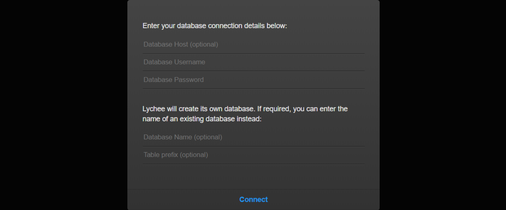
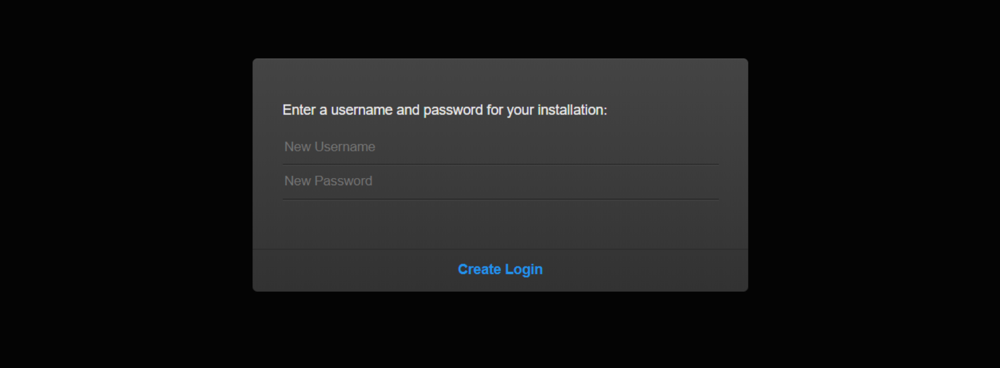

> 创建于2021年10月28日
> 作者：想想

[toc]

## Linux 环境

> IP `192.144.233.95`
> User `root`

启动 docker

```sh
systemctl start docker
```

下拉景象

```sh
docker image pull kdelfour/lychee-docker
```

```sh
[root@Xiang ~]# docker image pull kdelfour/lychee-docker
Using default tag: latest
latest: Pulling from kdelfour/lychee-docker
Image docker.io/kdelfour/lychee-docker:latest uses outdated schema1 manifest format. Please upgrade to a schema2 image for better future compatibility. More information at https://docs.docker.com/registry/spec/deprecated-schema-v1/
a3ed95caeb02: Pull complete 
....
7a31f1f46cb4: Pull complete 
Digest: sha256:e8f3f9b2f4d5a8b562d4ea76a18e5ef95a4d2112709ad0ba2a30108c9316fbc5
Status: Downloaded newer image for kdelfour/lychee-docker:latest
docker.io/kdelfour/lychee-docker:latest
```

查看镜像

```sh
[root@Xiang ~]# docker images
REPOSITORY               TAG            IMAGE ID       CREATED         SIZE
...
kdelfour/lychee-docker   latest         1bed5bfa1ad5   5 years ago     563MB
```

执行

先开放7733端口

`docker run -it -d --name lychee -p 7733:80 kdelfour/lychee-docker`

```sh
[root@Xiang ~]# docker run -it -d --name lychee -p 7733:80 kdelfour/lychee-docker
72755733a4762be588653c01029a78c2a4a1b0e1577766f0cf1772d881761b73
```

查看当前正在运行的容器

`docker container ls`

```sh
[root@Xiang ~]# docker container ls
CONTAINER ID   IMAGE                    COMMAND                  CREATED              STATUS          PORTS                                   NAMES
72755733a476   kdelfour/lychee-docker   "supervisord -c /etc…"   About a minute ago   Up 59 seconds   0.0.0.0:7733->80/tcp, :::7733->80/tcp   lychee
```

访问地址

`http://xiang.press:7733/`

因为我开放的是7733端口



默认用户名密码是：==**lychee**==



创建用户密码 `xiang` / `xiaocencen`


进入容器

`docker container ls`

拿到 container id 后，

`docker container exec -it 72755733a476 /bin/bash`

- 先停止运行的容器：`docker container stop [container-id]`
- 然后删除容器：`docker container rm [container-id]`
- 最后删除镜像：`docker image rmi [image-id]`


