> 创建于 2021年11月8日
> 作者：想想

[toc]


## 环境准备

`已部署 Jenkins并成功访问管理页面`、`JDK`、`Git` 、`Maven`

```
jdk  /usr/local/java/jdk1.8.0_181
git  /usr/libexec/git-core/git
maven  /usr/local/maven/apache-maven-3.8.3
gitee   https://gitee.com/Array_Xiang/jenkins-test.git
```


## 一、配置环境

Manage Jenkins > Global Tool Configuration

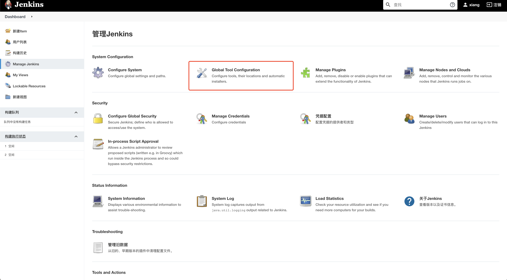

### 1.1、配置JDK


### 1.2、配置Git

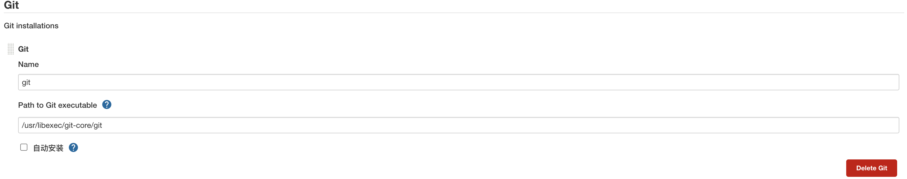

### 1.3、配置Maven


## 二、部署项目

我们部署一套 maven 项目，默认新建项目没有 maven 项目选项，我们需要去安装 `Maven Integration` 插件

==这里选两个 Config File Provider 和 Maven Integration==

Maven Integration 是方便构建 maven 项目用的

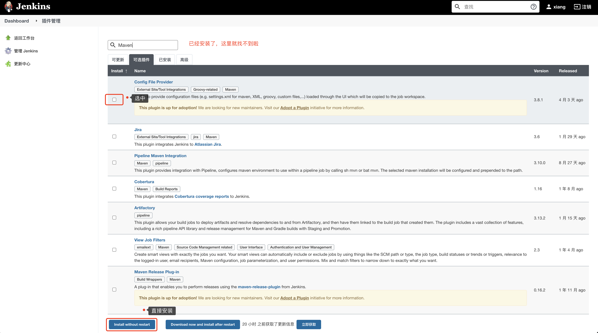

### 2.1、新建项目

输入项目名称

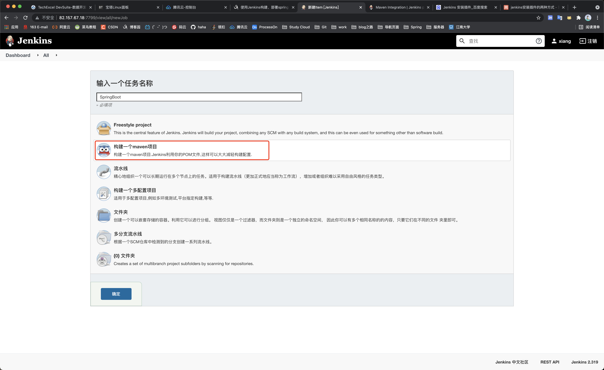

### 2.2、勾选丢弃旧的构建

选择是否备份被替换的旧包。我这里选择备份最近的10个

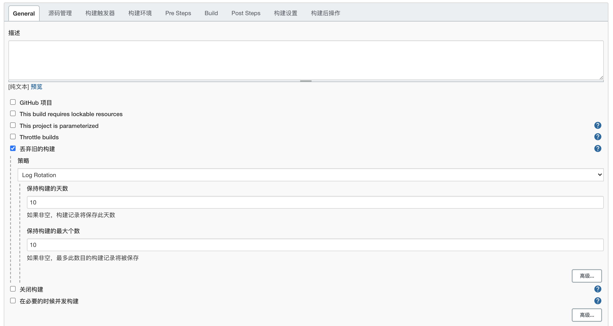

### 2.3、源码管理，配置Git相关信息

`https://gitee.com/Array_Xiang/jenkins-test.git`

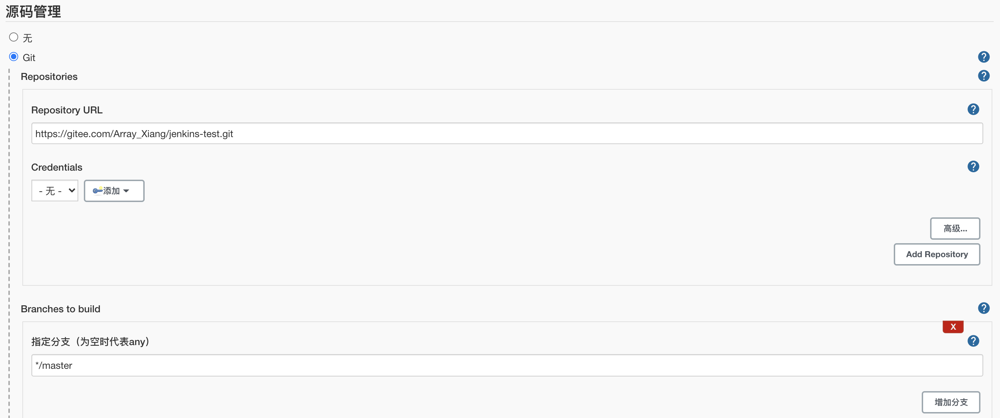

### 2.4、勾选 `Add timestamps to the Console Output`

代码构建的过程中会将日志打印出来

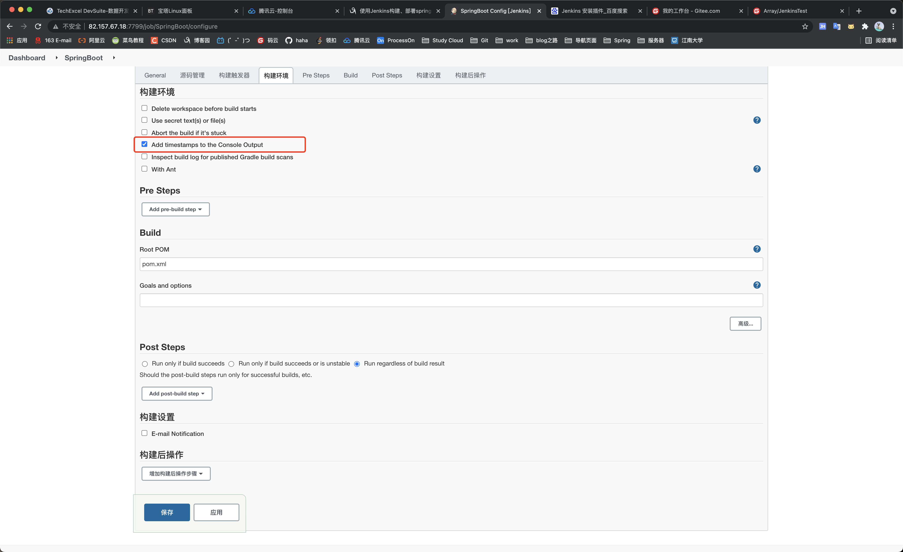

### 2.5、在Build中输入打包前的mvn命令

```sh
clean install
```

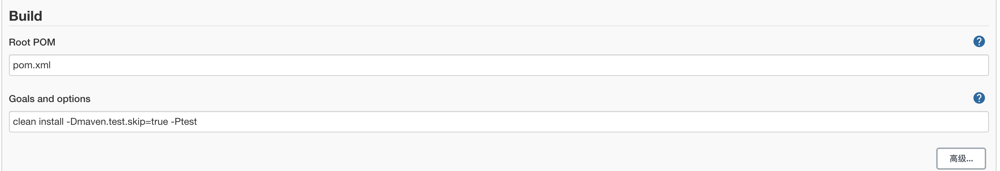

### 2.6、Post Steps 

选择 Run only if build succeeds

选择 Excute Shell

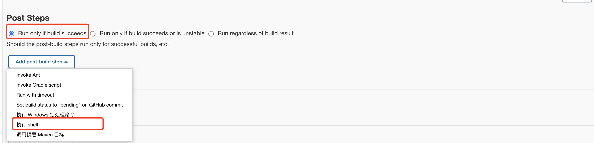

```sh
sh /home/Xiang/jenkins/bin/stop.sh
BUILD_ID=dontKillMe nohup java -jar /home/Xiang/.jenkins/workspace/SpringBoot/target/jenkins_test-v1.jar > /home/Xiang/jenkins/logs/jenkins_test-v1.log 2>&1 &
```


stop.sh

```sh
#!/bin/bash
echo "Stop SpringBoot Application"
pid=`ps -ef | grep jenkins_test-v1 | grep -v grep | awk '{print $2}'`
if [ -n "$pid" ]
then 
 kill -9  $pid
fi
```

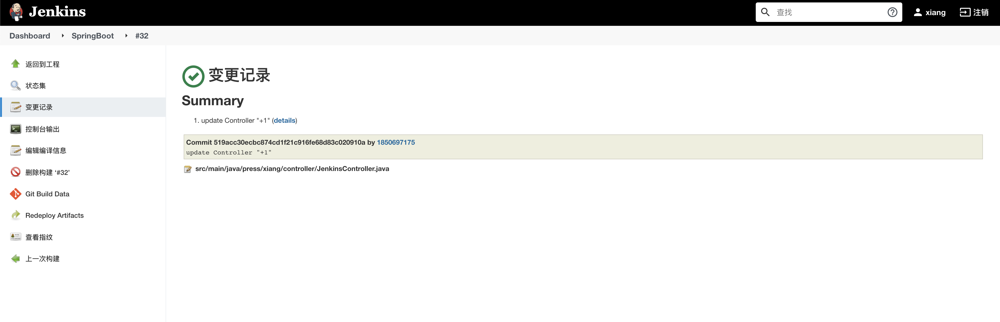

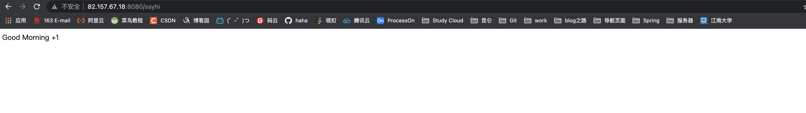

