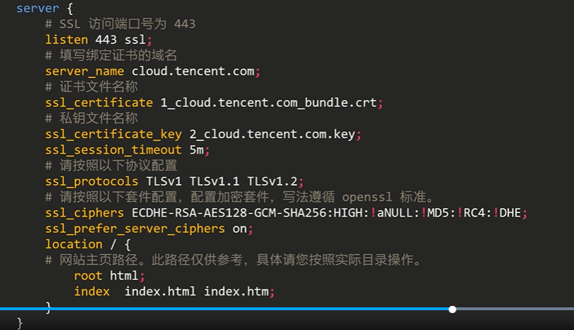
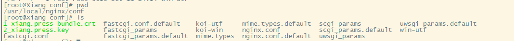

> 创建于2021年10月18日

[toc]


下载证书部署到Nginx上




### 服务器原配置

需要将下载的 文件放到 /usr/local/nginx/conf/ 目录下



### 需要添加的配置

```nginx
server{
        ## SSL 访问端口号为443
        listen 443 ssl;
        ## 填写绑定证书的域名
        server_name xiang.press;
        ## 证书文件名称
        ssl_certificate 1_xiang.press_bundle.crt;
        ssl_certificate_key 2_xiang.press.key;
        ssl_session_timeout 5m;
        # 请按照以下协议配置
        ssl_protocols TLSv1 TLSv1.1 TLSv1.2;
        # 请按照以下套件配置，配置加密套件，写法遵守 openssl 协议
        ssl_ciphers ECDHE-SRA-AES128-GCM-SHA256:HIGH:!aNull:!MD5:!RC4:!DHE;
        ssl_prefer_server_ciphers on;
        location / {
            ## 跟文件夹在位置，这里指的是 根下的html
            root   /usr/local/nginx/html;
            ## html 下的文件
            index  index.html index.htm;
        }
    
        location /api/ {
            proxy_pass http://localhost:8101/;
        }
    }
```

### 合并后

```nginx

worker_processes  1;

events {
    worker_connections  1024; 
    use epoll;
}

http {
    include       mime.types;   
    default_type  application/octet-stream;   
    fastcgi_intercept_errors on;   
    charset  utf-8;   
    server_names_hash_bucket_size 128;   
    client_header_buffer_size 4k;   
    large_client_header_buffers 4 32k;   
    client_max_body_size 300m;   
    sendfile on;   
    tcp_nopush     on;   
      
    keepalive_timeout 60;   
      
    tcp_nodelay on;   
    client_body_buffer_size  512k;   
    
    proxy_connect_timeout    5;   
    proxy_read_timeout       60;   
    proxy_send_timeout       5;   
    proxy_buffer_size        16k;   
    proxy_buffers            4 64k;   
    proxy_busy_buffers_size 128k;   
    proxy_temp_file_write_size 128k;   
      
    gzip on;   
    gzip_min_length  1k;   
    gzip_buffers     4 16k;   
    gzip_http_version 1.1;   
    gzip_comp_level 2;   
    gzip_types       text/plain application/x-javascript text/css application/xml;   
    gzip_vary on;
	
 
    
    server {
        listen       80;
        server_name  localhost;

        location / {
     		## 跟文件夹在位置，这里指的是 根下的html
            root   /usr/local/nginx/html;
     		## html 下的文件
            index  index.html index.htm;
        }

        location /api/ {
            proxy_pass http://localhost:8101/;
        }
            
        error_page   500 502 503 504  /50x.html;
        location = /50x.html {
            root   html;
        }
    }
    
    server {
        listen       1888;
        server_name  localhost;

        location / {
     		## 跟文件夹在位置，这里指的是 根下的html
            root   /usr/local/nginx/sarber;
     		## html 下的文件
            index  index.html index.htm;
        }

        location /api/ {
            proxy_pass http://localhost:8101/;
        }
            
        error_page   500 502 503 504  /50x.html;
        location = /50x.html {
            root   html;
        }
    }
    
    server{
        ## SSL 访问端口号为443
        listen 443 ssl;
        ## 填写绑定证书的域名
        server_name xiang.press;
        ## 证书文件名称
        ssl_certificate 1_xiang.press_bundle.crt;
        ssl_certificate_key 2_xiang.press.key;
        ssl_session_timeout 5m;
        # 请按照以下协议配置
        ssl_protocols TLSv1 TLSv1.1 TLSv1.2;
        # 请按照以下套件配置，配置加密套件，写法遵守 openssl 协议
        ssl_ciphers ECDHE-SRA-AES128-GCM-SHA256:HIGH:!aNull:!MD5:!RC4:!DHE;
        ssl_prefer_server_ciphers on;
        location / {
            ## 跟文件夹在位置，这里指的是 根下的html
            root   /usr/local/nginx/html;
            ## html 下的文件
            index  index.html index.htm;
        }
    
        location /api/ {
            proxy_pass http://localhost:8101/;
        }
    }
}


```

### 关于Nginx配置

#### 1.1、查看Nginx版本

```sh
[root@Xiang sbin]# /usr/local/nginx/sbin/nginx -V
nginx version: nginx/1.17.6
built by gcc 8.4.1 20200928 (Red Hat 8.4.1-1) (GCC) 
built with OpenSSL 1.1.1g FIPS  21 Apr 2020
TLS SNI support enabled
configure arguments: --prefix=/usr/local/nginx
```

可以发现，我们的Nginx没有 SSL 模块，所以需要添加SSL模块

#### 1.2、重新编译Nginx

进入原 Nginx 目录

```sh
cd /usr/local/nginx-1.17.6
```

执行 

```sh
./configure --prefix=/usr/local/nginx --with-http_stub_status_module --with-http_ssl_module
```

```sh
make
```

配置完之后，执行 `make`   千万不要执行 `make install` 否则就是覆盖安装了

编译后，备份原先的 nginx 执行文件

```sh
cp /usr/local/nginx/sbin/nginx /usr/local/nginx/sbin/nginx.bak
```

然后将刚刚编译好的nginx覆盖掉原有的nginx==（这个时候nginx要停止状态）==

```sh
cp /usr/local/nginx-1.17.6/objs/nginx /usr/local/nginx/sbin
```

现在检查是否安装成功

```sh
[root@Xiang objs]# /usr/local/nginx/sbin/nginx -V
nginx version: nginx/1.17.6
built by gcc 8.4.1 20200928 (Red Hat 8.4.1-1) (GCC) 
built with OpenSSL 1.1.1g FIPS  21 Apr 2020
TLS SNI support enabled
configure arguments: --prefix=/usr/local/nginx --with-http_stub_status_module --with-http_ssl_module
```

此时就快大功告成了，

#### 1.3、检查nginx编译环境

```sh
[root@Xiang objs]# /usr/local/nginx/sbin/nginx -t
nginx: the configuration file /usr/local/nginx/conf/nginx.conf syntax is ok
nginx: configuration file /usr/local/nginx/conf/nginx.conf test is successful
```

启动 Nginx 

