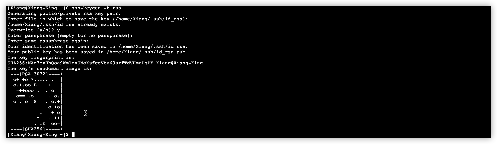
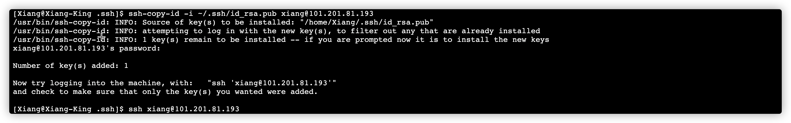

> 创建于 2021年11月17日
> 作者：想想

[toc]


## 一、Linux SSH远程连接另服务器

### 查看收否存在 ssh-client

执行 `rpm -qa|grep ssh-client`

```sh
rpm -qa|grep ssh-client
```

### 安装

如果没有 执行 `yum install ssh-client`

连接

```sh
ssh -p 43999 Xiang@82.157.67.18
```


## 二、免密登陆

现在让 A 服务器免密登陆 B 服务器

全程A服务器上操作

```sh
ssh-keygen -t rsa
```

一直回车



```sh
cd ~/.ssh
ssh-copy-id -i ~/.ssh/id_rsa.pub  xiang@101.201.81.193 # 注意这里是 B 服务器登陆
ssh-copy-id -i ~/.ssh/id_rsa.pub -p 43999 Xiang@82.157.58.225
ssh-copy-id -i ~/.ssh/id_rsa.pub -p 43999 Xiang@82.157.67.18
ssh-copy-id -i ~/.ssh/id_rsa.pub -p 43999 xiang@192.144.233.95

ssh-copy-id -i ~/.ssh/id_rsa.pub -p 43999 Xiang@queen
ssh-copy-id -i ~/.ssh/id_rsa.pub -p 43999 Xiang@king
ssh-copy-id -i ~/.ssh/id_rsa.pub -p 43999 xiang@xiang


ssh-copy-id -i ~/.ssh/id_rsa.pub xiang@43.143.225.148
ssh-copy-id -i ~/.ssh/id_rsa.pub xiang@43.143.223.97
ssh-copy-id -i ~/.ssh/id_rsa.pub xiang@101.201.81.193

ssh-copy-id -i ~/.ssh/id_rsa.pub xiang@Nene
ssh-copy-id -i ~/.ssh/id_rsa.pub xiang@Yaya
ssh-copy-id -i ~/.ssh/id_rsa.pub xiang@Super
```



其中会验证密码，验证通过就成功了

```sh
ssh xiang@101.201.81.193
```

直接访问！ 成功！
