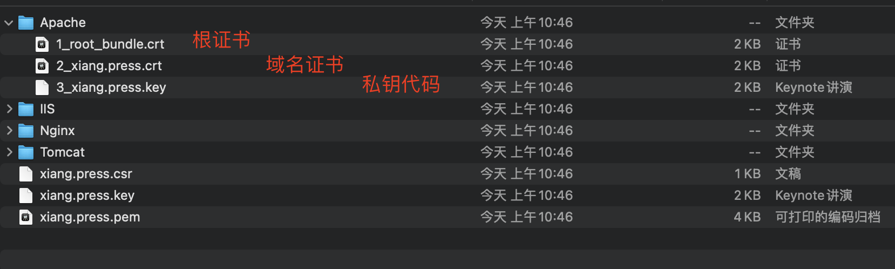

> 创建于2021年10月14日
>
> 作者：谢谢

[toc]

## SSL

​		SSL证书（SSL Certificates）提供了安全套接层（SSL）证书的一站式服务，包括证申请、管理及部署功能，与顶级的数据证书授权（CA）机构和代理商合作，为您的网站、移动应用提供HTTPS解决方案

+ 域名形（DV）信任等级一般，只需要验证网站的真实性便可颁发
+ 企业形（OV）信任等级强，需要验证企业的身份，审核严格，安全性更高
+ 增强型（EV）信任等级最高，一般用于银行证券金融机构，审核严格，安全性最高，同时可以激活绿色网址栏

### HTTPS 优势

1. 防流量劫持，全站 Https 说根治运营商、中间人流量劫持的解决方案，不仅可杜绝网页中被插入广告，更可以保护用户隐私安全
2. 提示搜索排名
3. 杜绝钓鱼网站，HTTPS 栏中有绿色图标，帮助用户识别钓鱼网站

