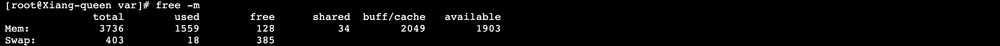
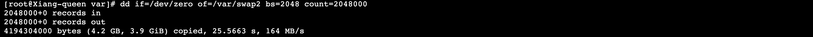
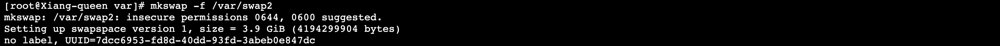
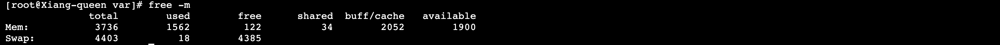
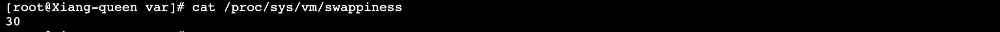
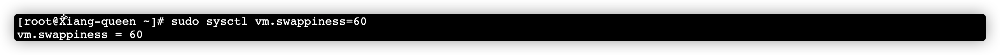

> 创建于2021年12月8日
> 作者：想想
> 来源：https://www.cnblogs.com/bbox/p/9585432.html
> https://www.cnblogs.com/hechaoyang/archive/2011/03/26/1996575.html

[toc]


## Linux 启动 SWAP 并控制大小和使用率

使用 `ROOT` 操作

### 查看是否启用Swap

`free -m`



表面当前服务器已经存在swap，如果swap 为空，表示系统没有启用swap


### 通过dd命令增加1gswap空间


[dd相关的命令](https://www.cnblogs.com/classics/p/11512709.html)

```sh
dd if=/dev/zero of=/var/swap2 bs=2048 count=2048000
```

```sh
[root@Xiang-queen var]# dd if=/dev/zero of=/var/swap2 bs=2048 count=2048000
2048000+0 records in
2048000+0 records out
4194304000 bytes (4.2 GB, 3.9 GiB) copied, 25.5663 s, 164 MB/s
```

### 通过dd命令增加16gswap空间

```
dd if=/dev/zero of=/var/swap2 bs=1024 count=16384000 		# 16G
dd if=/dev/zero of=/var/swap1 bs=1024 count=25165824 		# 24G
```



### 创建swap文件

`mkswap -f /var/swap2`

```sh
[root@Xiang-queen var]# mkswap -f /var/swap2
mkswap: /var/swap2: insecure permissions 0644, 0600 suggested.
Setting up swapspace version 1, size = 3.9 GiB (4194299904 bytes)
no label, UUID=7dcc6953-fd8d-40dd-93fd-3abeb0e847dc
```



### 加载swap文件

`swapon /var/swap2`

```sh
[root@Xiang-queen var]# swapon /var/swap2
swapon: /var/swap2: insecure permissions 0644, 0600 suggested.
```


这样只能保证在本次运行有效，如果要永久生效，需要在 `/etc/rc.local` 文件中添加 `swapon /var/swap2`

```sh
vim /etc/rc.local
# 添加 swapon /var/swap2
```

### 查看是否生效

`free -m`

```sh
[root@Xiang-queen var]# free -m
              total        used        free      shared  buff/cache   available
Mem:           3736        1562         122          34        2052        1900
Swap:          4403          18        4385
```



表示已经生效


## 修改 SWAP 交换分区使用率

默认都是60，但我这台服务器是30，我现在想改成 60

### 查看 swap 使用率

`cat /proc/sys/vm/swappiness`

```sh
[root@Xiang-queen var]# cat /proc/sys/vm/swappiness
30
```



### 修改为 60

`sudo sysctl vm.swappiness=60`

```sh
[root@Xiang-queen ~]# sudo sysctl vm.swappiness=60
vm.swappiness = 60
```



这样只是临时修改，在你启动后还是会恢复成原来样子，所以我们还要再操作一步

`vim /etc/sysctl.conf`

刷新

```sh
sysctl -p
```

在最后一行加上 `vm.swappiness=60` 保存重启即可


## 补充

### 下次开启启动

要想在启动时开启，需要在`/etc/fstab`中添加如下内容：

```sh
/var/swap1    swap    swap   defaults 0 0
```

当下一次系统启动时，新的swap文件就打开了。

### 检查所有swap

在添加新的swap文件并开启后，检查cat /proc/swaps 或者free命令的输出来查看swap是否已打开。

```sh
cat /proc/swaps
```

### 删除SWAP分区

 swapoff /swapfile  修改/etc/fstab文件 rm -rf /swapfile 

```sh
swapoff /var/swap1
rm -rf /var/swap1
```

