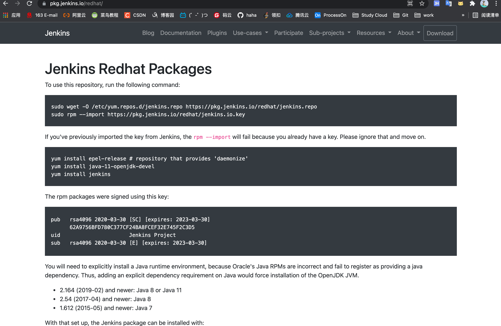
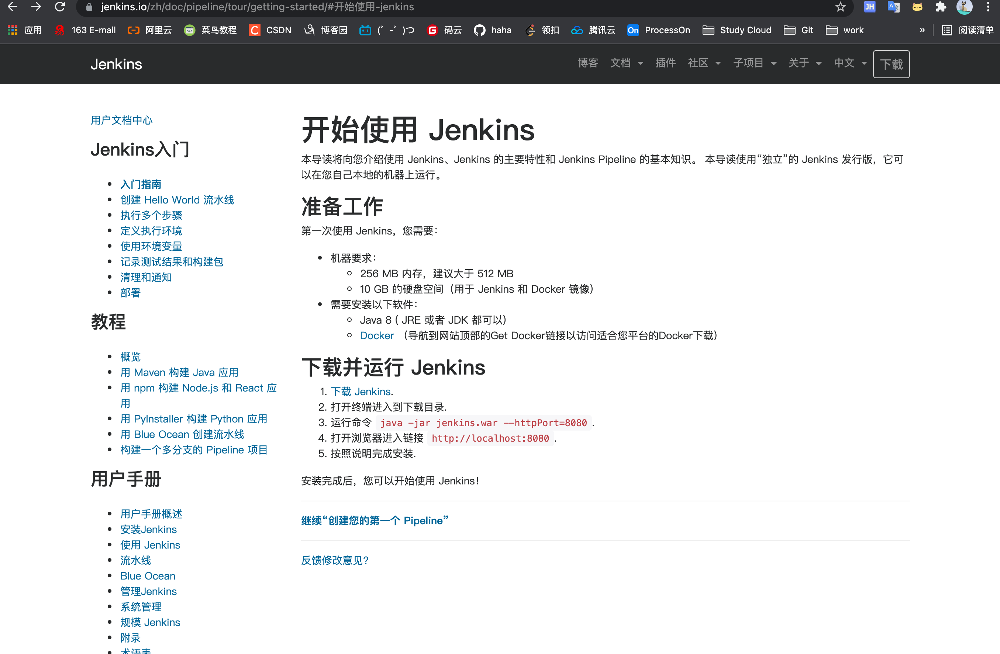
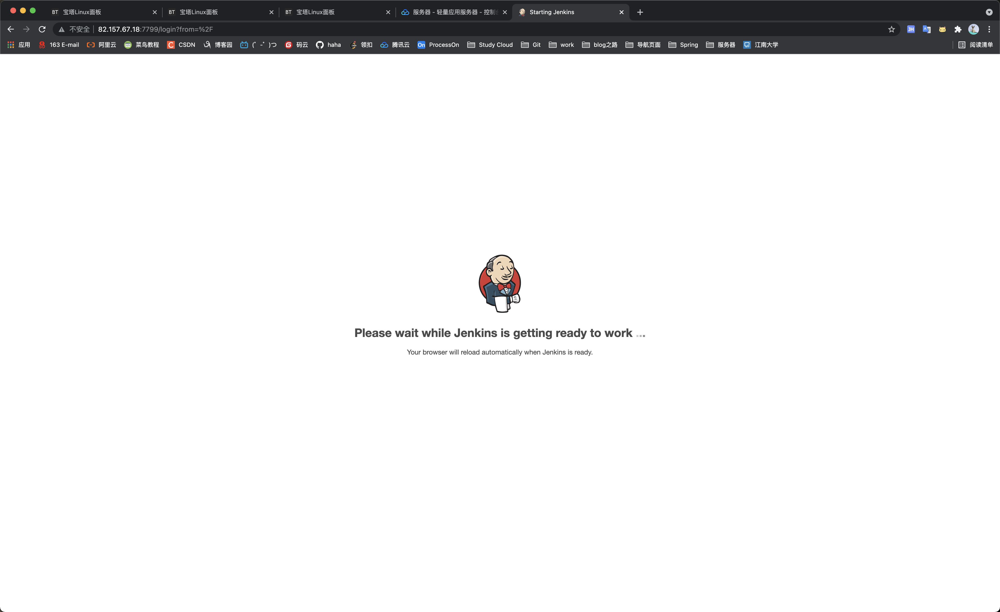
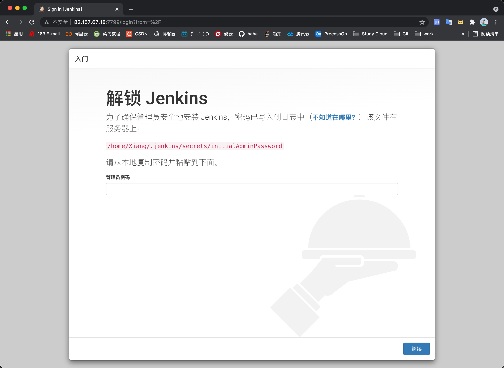

> 创建于 2021年11月7日
> 作者：想想

[toc]

### 文献：

```
https://pkg.jenkins.io/redhat/
```



```
https://www.jenkins.io/zh/doc/pipeline/tour/getting-started/#%E5%BC%80%E5%A7%8B%E4%BD%BF%E7%94%A8-jenkins
```



## 安装环境

以 Linux +  CentOS 8.2 为例

有 `java` 、 `maven` 、 `git` 环境

```sh
[Xiang@Xiang-King ~]$ java -version
java version "1.8.0_181"
Java(TM) SE Runtime Environment (build 1.8.0_181-b13)
Java HotSpot(TM) 64-Bit Server VM (build 25.181-b13, mixed mode)
```

```sh
[Xiang@Xiang-King ~]$ mvn -v
Apache Maven 3.8.3 (ff8e977a158738155dc465c6a97ffaf31982d739)
Maven home: /usr/local/maven/apache-maven-3.8.3
Java version: 1.8.0_181, vendor: Oracle Corporation, runtime: /usr/local/java/jdk1.8.0_181/jre
Default locale: en_US, platform encoding: UTF-8
OS name: "linux", version: "4.18.0-305.3.1.el8.x86_64", arch: "amd64", family: "unix"
```

```sh
[Xiang@Xiang-King ~]$ git --version
git version 2.27.0
```

## 开始安装

### 1、改变 yum 源

```sh
sudo wget -O /etc/yum.repos.d/jenkins.repo https://pkg.jenkins.io/redhat/jenkins.repo
```


```sh
[Xiang@Xiang-King ~]$   sudo wget -O /etc/yum.repos.d/jenkins.repo https://pkg.jenkins.io/redhat/jenkins.repo
--2021-11-07 16:46:13--  https://pkg.jenkins.io/redhat/jenkins.repo
Resolving pkg.jenkins.io (pkg.jenkins.io)... 151.101.110.133, 2a04:4e42:1a::645
Connecting to pkg.jenkins.io (pkg.jenkins.io)|151.101.110.133|:443... connected.
HTTP request sent, awaiting response... 200 OK
Length: 71
Saving to: ‘/etc/yum.repos.d/jenkins.repo’

/etc/yum.repos.d/jenkins.repo             100%[=====================================================================================>]      71  --.-KB/s    in 0s      
2021-11-07 16:46:17 (7.24 MB/s) - ‘/etc/yum.repos.d/jenkins.repo’ saved [71/71]
```

### 2、获取密钥

`sudo rpm --import https://pkg.jenkins.io/redhat/jenkins.io.key`

```sh
[Xiang@Xiang-King ~]$ sudo rpm --import https://pkg.jenkins.io/redhat/jenkins.io.key
```

如果您之前已经从Jenkins导入了密钥，rpm -import将会失败，因为您已经有了密钥。请忽略它，继续前进。

### 3、安装 epel-release

`sudo yum install epel-release # repository that provides 'daemonize'`

```sh
[Xiang@Xiang-King ~]$ sudo yum install epel-release # repository that provides 'daemonize'
Repository epel is listed more than once in the configuration
Jenkins                                                                                                                                  10 kB/s |  94 kB     00:09    
Last metadata expiration check: 0:00:06 ago on Sun 07 Nov 2021 04:54:52 PM CST.
Package epel-release-8-13.el8.noarch is already installed.
Dependencies resolved.
Nothing to do.
Complete!
```

### 4、安装 jdk

其实我在此之前就安装过了

`yum install java-11-openjdk-devel`

### 5、安装jekins

`sudo yum install jenkins`

### 6、启动jenkins

`java -jar jenkins.war --httpPort=7799`

```sh
[Xiang@Xiang-King jenkins]$ java -jar jenkins.war --httpPort=7799
Running from: /home/Xiang/jenkins/jenkins.war
webroot: $user.home/.jenkins
...

Jenkins initial setup is required. An admin user has been created and a password generated.
Please use the following password to proceed to installation:

4eda89ad90c54c08bf7759836d08d0c4

This may also be found at: /home/Xiang/.jenkins/secrets/initialAdminPassword
```

### 7、访问 jenkins

```
http://82.157.67.18:7799
```



### 8、修改镜像源

找到 `hudson.model.UpdateCenter.xml` 文件位置

```sh
vim /home/Xiang/.jenkins/hudson.model.UpdateCenter.xml
```

将` https://updates.jenkins.io/update-center.json` 修改成 `http://mirror.xmission.com/jenkins/updates/update-center.json`

之后重启Jenkins服务，再重新刷新Jenkins启动页面即可



### 默认配置

```sh
（1）/usr/lib/jenkins/：jenkins安装目录，WAR包会放在这里。
 (2) /etc/sysconfig/jenkins：jenkins配置文件，“端口”，“JENKINS_HOME”等都可以在这里配置。
（3）/var/lib/jenkins/：默认的JENKINS_HOME。
（4）/var/log/jenkins/jenkins.log：Jenkins日志文件。
```

