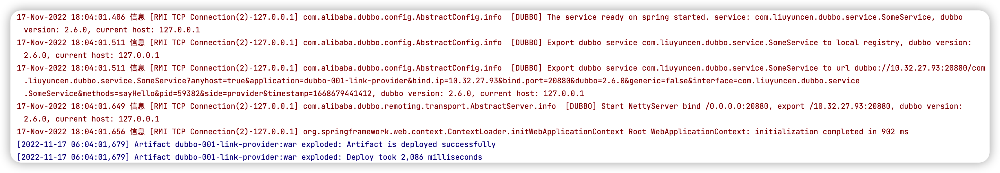

### SpringMVC 整合 Dubbo

众所周知 Dubbo 是一个优秀的RPC框架

... 好了不介绍了

SpringMVC 整合 Dubbo 的配置文件及注意事项

> Tomcat 8、Dubbo 2.6.0、Spring 4.3.16.RELEASE

[toc]


#### 项目结构

```
# provider
src
└── main
    ├── java
    │   └── com
    │       └── liuyuncen
    │           └── dubbo
    │               └── service
    │                   ├── SomeService.java
    │                   └── impl
    │                       └── SomeServiceImpl.java
    ├── resources
    │   └── dubbo-link-provider.xml
    └── webapp
        ├── WEB-INF
        │   └── web.xml
        └── index.jsp
pom.xml

# consumer
src
└── main
    ├── java
    │   └── com
    │       └── liuyuncen
    │           └── dubbo
    │               └── web
    │                   └── SomeController.java
    ├── resources
    │   ├── dubbo-link-consumer.xml
    │   └── springmvc.xml
    └── webapp
        ├── WEB-INF
        │   └── web.xml
        └── hello.jsp
pom.xml

```

#### 代码展示

provider SomeServiceImpl.java

```java
package com.liuyuncen.dubbo.service;

/**
 * @belongsProject: dubbo-workspace
 * @belongsPackage: com.liuyuncen.dubbo.service
 * @author: Xiang想
 * @createTime: 2022-11-17  14:30
 * @description: TODO
 * @version: 1.0
 */
public interface SomeService {

    String sayHello(String msg);
}
```

provider web.xml

```xml
<?xml version="1.0" encoding="UTF-8"?>
<web-app xmlns="http://xmlns.jcp.org/xml/ns/javaee" xmlns:xsi="http://www.w3.org/2001/XMLSchema-instance"
         xsi:schemaLocation="http://xmlns.jcp.org/xml/ns/javaee
                      http://xmlns.jcp.org/xml/ns/javaee/web-app_4_0.xsd" version="4.0">
    <context-param>
        <param-name>contextConfigLocation</param-name>
        <param-value>classpath:dubbo-link-provider.xml</param-value>
    </context-param>
    <listener>
        <listener-class>org.springframework.web.context.ContextLoaderListener</listener-class>
    </listener>
</web-app>
```

consumer springmvc.xml

```xml
<?xml version="1.0" encoding="UTF-8"?>
<beans xmlns="http://www.springframework.org/schema/beans"
       xmlns:xsi="http://www.w3.org/2001/XMLSchema-instance"
       xmlns:context="http://www.springframework.org/schema/context"
       xmlns:mvc="http://www.springframework.org/schema/mvc"
       xsi:schemaLocation="http://www.springframework.org/schema/beans http://www.springframework.org/schema/beans/spring-beans.xsd http://www.springframework.org/schema/context http://www.springframework.org/schema/context/spring-context.xsd http://www.springframework.org/schema/tool http://www.springframework.org/schema/tool/spring-tool.xsd http://www.springframework.org/schema/mvc http://www.springframework.org/schema/mvc/spring-mvc.xsd">

    <context:component-scan base-package="com.liuyuncen.dubbo.web"/>
    <mvc:annotation-driven/>
    <bean class="org.springframework.web.servlet.view.InternalResourceViewResolver">
        <property name="prefix" value="/"/>
        <property name="suffix" value=".jsp"/>
    </bean>
</beans>
```

consumer web.xml

```xml
<?xml version="1.0" encoding="UTF-8"?>
<web-app xmlns="http://xmlns.jcp.org/xml/ns/javaee" xmlns:xsi="http://www.w3.org/2001/XMLSchema-instance"
         xsi:schemaLocation="http://xmlns.jcp.org/xml/ns/javaee
                      http://xmlns.jcp.org/xml/ns/javaee/web-app_4_0.xsd" version="4.0">
  <display-name>Archetype Created Web Application</display-name>
  <servlet>
    <servlet-name>dispatcherServlet</servlet-name>
    <servlet-class>org.springframework.web.servlet.DispatcherServlet</servlet-class>
    <init-param>
      <param-name>contextConfigLocation</param-name>
      <param-value>classpath:dubbo-link-consumer.xml,classpath:springmvc.xml</param-value>
    </init-param>
    <load-on-startup>1</load-on-startup>
  </servlet>
  <servlet-mapping>
    <servlet-name>dispatcherServlet</servlet-name>
    <url-pattern>/</url-pattern>
  </servlet-mapping>
</web-app>
```

consumer hello.jsp

```jsp
<%--
  Created by IntelliJ IDEA.
  User: xiang
  Date: 2022/11/17
  Time: 3:12 PM
  To change this template use File | Settings | File Templates.
--%>
<%@ page contentType="text/html;charset=UTF-8" language="java" %>
<html>
<head>
    <title>Title</title>
</head>
<body>
<h1>${msg}</h1>
</body>
</html>
```

#### 核心配置

dubbo-link-provider.xml

```xml
<?xml version="1.0" encoding="UTF-8"?>
<beans xmlns="http://www.springframework.org/schema/beans"
       xmlns:xsi="http://www.w3.org/2001/XMLSchema-instance" xmlns:dubbo="http://code.alibabatech.com/schema/dubbo"
       xsi:schemaLocation="http://www.springframework.org/schema/beans http://www.springframework.org/schema/beans/spring-beans.xsd http://code.alibabatech.com/schema/dubbo http://code.alibabatech.com/schema/dubbo/dubbo.xsd">

<!--    声明服务提供者名称，保证它的唯一性，它是 dubbo 内部使用的唯一标识 -->
    <dubbo:application name="dubbo-001-link-provider"/>

<!--    指定dubbo协议名称和端口号 name 协议    port 端口 默认 20880 -->
    <dubbo:protocol name="dubbo" port="20880"/>

<!--    暴露服务:dubbo:service
        interface 暴露服务的接口和全限定类名
        ref 引用接口在 spring 容器中的标识名称
        registry 使用直连方式 N/A
-->
    <dubbo:service interface="com.liuyuncen.dubbo.service.SomeService"
                   ref="someServiceImpl"
                   registry="N/A"/>

<!--    加载接口实现类-->
    <bean id="someServiceImpl" class="com.liuyuncen.dubbo.service.impl.SomeServiceImpl"/>
</beans>
```

dubbo-link-consumer.xml

```xml
<?xml version="1.0" encoding="UTF-8"?>
<beans xmlns="http://www.springframework.org/schema/beans"
       xmlns:xsi="http://www.w3.org/2001/XMLSchema-instance" xmlns:dubbo="http://code.alibabatech.com/schema/dubbo"
       xsi:schemaLocation="http://www.springframework.org/schema/beans http://www.springframework.org/schema/beans/spring-beans.xsd http://code.alibabatech.com/schema/dubbo http://code.alibabatech.com/schema/dubbo/dubbo.xsd">

    <!--    声明服务消费者名称，保证它的唯一性，它是dubbo内部服务名称唯一标识-->
    <dubbo:application name="dubbo-002-link-consumer"/>

    <!--    引用远程接口
    id 远程接口服务的代理对象名称
    interface 接口的全限定类名
    url 调用远程接口服务的url地址
    registry 直连方式，不使用注册中心，值为 N/A
    -->
    <dubbo:reference id="someServiceImpl"
                     interface="com.liuyuncen.dubbo.service.SomeService"
                     url="dubbo://localhost:20880"
                     registry="N/A"/>
</beans>
```


#### 项目启动

因为是 SpringMVC 项目，Tomcat 启动

provider 启动日志:



Consumer 启动日志


