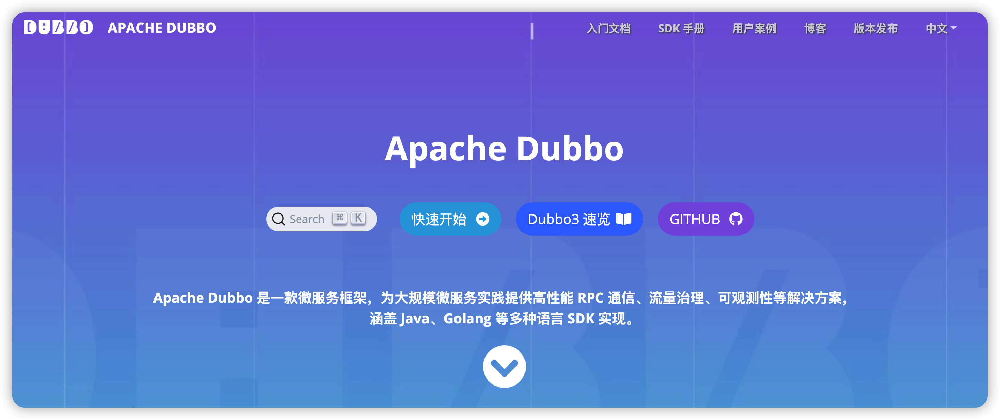

```
Dubbo 是一个优秀的RPC框架
```



**Apache Dubbo 是一款微服务框架，为大规模微服务实践提供高性能 RPC 通信、流量治理、可观测性等解决方案，**
**涵盖 Java、Golang 等多种语言 SDK 实现。**

### Dubbo

+ Dubbo 一直都是 Alibaba 公司内部使用框架
+ 2011年 dubbo 被托管到 GitHub 开源
+ 2014年11月 发布 2.4.11 宣布停止更新
+ 2017年 SpringCloud 横空出世，Dubbo 感觉压力紧张更新了好几个版本
+ 2018年 阿里联合当当将 Dubbo 和 DubboX 合并，发布2.6 版
+ 2018年 除夕夜 阿里将 Dubbo 贡献给 Apache 基金会
+ 至今 Apache 维护和更新 Dubbo


> 官网地址：https://dubbo.apache.org/zh/

