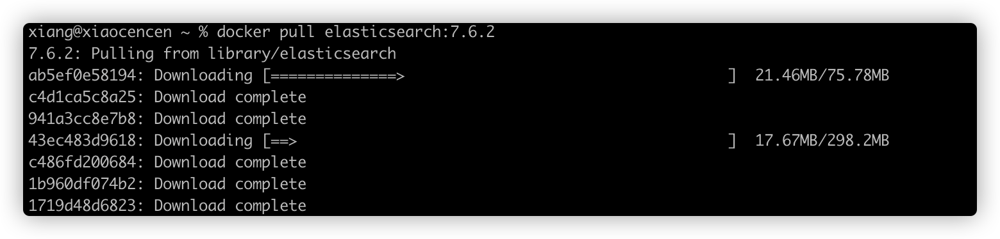
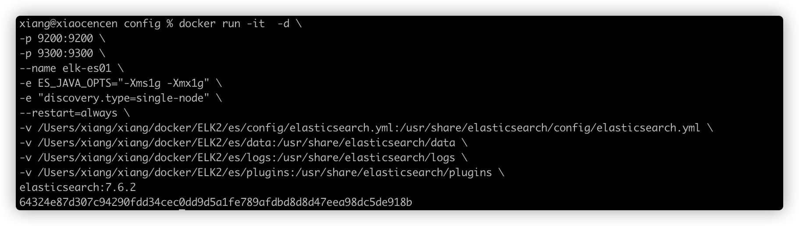
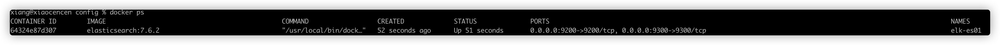
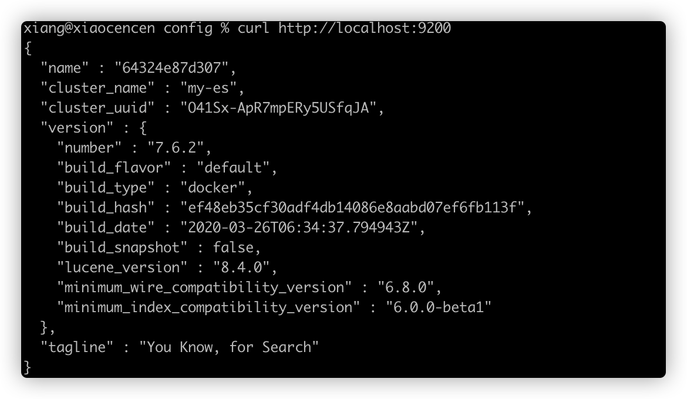
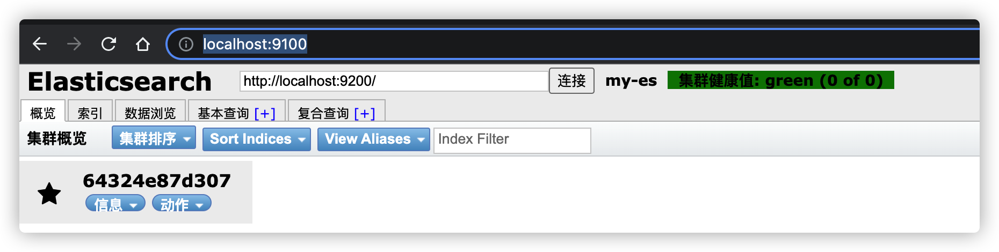
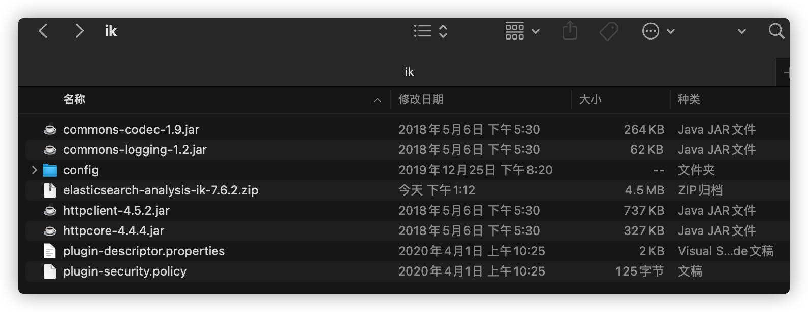
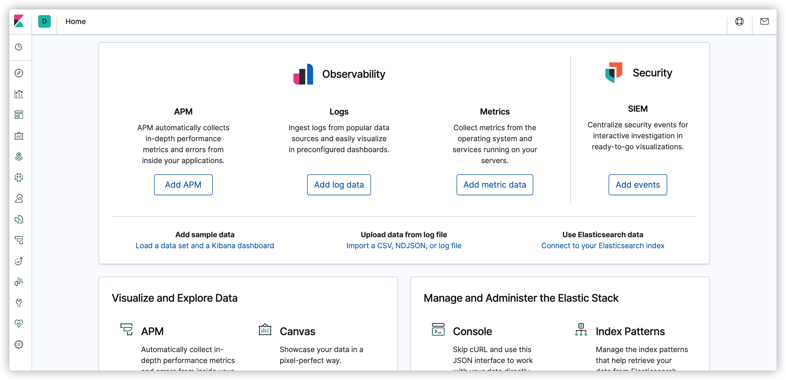

[toc]

准备工作，docker 容器

### 1、Docker 方式部署 Elasticsearch 数据库

从互联网下载 Elasticsearch 精修

```sh
docker pull elasticsearch:7.6.2
```



配置 ES，创建挂载目录

```sh
mkdir /Users/xiang/xiang/docker/ELK2/es/{config,data,logs,plugins}
```

配置文件

```sh
cat > /Users/xiang/xiang/docker/ELK2/es/config/elasticsearch.yml << EOF
cluster.name: "my-es"
network.host: 0.0.0.0
http.port: 9200
http.cors.enabled: true
http.cors.allow-origin: "*"
EOF
```

启动 elasticsearch 容器

```sh
docker run -it  -d \
-p 9200:9200 \
-p 9300:9300 \
--name elk-es01 \
-e ES_JAVA_OPTS="-Xms1g -Xmx1g" \
-e "discovery.type=single-node" \
--restart=always \
-v /Users/xiang/xiang/docker/ELK2/es/config/elasticsearch.yml:/usr/share/elasticsearch/config/elasticsearch.yml \
-v /Users/xiang/xiang/docker/ELK2/es/data:/usr/share/elasticsearch/data \
-v /Users/xiang/xiang/docker/ELK2/es/logs:/usr/share/elasticsearch/logs \
-v /Users/xiang/xiang/docker/ELK2/es/plugins:/usr/share/elasticsearch/plugins \
elasticsearch:7.6.2
```





验证 elasticsearch 是否启动成功

```sh
curl http://localhost:9200
```



安装 ES 辅助工具，这个工具安装好之后，就相当于启动了这个服务，这个服务是一个站点，通过这个站点里面  ES的API，就可以获取到 ES的当前信息了

下载 elasticsearch-head 镜像

```sh
docker pull mobz/elasticsearch-head:5
```

运行 elasticsearch-head 容器

```sh
docker run -d -p 9100:9100 mobz/elasticsearch-head:5
```

访问浏览器  http://localhost:9100/



下载 ES IK 分词器，可以直接通过这个链接下载，这里选对应版本 7.6.2

```
https://github.com/medcl/elasticsearch-analysis-ik/releases/download/v7.6.2/elasticsearch-analysis-ik-7.6.2.zip
```

放到 /Users/xiang/xiang/docker/ELK2/es/plugins/ik/ 目录下进行解压



### 2、Docker 部署 Kibana 可视化工具

```sh
docker pull kibana:7.6.2
```

获取 elasticsearch 容器 ip

```sh
docker inspect --format '{{ .NetworkSettings.IPAddress }}' elk-es01
```

结果是 ：172.17.0.3

创建 kibana 配置文件

```sh
mkdir -p /Users/xiang/xiang/docker/ELK2/kibana

cat > /Users/xiang/xiang/docker/ELK2/kibana/kibana.yml <<EOF
server.name: kibana
server.host: "0"
elasticsearch.hosts: ["http://172.17.0.3:9200"]
xpack.monitoring.ui.container.elasticsearch.enabled: true
EOF
```

启动

```
docker run -it -d  --restart=always \
--name elk-kibana -p 5601:5601 -v /Users/xiang/xiang/docker/ELK2/kibana/kibana.yml:/usr/share/kibana/config/kibana.yml kibana:7.6.2 
```

访问 http://localhost:5601 就可以看到 Kibana 页面了



### 3、Docker 安装 Logstash

```sh
docker pull logstash:7.6.2
```

