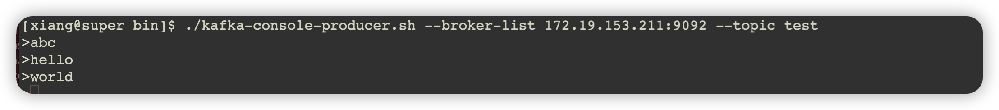
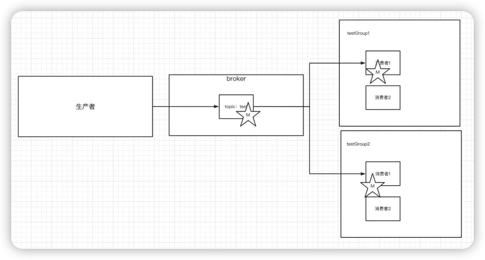
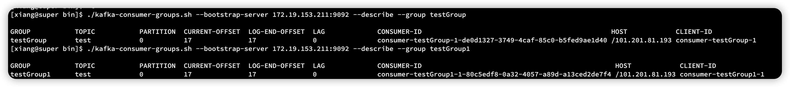
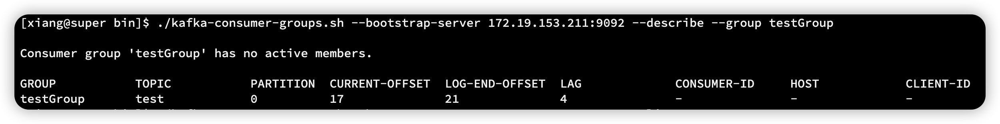
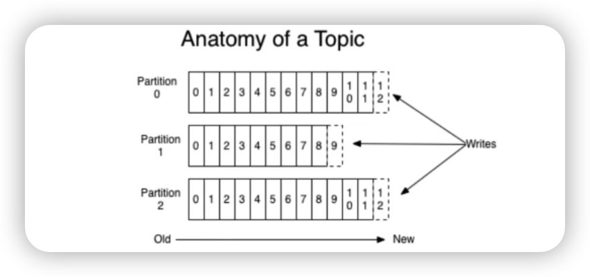
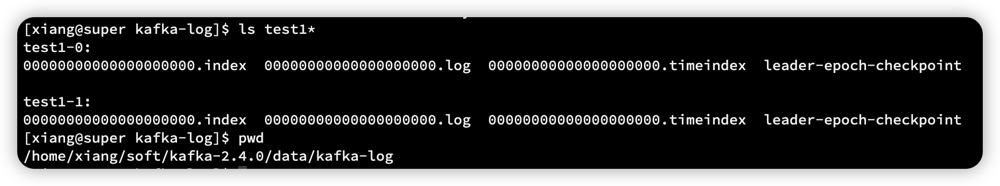

### 一、Kafka 介绍

Kafka 是最初由 Linkedin 公司开发，是一个分布式、支持分区的（partition）、多副本（replica）基于zookeeper 协调的分布式消息系统，它的最大特性就是可以实时的处理大量数据以满足各种需求，比如基于 hadoop 的批量处理系统，低延迟系统、Storm/Spark 流式处理引擎，web/nginx 日志，访问日志，消息服务等等，用 scala 语言编写，LInkedin 与2010 年贡献给了 Apache 基金并成为顶级开源项目。

#### 1.1、Kafka使用场景

+ 日志收集、一个公司可以用 kafka 收集各种日志，通过kafka 以统一接口服务方式开放各种 consumer，例如 hadoop、Hbase、Solr 等
+ 消息系统：解耦和生产者、消费者、缓存消息等
+ 用户活动追踪：Kafka 经常被用来记录 web 用户或者 app 用户各种活动，如浏览网页，搜索、点击等活动，这些活动信息被各个服务器发布到 kafka 的 topic 中国，然后订阅者通过订阅这些 topic 来实时监控分析。或者装载到 hadoop、数据仓库中做离线分析和挖掘
+ 运营指标：kafka 也经常用来记录运营监控数据。包括手机各种分布式应用数据，生产各种操作的集中反馈，比如报警和报告。

#### 1.2、Kafka基本概念

kafka 是一个分布式，分区的消息服务，它提供一个消息系统应该具备的功能，但是确实有独到的设计，kafka 借鉴JMS 规范思想，但是确并没有完全遵循 JMS 规范

首先，让我们来看一下基础的消息名词

| 名词          | 解释                                                         |
| ------------- | ------------------------------------------------------------ |
| Broker        | 消息中间件处理节点，一个Kafka节点就是一个 broker，一个或多个broker可以组成一个kafka集群 |
| Topic         | kafka根据 topic对消息进行归类，发布到 Kafka 集群的每一条消息都需要指定 topic |
| Producer      | 消息生产者，向 broker 发送消息                               |
| Consumer      | 消息消费者，向 broker 读取消息                               |
| ConsumerGroup | 每个 consumer 属于一个特定的 consumer group，一条消息可以被多个不同的 consumer gourp 消费，但是一个comsumerGroup 中只有1个consumer 可以消费 |
| Partition     | 物理概念，一个topic 可以分为多个 partition，每个partition内部是有序的 |

### 二、安装 Kafka

下载地址：

https://archive.apache.org/dist/kafka/2.4.0/kafka_2.11-2.4.0.tgz

直接解压

#### 2.1、修改配置文件

修改 conf/server.properties

注意以下几个参数

```properties
# 在kafka集群中必须是唯一的
broker.id=0
# 主机地址：端口
# 内网
listeners=PLAINTEXT://172.19.153.211:9092 
# 外网
advertised.listeners=PLAINTEXT://101.201.81.193:9092
# log 日志
log.dirs=/home/xiang/soft/kafka-2.4.0/data/kafka-log
# zookeeper 地址
zookeeper.connect=localhost:2181
```

#### 2.2、启动

```sh
./kafka-server-start.sh -daemon ../config/server.properties 
```

`-daemon` 后台启动，如果不加就是展示日志启动

启动后查看是否成功

在 zookeeper 的服务器里

```sh
[zk: localhost:2181(CONNECTED) 19] ls /brokers/ids
[0]
```

这个 0 就是刚刚在 server.properties 里的 broker ，这里就代表 kafka 注册到 zookeeper 里来了

#### 2.3、创建topic

创建 topic

```sh
./kafka-topics.sh --create --zookeeper localhost:2181 --replication-factor 1 --partitions 1 --topic test
```

查看 topic

```sh
./kafka-topics.sh --list --zookeeper localhost:2181 test
```

### 三、发送消息

把消息发送给 broker 中的某个 topic，打开一个 kafka 发送消息的客户端，然后开始用客户端向 kafka 服务器发送消息

```sh
./kafka-console-producer.sh --broker-list 172.19.153.211:9092 --topic test
```



打开之后，每发一句话，就是发送一个消息

#### 3.1、消费消息

+ 方式一：从最后一条消息的偏移量+1 开始消费

```sh
./kafka-console-consumer.sh --bootstrap-server 172.19.153.211:9092 --topic test
```

+ 方式二：从头开始消费

```sh
./kafka-console-consumer.sh --bootstrap-server 172.19.153.211:9092 --from-beginning --topic test
```

几点注意：

+ 消息会被存储
+ 消息是顺序存储
+ 消息是有偏移量的
+ 消费时可以指明偏移量进行消费

#### 3.2、关于消息的细节

+ 生产者将消息发送给 broker ，broker 会将消息保存在本地日志文件中

```
log.dirs/分区-主题/0000000000.log
```

+ 消息的保存是有序的，通过 offset 偏移量来描述消息的有序性
+ 消费者消费消息时也是通过 offset 来描述当前要消费的那条消息的位置

#### 3.3、单播消息

如果多个消费者在同一个消费组，那么只有一个消费组可以收到订阅的topic中的消息。换言之，同一个消费组中只能有一个消费者收到 topic 中的消息 

```sh
./kafka-console-consumer.sh --bootstrap-server 172.19.153.211:9092 --consumer-property  group.id=testGroup --topic test
```

#### 3.4、多播消息

不同的消息组订阅同一个 topic，那么不同的消费组中只有一个消费组能收到。实际上也是多个消费组中的多个消费组收到了同一个消息

两条命令 `group.id` 不一样  

```sh
./kafka-console-consumer.sh --bootstrap-server 172.19.153.211:9092 --consumer-property  group.id=testGroup --topic test
```

```sh
./kafka-console-consumer.sh --bootstrap-server 172.19.153.211:9092 --consumer-property  group.id=testGroup1 --topic test
```




#### 3.5、查看消费组及信息

```sh
# 查看当前主题下有哪些消费组
./kafka-consumer-groups.sh --bootstrap-server 172.19.153.211:9092 --list

# 查看消费组中的具体信息:比如当前偏移量、最后一条消息的偏移量、堆积的消息数量
./kafka-consumer-groups.sh --bootstrap-server 172.19.153.211:9092 --describe --group testGroup
```



当我们关掉所有的客户端，再发 4 条消息，重新获取偏移量等信息



+ Partition 分区
+ Current-offset 最后被消费的消息的偏移量
+ Log-end-offset 消息总量（最后一条消息的偏移量）
+ lag 积压了多少消息

### 四、主题、分区的概念

#### 4.1、主题 Topic

主题-topic 在kafka 中是一个逻辑的概念，kafka 通过topic 将消息进行分类。不同的topic 会被订阅 topic 的消费者消息，但是有一个问题，如果说这个topic中的消息非常多，多到几个T来存，因为消息是会被保存到 log 日志文件中的。为了解决文件过大的问题，kafka 提出了 Partition 分区的概念

#### 4.2、Partition分区

##### 4.2.1、分区的概念

通过 Partition 将一个topic 中的消息分区来存储，这样有多个好处

+ 分区存储，可以解决统一存储文件过大问题
+ 提供了读取的吞吐量：读和写可以同时在多个分区处理



细节：

+ 定期将自己消费分区的 offset 提交给 kafka 内部 topic：__consumer_offsets 提交过去的时候，key 是 consumerGroupId + topic + 分区号，value 就是当前 offset 的值，kafka 会定期清理 topic 里的消息，最后就保留最新的那条消息
+ 因为 __consumer_offset 可能会接收到高并发的请求，kafka 默认给其分配了50个分区，可以通过（offsets.topic.num.partitions 设置），这样可以通过加机器的方式抗大并发。
+ 通过如下公式可以选出 consumer 消费的 offset 要提交到 __consumer_offset 的哪一个分区

> 公式：hash（consumerGroupId）% __consumer_offsets 主题的分区数

##### 4.2.2、创建分区

执行以下命令创建为 “test” 的 topic，这个topic 只有2个 partition 

```sh
./kafka-topics.sh --create --zookeeper 172.19.153.211:2181 --replication-factor 1 --partitions 2 --topic test1
```

到 data/kafka-log  目录下查看以下，可以看到有 test1-0、test1-1 两个分区  



查看当前kafka内有哪些 topic 

```sh
./kafka-topics.sh --list --zookeeper 172.19.153.211:2181
```


```sh
./kafka-topics.sh --create --zookeeper 172.19.153.211:2181 --partitions 2 --topic test1
```

