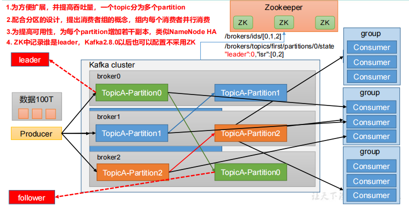
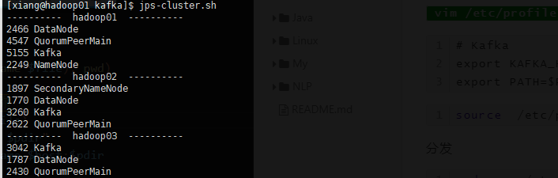

## Kafka 基础架构



1. Producer：生产者
2. Consumer：消费者
3. Consumer Group（CG）消费组，由多个 consumer 组成，消费组组内每个消费组消费不同分区的数据，一个分区只能由一个组内消费组消费，消费者组之间互不影响，所有的消费者都属于某个消费者组，即消费者组是逻辑上的一个订阅者。
4. Broker：一台 Kafka 服务器就是一个 broker，一个集群由多个 broker 组成，一个broker 可以容纳多个 topic
5. Topic：可以理解为一个队列，生产者和消费者面向的都是一个 topic
6. Partition：为了实现扩展性，一个非常大的 topic可以分布到多个 broker 上，一个 topic 可以分为多个 partition，每个 partition 都是一个有序队列
7. Replica：副本，一个 Topic 的每个分区都有若干个副本，一个 Leader 和若干个 Follower
8. Leader：老大
9. Follower：小弟。老大挂掉时候，小弟晋升为老大


## 部署安装

| Hadoop01  | Hadoop02  | Hadoop03  |
| --------- | --------- | --------- |
| zookeeper | zookeeper | zookeeper |
| Kafka     | Kafka     | Kafka     |

Hadoop01 解压 `kafka_2.12-3.0.0.tgz` 到 `/opt/module`

#### 配置


修改 `server.properties`

创建log目录 

```sh
mkdir -p /opt/module/kafka_2.12-3.0.0/logs
```

```properties
#broker 的全局唯一编号，不能重复，只能是数字。
broker.id=0

#处理网络请求的线程数量
num.network.threads=3
#用来处理磁盘 IO 的线程数量
num.io.threads=8
#发送套接字的缓冲区大小
socket.send.buffer.bytes=102400
#接收套接字的缓冲区大小
socket.receive.buffer.bytes=102400
#请求套接字的缓冲区大小
socket.request.max.bytes=104857600
#kafka 运行日志(数据)存放的路径，路径不需要提前创建，kafka 自动帮你创建，可以配置多个磁盘路径，路径与路径之间可以用"，"分隔
#提前创建好这个目录 
log.dirs=/opt/module/kafka_2.12-3.0.0/logs

#topic 在当前 broker 上的分区个数
num.partitions=1
#用来恢复和清理 data 下数据的线程数量
num.recovery.threads.per.data.dir=1
# 每个 topic 创建时的副本数，默认时 1 个副本
offsets.topic.replication.factor=1
#segment 文件保留的最长时间，超时将被删除
log.retention.hours=168
#每个 segment 文件的大小，默认最大 1G
log.segment.bytes=1073741824
# 检查过期数据的时间，默认 5 分钟检查一次是否数据过期
log.retention.check.interval.ms=300000
#配置连接 Zookeeper 集群地址（在 zk 根目录下创建/kafka，方便管理）
zookeeper.connect=hadoop01:2181,hadoop02:2181,hadoop03:2181/kafka
```

分发 Kafka

```sh
scp -r kafka_2.12-3.0.0/ hadoop02:$PWD
scp -r kafka_2.12-3.0.0/ hadoop03:$PWD
```


#### 修改环境变量

`vim /etc/profile.d/bigdata.sh`

```
# Kafka
export KAFKA_HOME=/opt/module/kafka_2.12-3.0.0
export PATH=$PATH:$KAFKA_HOME/bin
```

```sh
source  /etc/profile.d/bigdata.sh
```

分发

```sh
sudo scp /etc/profile.d/bigdata.sh hadoop02:/etc/profile.d/bigdata.sh
sudo scp /etc/profile.d/bigdata.sh hadoop03:/etc/profile.d/bigdata.sh
```


#### 启动

```sh
cd /opt/module/kafka

bin/kafka-server-start.sh -daemon config/server.properties
```



集群启动方法

```sh
#!/bin/bash

case $1 in
"start"){
    for i in xiang@hadoop01 xiang@hadoop02 xiang@hadoop03
    do
        echo "---- 启动 $i kafka ----"
        ssh $i "source /etc/profile; /opt/module/kafka/bin/kafka-server-start.sh -daemon /opt/module/kafka/config/server.properties"
    done
}
;;
"stop"){
    for i in xiang@hadoop01 xiang@hadoop02 xiang@hadoop03
    do
        echo "---- 停止 $i kafka ----"
        ssh $i "source /etc/profile; /opt/module/kafka/bin/kafka-server-stop.sh -daemon /opt/module/kafka/config/server.properties"
    done
}
;;
esac
```

+ 启动 `kafka-cluster.sh start`
+ 停止 `kafka-cluster.sh stop`