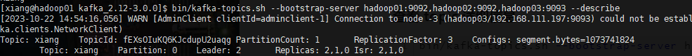
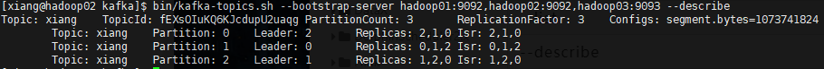

### 主题命令启动

```sh
bin/kafka-topics.sh
```

| 参数                                              | 描述                                   |
| ------------------------------------------------- | -------------------------------------- |
| --bootstrap-server <String: server toconnect to>  | 连接的 Kafka Broker 主机名称和端口号。 |
| --topic <String: topic>                           | 操作的 topic 名称。                    |
| --create                                          | 创建主题。                             |
| --delete                                          | 删除主题。                             |
| --alter                                           | 修改主题。                             |
| --list                                            | 查看所有主题                           |
| --describe                                        | 查看主题详细描述。                     |
| --partitions <Integer: # of partitions>           | 设置分区数。                           |
| --replication-factor<Integer: replication factor> | 设置分区副本。                         |
| --config <String: name=value>                     | 更新系统默认的配置。                   |


生产环境，一次连接多个 Kafka 避免宕机

##### 查看 topic

```sh
bin/kafka-topics.sh --bootstrap-server hadoop01:9092,hadoop02:9092,hadoop03:9092 --list
```


##### 创建 topic

指定1个分区，3块副本==（必须指定）==

```sh
bin/kafka-topics.sh --bootstrap-server hadoop01:9092,hadoop02:9092,hadoop03:9092 --topic xiang --create --partitions 1 --replication-factor 3
```

##### 查看 topic 详细信息

```sh
bin/kafka-topics.sh --bootstrap-server hadoop01:9092,hadoop02:9092,hadoop03:9092 --describe 
```



+ Leader：2 这里的 2 代表之前的，`broker.id=0`  谁配置的是2 ，谁就是 Leader


##### 增加分区

```sh
bin/kafka-topics.sh --bootstrap-server hadoop01:9092,hadoop02:9092,hadoop03:9092 --topic xiang --alter --partitions 3
```




##### 写入数据

 ```sh
bin/kafka-console-producer.sh --bootstrap-server hadoop01:9092 --topic xiang
 ```


##### 消费数据

```sh
bin/kafka-console-consumer.sh -bootstrap-server hadoop01:9092 --topic xiang
```


##### 消费历史数据

```sh
bin/kafka-console-consumer.sh --bootstrap-server hadoop01:9092 --topic xiang --from-beginning
```

读取所有历史数据


