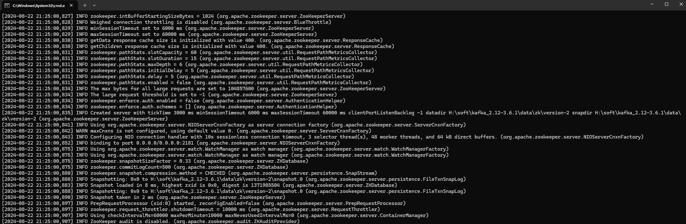
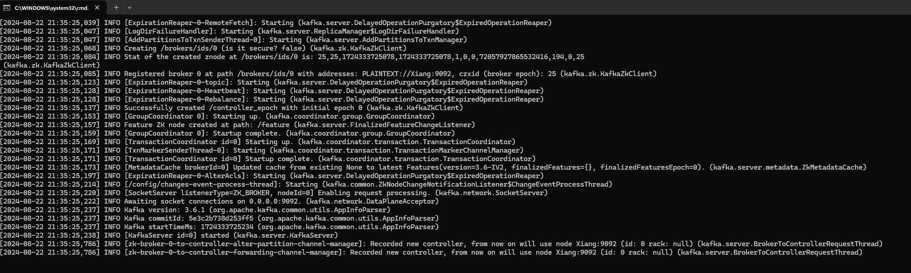
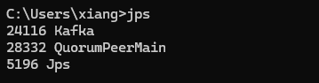
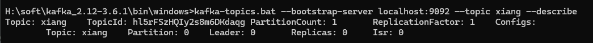
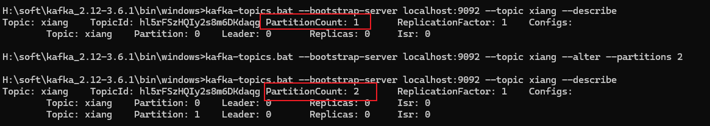
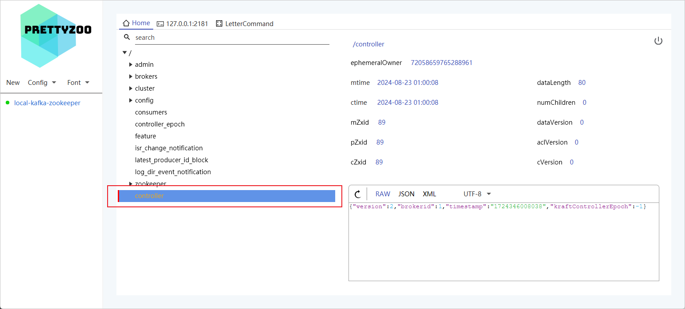
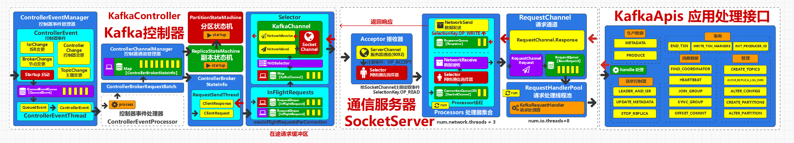

> 2024-08-22


需要 JDK8 环境

### Windows 安装 Kafka


解压 `kafka_2.12-3.6.1` 修改  `conf/zookeeper.properties`

创建 `$KAFKA_HOME/data` 目录

```
dataDir=H:/soft/kafka_2.12-3.6.1/data/zk
```


进入到  `$KAFKA_HOME/bin/windows` 目录下进入 CMD 控制台执行

```sh
zookeeper-server-start.bat ../../config/zookeeper.properties
```




在 `$KAFKA_HOME` 下创建 `zkStart.cmd` 文件

```sh
call bin/windows/zookeeper-server-start.bat config/zookeeper.properties
```

`zkStop.cmd`

```sh
call bin/windows/zookeeper-server-stop.bat
```

后续直接双击这两个文件就可以启动关闭


修改 `$KAFKA_HOME/config/server.properties`

```sh
log.dirs=H:/soft/kafka_2.12-3.6.1/data/kafka
```

在 `$KAFKA_HOME` 下创建 `kafkaStart.cmd` 文件




先启动 zookeeper 再启动 kafka 这样再 data 目录下就会有 kafka 和 zk 两个文件



关闭的时候，先关闭 kafka，再关闭 zookeeper


### 操作 Kafka 

先进入 `H:\soft\kafka_2.12-3.6.1\bin\windows` 目录下，执行 cmd


创建 `xiang ` topic

```sh
kafka-topics.bat --bootstrap-server localhost:9092 --topic xiang --create

-- Created topic xiang.
```

如果返回了一堆日志，可能是 Java 版本太低导致的。


查看所有 topic

```sh
kafka-topics.bat --bootstrap-server localhost:9092 --list

./kafka-topics.sh  --bootstrap-server 10.129.24.122:9092 --zookeeper 10.129.24.44:5181 --list
kafka-topics.sh --zookeeper 10.129.24.44:5181 --describe
```

查看更详细的 topic

```sh
kafka-topics.bat --bootstrap-server localhost:9092 --topic xiang --describe
```



修改一个 topic

```sh
kafka-topics.bat --bootstrap-server localhost:9092 --topic xiang --alter --partitions 2
```



删除topic

```sh
kafka-topics.bat --bootstrap-server localhost:9092 --topic xiang --delete
```

在 windows 上删除会导致 kafka 服务挂掉，这是因为 Linux和windows 系统差异问题。在删除 topic 时，尽可能在 Linux 服务器上操作。


生产数据，执行会，会有小箭头，表示可以生产数据了

```sh
kafka-console-producer.bat --bootstrap-server localhost:9092 --topic xiang
```

消费数据

```sh
kafka-console-consumer.bat --bootstrap-server localhost:9092 --topic xiang
```


### 集群配置

修改 `server.properties` 

```
borker.id=1
listeners=PLAINTEXT://:9093
# 多个节点不能重复，端口不能重复

log.dirs=xxxx
```


### 查看Kafka集群的 Master



通过查看 Zookeeper 的临时节点  controller 种的 brokerid 判断当前 master 节点，当手动删除找个 `controller` 时，kafka 会立即选举新的 master


通过监听`/brokers/ids` 后续的 Broker 就可以知道新增加新来的节点，通知集群变化，以 其中一个 为例

```
{
    "listener_security_protocol_map": {
        "PLAINTEXT": "PLAINTEXT"
    },
    "endpoints": [
        "PLAINTEXT://Xiang:9092"
    ],
    "jmx_port": -1,
    "features": {},
    "host": "Xiang",
    "timestamp": "1724344892015",
    "port": 9092,
    "version": 5
}
```




采用了大量的 生产者消费者模型，降低耦合性，对 Kafka 处理大批量请求起到了决定性因素。


[主题分区副本分配](https://github.com/YuncenLiu/kafka-module-study-yun/blob/master/kafka-springboot/src/main/java/com/liuyuncen/kafka/demo/admin/AdminTopicDemo.java) 参考代码