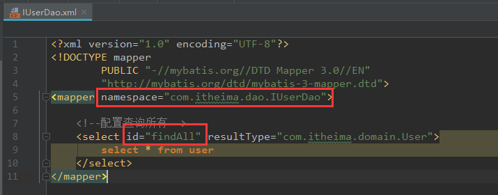

## 1、mybatis的环境搭建

### 1.1、创建maven工程并导入坐标

```xml
<dependency>
    <groupId>org.mybatis</groupId>
    <artifactId>mybatis</artifactId>
    <version>3.4.5</version>
</dependency>
<dependency>
    <groupId>mysql</groupId>
    <artifactId>mysql-connector-java</artifactId>
    <version>5.1.6</version>
</dependency>
```

### 1.2、创建实体类和dao的接口

```java
public interface IUserDao {

    /**
     * 查询所有操作
     * @return
     */
    List<User> findAll();
}
```

实体类....  根据数据库来创建

### 1.3、创建Mybatis的主配置文件

SqlMapConifg.xml

```xml
<?xml version="1.0" encoding="UTF-8"?>
<!DOCTYPE configuration
        PUBLIC "-//mybatis.org//DTD Config 3.0//EN"
        "http://mybatis.org/dtd/mybatis-3-config.dtd">
<!-- mybatis的主配置文件 -->
<configuration>
    <!-- 配置环境 -->
    <environments default="mysql">
        <!-- 配置mysql的环境-->
        <environment id="mysql">
            <!-- 配置事务的类型-->
            <transactionManager type="JDBC"></transactionManager>
            <!-- 配置数据源（连接池） -->
            <dataSource type="POOLED">
                <!-- 配置连接数据库的4个基本信息 -->
                <property name="driver" value="com.mysql.jdbc.Driver"/>
                <property name="url" value="jdbc:mysql://localhost:3306/eesy_mybatis"/>
                <property name="username" value="root"/>
                <property name="password" value="root"/>
            </dataSource>
        </environment>
    </environments>

    <!-- 指定映射配置文件的位置，映射配置文件指的是每个dao独立的配置文件 -->
    <mappers>
        <mapper resource="com/itheima/dao/IUserDao.xml"/>
    </mappers>
</configuration>
```

### 1.4、创建映射配置文件

IUserDao.xml

```xml
<?xml version="1.0" encoding="UTF-8"?>
<!DOCTYPE mapper
        PUBLIC "-//mybatis.org//DTD Mapper 3.0//EN"
        "http://mybatis.org/dtd/mybatis-3-mapper.dtd">
<mapper namespace="com.itheima.dao.IUserDao">
    <!--配置查询所有-->
    <select id="findAll" resultType="com.itheima.domain.User">
        select * from user
    </select>
</mapper>
```

### 1.5、注意事项

1、创建IUserDao.xml 和 IUserDao.java 名称是为了和我们之前的知识保持一致，在Mybatis中它把持久层的操作接口名称和映射文件也叫做：Mapper

所以IUserDao 和 IUserMapper 是一样的  ==所以以后看到Mapper，就知道他的Dao==

2、在idea中创建目录的时候，它的包是不一样的，包在创建的时候，com.array.dao它是三级结构，但是在resources里面，如果你还是这样写，它就不是三级目录了，就是一个一级目录，你还这样写的话，在文件夹里是`com.array.dao`这样的一个文件夹。

3、mybatis的映射配置文件位置必须和dao接口的包结构一样，就两个都得是  com.array.dao 才行

4、映射配置文件的 mapper 标签 namespace 属性的去找必须是dao接口的全限定类名

5、映射配置文件的操作配置， id 属性的取值必须是 dao 接口的方法名

当我们遵从了 第三，四，五点之后，我们在开发中就无须再写 dao 的实现类（也就是说，写完接口，就实现）

## 2、入门案例

### 2.1、拷贝个配置文件(不用管它干啥)

先拷贝个文件：

```properties
# Set root category priority to INFO and its only appender to CONSOLE.
#log4j.rootCategory=INFO, CONSOLE            debug   info   warn error fatal
log4j.rootCategory=debug, CONSOLE, LOGFILE

# Set the enterprise logger category to FATAL and its only appender to CONSOLE.
log4j.logger.org.apache.axis.enterprise=FATAL, CONSOLE

# CONSOLE is set to be a ConsoleAppender using a PatternLayout.
log4j.appender.CONSOLE=org.apache.log4j.ConsoleAppender
log4j.appender.CONSOLE.layout=org.apache.log4j.PatternLayout
log4j.appender.CONSOLE.layout.ConversionPattern=%d{ISO8601} %-6r [%15.15t] %-5p %30.30c %x - %m\n

# LOGFILE is set to be a File appender using a PatternLayout.
log4j.appender.LOGFILE=org.apache.log4j.FileAppender
log4j.appender.LOGFILE.File=d:\axis.log
log4j.appender.LOGFILE.Append=true
log4j.appender.LOGFILE.layout=org.apache.log4j.PatternLayout
log4j.appender.LOGFILE.layout.ConversionPattern=%d{ISO8601} %-6r [%15.15t] %-5p %30.30c %x - %m\n
```

### 2.2、创建一个Test

#### 2.2.1、使用xml方式

步骤如代码所示

MybatisTest.java

```java
public class MybatisTest {

    /**
     * 入门案例
     * @param args
     */
    public static void main(String[] args)throws Exception {
        //1.读取配置文件
        InputStream in = Resources.getResourceAsStream("SqlMapConfig.xml");
        //2.创建SqlSessionFactory工厂
        SqlSessionFactoryBuilder builder = new SqlSessionFactoryBuilder();
        SqlSessionFactory factory = builder.build(in);
        //3.使用工厂生产SqlSession对象
        SqlSession session = factory.openSession();
        //4.使用SqlSession创建Dao接口的代理对象
        IUserDao userDao = session.getMapper(IUserDao.class);
        //5.使用代理对象执行方法
        List<User> users = userDao.findAll();
        for(User user : users){
            System.out.println(user);
        }
        //6.释放资源
        session.close();
        in.close();
    }
}
```

注意：

​	不要忘记在映射配置中告知mybatis要封装到哪个实体类中

配置的方法：指定实体类的全限定类名，就是在IUserDao.xml里写上这个：

```xml
namespace="com.itheima.dao.IUserDao"
```

#### 2.2.2、使用注解的方式

`SqlMapConifg.xml`这里改一下

```xml
 <mappers>
        <mapper class="com.itheima.dao.IUserDao"/>
    </mappers>
```

把resources包下面的代码删掉，执行 ==成功==

**mybatis基于注解的入门案例**

​	把IUserDao.xml移除，在dao接口的方法上使用@Select注解，并且指定SQL语句

​	同时需要在SqlMapConfi.xml 中的 mapper 配置时，使用class 属性指定 dao 接口的全限定类名。

```java
@Select("select * from user")
```

**明确**：

​	在实际开发中，都是越简便越好，所以都是采用不写dao实现类的方式

#### 2.2.3、实现dao层

UserDaoImpl.java

```java
public class UserDaoImpl implements IUserDao {

    private SqlSessionFactory factory;

    public UserDaoImpl(SqlSessionFactory  factory){
        this.factory = factory;
    }


    public List<User> findAll(){
        //1.使用工厂创建SqlSession对象
        SqlSession session = factory.openSession();
        //2.使用session执行查询所有方法
        List<User> users = session.selectList("com.itheima.dao.IUserDao.findAll");
        session.close();
        //3.返回查询结果
        return users;
    }
}
```

IUserDao.xml不要删

更改MybatisTest.java   的第三步，session.close（） 也可以删掉

```java
 public static void main(String[] args)throws Exception {
     //1.读取配置文件
     InputStream in = Resources.getResourceAsStream("SqlMapConfig.xml");
     //2.创建SqlSessionFactory工厂
     SqlSessionFactoryBuilder builder = new SqlSessionFactoryBuilder();
     SqlSessionFactory factory = builder.build(in);
     //3.使用工厂创建dao对象
     IUserDao userDao = new UserDaoImpl(factory);
     //4.使用代理对象执行方法
     List<User> users = userDao.findAll();
     for(User user : users){
         System.out.println(user);
     }
     //5.释放资源
     in.close();
 }
```

执行，一样，但是完全没有必要这样写，反而增加了负担




**老师的意义在于让我们理解  namespcae 和 id 的区别**

#### 2.2.4、分析MybatisTest.java


我们这样分解来写的目的就是为了一步一步的去了解内部层次，等到我们真正开发的时候，就直接是从第一步调到第四步直接以需求为目的的开发了。

### 2.3、自定义Mybatis的分析：

#### 2.3.1、mybatis能做什么		

mybaits在使用代理dao的方法实现增删改查时做了什么事情？

​				只有两件事：

​						第一：创建代理对象

​						第二：在代理对象中调用selectList


我们今天关注的点是：

​	1、如果创建代理对象 以及 使用设计模式带来的优势

​	2、这里面调用的组合关系

不关注的点：

​	1、jdbc这一套

​	2、解析xml（我们解析技术很多，只要解析到就ok）

#### 2.3.2、mybatis能看到的类

自定义mybatis能通过入门案例看到类

先干件大事，把mybaits的pom信息删掉，自己写

​	class Resources

```java
package com.itheima.mybatis.io;

import java.io.InputStream;

/**
 * @Description: 使用类加载器读取配置文件的类
 * @Author: Array
 */
public class Resources {
    /**
     * @Description: 根据传入的参数，获取一个字节输入流
     */
    public static InputStream getResourceAsStream(String filePath){
        //Resources.class 第一步，拿到当前类的字节码
        //getClassLoader() 第二步，获取字节码的类的加载器
        //getResourceAsStream(filePath) 第三步，根据类加载器读取配置
        return Resources.class.getClassLoader().getResourceAsStream(filePath);
    }
}

```

​	class SqlSessionFactoryBuilder

​	interface SqlSessionFactory

```java
package com.itheima.mybatis.sqlsession;

/**
 * @Description: 自定义mybais中 和 数据库交互的核心类
 * 它里面可以创建 dao 接口的代理对象
 * @Author: Array
 * @Date: 2020/4/5 16:35
 */
public interface SqlSession {

    /**
     * @Title:
     * @Description: 根据参数创建一个代理对象
     * @param daoInterfaceClass dao的接口字节码
     * @param <T>
     * @return @return
     * @author Array
     * @date 2020/4/5 16:37
     */
    <T> T getMapper(Class<T> daoInterfaceClass);

    /**
     * @Title: 释放资源
     * @author Array
     * @date 2020/4/5 16:39
     */
    void close();

}

```

```java
package com.itheima.mybatis.sqlsession;

public interface SqlSessionFactory {

    /**
     * @Description: 用于打开一个新的SqlSession对象
     * @author Array
     */
    SqlSession openSession();
}
public interface SqlSessionFactory {

}
```

```java
package com.itheima.mybatis.sqlsession;

import java.io.InputStream;

/**
 * @Description: 用于创建一个SqlSessionFactory对象
 */
public class SqlSessionFactoryBuilder {
    public SqlSessionFactory build(InputStream config){
        return null;
    }
}
```

​	interface SqlSession

我们的错越来越少了

.... 后面特别复杂，我源码上传到码云里去了

