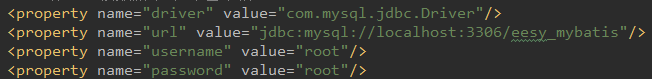
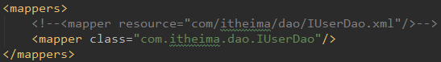
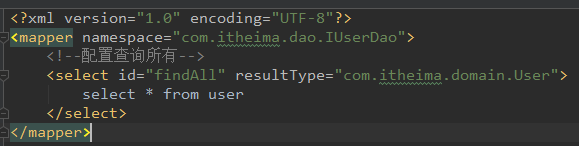
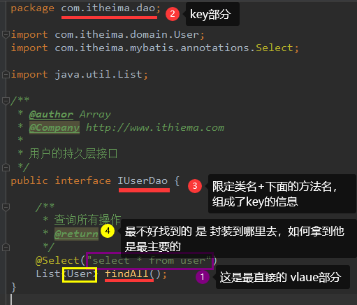
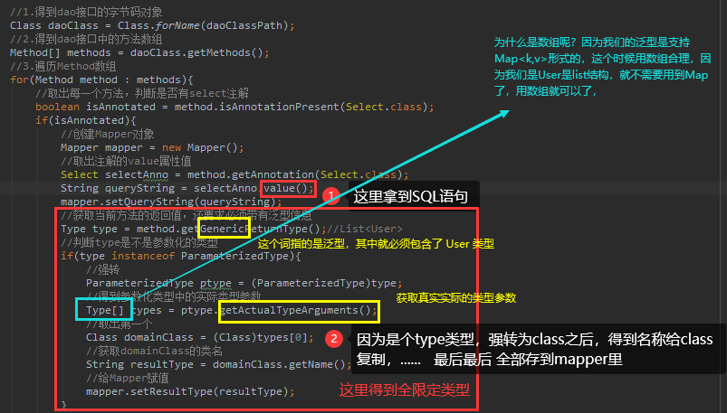
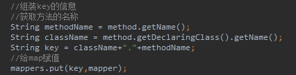

## 1、回顾mybatis自定义

回顾mybatis的自定义再分析和环境搭建+完善基于注解的mybatis


详解：

关于注解这一块呢，想跟他加再说一下，昨天在我们自定义的时候，这两个工具类

首先呢，我们来讲解析配置文件：他加载的是主配置文件的内容，这里我们要两个配置信息就够了





​	映射这一块，我是靠resource属性和 class属性来区分哪个是 xml 哪个是 注解，我们还要判断有哪个属性就知道了，对于解析来说，我们这里用的是dom4j，但是dom4j这个技术对我们来说，并没有接触过，但是，我们不要关心用什么技术来解析xml，只要关心拿到解析后的值怎么来用就可以了。拿到上面的内容来链接数据库，拿到下面的内容，去映射配置。去映射配置我们得到的内容不外乎就是给我们能提供的信息，IUserDao.xml 很直观



包含了我们获取时，所需要的key，也就是我们的 `namespace`  `id`  `resultTpye` 还有我们的SQL语句

但是注解就非常直观，打开什么都没写，也能实现功能，这时候一比对，其实我们想要的信息，我们也都有了






最后全部存到mappers里



## 2、Mybatis实现用户新增

### 2.1、在UserMpaaer类中新增添加方法

```java
private InputStream in;
    private SqlSession sqlSession;
    private IUserDao userDao;

    @Before //用于在测试方法执行之前执行
    public void init() throws IOException {
        // 1.读取配置文件，生成字节输入流
        in = Resources.getResourceAsStream("SqlMapConfig.xml");
        // 2.获取SqlSessionFactory对象
        SqlSessionFactory factory = new SqlSessionFactoryBuilder().build(in);
        // 3.获取SqlSession对象
        sqlSession = factory.openSession();
        // 4.获取dao的代理对象
        userDao = sqlSession.getMapper(IUserDao.class);
    }

    @After //用于在测试方法执行之后执行
    public void destory() throws IOException {
        sqlSession.commit();
        // 6.释放资源
        sqlSession.close();
        in.close();
    }
```

添加注解 ==@Before     @After==

```java
// 这是测试保存操作
    @Test
    public void testSave(){
        User user = new User();
        user.setUsername("mybatis saveUser");
        user.setAddress("北京市顺义区");
        user.setSex("男");
        user.setBirthday(new Date());
        // 5.执行保存方法
        userDao.saveUser(user);
    }
```

在增删改过程中，如果没有  `sqlSession.commit();`  的过程，提交的数据将不能保存，

------

**不管你怎么增删除改，**

**第一，在UserDao的接口里面，写好方法，传入的参数、返回的类型**

```java
//查询所有用户
List<User> findAll();

// 保存方法
void saveUser(User user);

// 更新用户
void updateUser(User user);

// 删除用户
void deleteUser(Integer id);

//查询一个
User findById(Integer id);
```

**然后在 `IuserDao.xml`  里写好sql代码**

```xml
<select id="findAll" resultType="com.itheima.domain.User">
    select * from user;
</select>

<!-- 保存用户 -->
<insert id="saveUser" parameterType="com.itheima.domain.User">
    insert into user(username,address,sex,birthday) value(#{username},#{address},#{sex},#{birthday});
</insert>

<!-- 更新用户 -->
<update id="updateUser" parameterType="com.itheima.domain.User">
    update user set username=#{username},address=#{address},sex=#{sex},birthday=#{birthday,jdbcType=DATE} where id=#{id};
</update>

<!-- 删除用户 -->
<delete id="deleteUser" parameterType="Integer">
    delete from user where id =#{userId};
</delete>

<!-- 根据id查询用户 -->
<select id="findById" parameterType="Integer" resultType="com.itheima.domain.User">
    select * from user where id = #{uid};
</select>
```

这里要注意，如果是有返回单独类型  要加 `parameterType` 属性，  如果是返回类型 就不如查询 要加  `parameterType` 

**最后在测试类里写好逻辑**   ==完成==

模糊查询注意：

```xml
<select id="findByName" parameterType="string" resultType="com.itheima.domain.User">
     	 select * from user where username like #{username}; 
    <!-- select  * from user where username like '%${value}%'; -->
</select>
```

```java
public void testFindByName(){
    List<User> users = userDao.findByName("%王%");
    //		 List<User> users = userDao.findByName("王");
    for (User user : users) {
        System.out.println(user);
    }
}
```

这里有两种写法，但是我们推荐使用未注释的那种


原因是防止sql注入，使用prepareStatement的参数占位符更好一点

在保存过程中，有个小细节，在执行方法前，是拿不到数据库的信息，执行方法后，就可以拿到该数据库的相关信息

