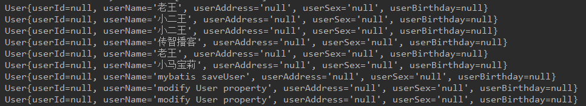
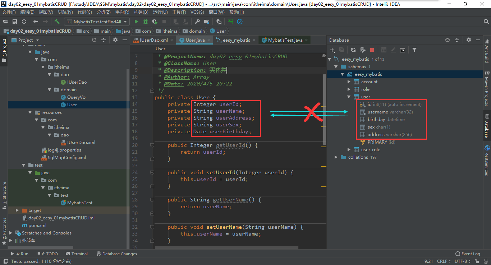

[toc]

# Mybatis的参数深入

## 1、Mybatis参数

### 1.1、parameterType（输入类型）

#### 1.1.1、传递简单类型

#### 1.1.2、传递pojo类型

也就是javaBean，也就是实体类对象

Mybatis使用  ==ognl==  表达式解析对象字段的值，#{}或者${}括号中的值成为pojo属性名称

> **ONGL表达式**：
>
> ​	Object Graphic Navigation Lanaugae：对象图导航语言
>
> ​		它是通过对象中的取值方法，来获取数据，在写法上把get给省略了。比如，我们获取用户的名称，正常的写法，User.getUsername();而OGNL的写法是：user.username 如果后面还继续要加内容，继续打点就能
>
> mybatis中为什么能直接写username，不用user.  呢：    因为，在parameterType 中已经提供了属性所属的类，所以此时不需要写对象名

```java
/*
新建一个QueryVo实体类，里面就封装一个User，Get、Set User
*/
//测试使用QueryVo作为查询条件
@Test
public void testFindByVo(){
    QueryVo vo = new QueryVo();
    User user = new User();
    user.setUsername("%王%");
    vo.setUser(user);
    List<User> users = userDao.findUserByVo(vo);
    for (User u : users) {
        System.out.println(u);
    }
}
```

#### 1.1.3、传递pojo包装对象

​		开发中通过 pojo 传递查询条件，查询条件是综合查询条件，不仅包括用户查询条件，还包括其他的查询条件（比如将用户购买商品信息也作为查询条件），这时可以使用包括对象传递输入参数。Pojo类中包含pojo

我们在更改User里的参数后，需要连带着更改 get set 方法，及调用这些方法的测试类，还有 `keyProperty="userId"` 这个属性，需要随着更改而更改。但是，我们去查询所有的时候，就会发现，根本查询不到，只有userName这个字段查询到了，其根本原因在于 ==Windows环境下的MySQL 对大小写不严格，而Linux环境下的MySQL需要严格遵循大小写== 然而我们在这里只是改变了改变了大小写，所以只能查出没有改变字段的数据。





解决的办法是：(起别名，这总解办法是效率最高的，因为这是在mysql的层面上，解决问题)

```sql
select id as userId,username as userName,address as userAddress,sex as userSex,birthday as userBirthday from user;
```

第二种方式需要引用 **`resultMap="userMap"`**

```xml
<!-- 配置 查询结果的类名和实体类的属性名和对应关系 -->
<resultMap id="userMap" type="com.itheima.domain.User">
    <!-- 主键字段的对应 -->
    <id property="userId" column="id"></id>

    <!-- 非主键字段的对应 -->
    <result property="userName" column="username"></result>
    <result property="userAddress" column="address"></result>
    <result property="userSex" column="sex"></result>
    <result property="userBirthday" column="birthday"></result>
</resultMap>

<select id="findAll" resultMap="userMap">
    select * from user;
</select>
```

但是这种情况相对于上一种来说，效率要慢一点，但是开发更简单。


------

我们重新打开项目，把之前的QueryVo去掉，记住，要把    `IUserDao.xml`   里面无关的代码全删掉，不然运行会报错


大型套娃现场....    初学者不建议深究，会怀疑人生

最后一个 老师还布置了一个任务，让我们自己解决  `findById`   的流操作，我们先找到selectOne的方法，在哪行打断点，执行debug，后面会跟随 session：DefaultSqlSession 这里，我们从方法里进去到这个地方，发现是个抽象类，实现处，可以找到  DefaultSqlSession  点进去，按此方法，会和最上面的路径一直，最后执行的都是 ps.execute() 方法 


#### 1.1.4、连接池初期

```xml
配置properties
    可以在标签内部配置数据库的信息，也可以通过属性引用外部配置文件信息
    resource属性：
        用于指定配置文件的位置，是按照类路径的写法来写，并且必须存在于类路径下。
    url属性：
        是要求按照Url的写法来写地址
        Url：Uniform Resource Location 统一资源定位符。他是可以唯一标识一个资源的位置
        它的写法：
            协议      主机    端口         URI
            http://location:8080/mybatisserver/index.jsp
        URI:Uniform Resource Identifier 统一资源标识符。他是在应用中可以唯一定位一个资源的。
```

```xml
    <!-- 使用typeAliases配置别名，它只能配置domain中类的别名 -->
    <typeAliases>
        <!-- typeAlias 用于配置别名。type属性指定的是实体类全限定类名。alias属性指定别名，当指定了别名，就不再区分大小写 -->
        <typeAlias type="com.itheima.domain.User" alias="user"></typeAlias>
    </typeAliases>
```

使用了typeAliases配置别名后，在IUserDao.xml中的 原来指向  `com.itheima.domain.User`  中的，现在直接 `user` 就可以了，而大小写都随意

还是一样能出来，但是如果表过多的话，使用这个确实会有些麻烦

```xml
<!-- 用于指定要配置别名的包，当指定后，该包下的实体类都会注册别名，并且类名就别名，不再区分大消息-->
        <package name="com.itheima.domain"></package>
```

我们就可以这样写，这样一来，原来的类名就都不用写了，原因是我们把包给配置进去了

```xml
<mappers>
        <!--<mapper resource="com/itheima/dao/IUserDao.xml"></mapper>-->
        <!-- package标签是用于指定dao接口所在的包，当指定完成后，就不需要写Mapper以及resource或者class了 -->
        <!-- 上面那个package 是指定实体类的，下面这个是指定接口的 -->
        <package name="com.itheima.dao"></package>
</mappers>
```

这两个package在实际开发中，还是能节省我们很多开发时间的


后面还有一张图没用到，大致看了一下是，getMapper的原理：

