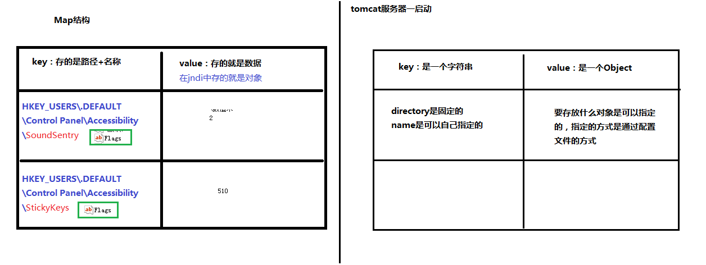

重点哟~

数据库的操作，

## 1、if

如果我们不清楚查询的条件的时候，我们可以去这样写

```xml
<select id="findUserByCondition" resultMap="userMap" parameterType="user">
    select * from user where 1=1
    <if test="userName != null">
        and username = #{userName}
    </if>
    <if test="userSex != null">
        and sex = #{userSex}
    </if>
</select>
```

这个意思很明显了，我们在测试时候，如果不确定客户会传几个参数进来，就只能用	`if`   进行判断，在测试的时候，我们只要传入	`user`  类就可以了，至于客户想传什么参数，我们就把参数丢进	`user`    里就可以了，判断有数据的话，就自己读取

## 2、where

我们能看到，上面有个	`where`    语句，这样的话啊，判断始终为	`true`   老师也没讲有什么坏处，但是有更简洁的办法，那就是	`where`   标签

```xml
<select id="findUserByCondition" resultMap="userMap" parameterType="user">
    select * from user
    <where>
        <if test="userName != null">
            and username = #{userName}
        </if>
        <if test="userSex != null">
            and sex = #{userSex}
        </if>
    </where>
</select>
```

这样的话，就省略了  `where 1=1`    

## 3、foreach

选择性查询，了解一下？

我们经常能看到，用户对着左边的勾选框，选中的进行查询，其实这就是查询多个用户，对我们来说，如果要用	`sql`    语句实现的话，那就是	`where id in()`    写子查询了，我们的	`mybatis`   也提供了标签

```xml
<!-- 根据queryvo 中的Id集合实现查询用户列表 -->
    <select id="findUserInIds" resultMap="userMap" parameterType="queryvo">
        select * from user
        <where>
            <if test="ids != null and ids.size()>0">
                <foreach collection="ids" open="id in (" close=")" item="uid" separator=",">
                    #{uid}
                </foreach>
            </if>
        </where>
    </select>
```

我这里大致讲一下

`if`   判断是为了防止客户一个都没选... 

`foreach`    里面的一些参数，  `collection`    参数中的   `ids`    是   `QueryVo`   里面的属性，	`open`   打开，写左括号的东西   `close`  写右边括号里的，至于括号里面的东西，就统统丢到   `item`    属性中了， 赋给了  `uid`   。然后  `separator`   表示的是分隔符，看显然，我们看到的分隔符是逗号...里面的参数，注意看，里面的参数  和我们的  `item`    一样，对，就是一一对应的，如果 item  里面写什么，  #{ }  这里面也写什么

## 扩展，抽取sql

look  look，三个方法， select * from user 用了三次，为了避免老是用重复的代码，我们又来了个标签

```xml
 <!-- 了解的内容：抽取重复的sql语句 -->
    <!-- 抽取sql的方式，不建议在后面写分号，因为... 后面还可能会用嘛-->
    <sql id="defaultUser">
        select * from user
    </sql>
```

在查询的时候，直接这样写就好了

```xml
<!-- 查询所有 -->
    <select id="findAll" resultMap="userMap">
        <include refid="defaultUser"></include>
    </select>
```

==抽取sql的方式，不建议在后面写分号==


------

# 表与表关联

```xml
<!--查询所有账户同时包含用户名和地址信息-->
    <select id="findAllAccount" resultType="accountuser">
        select a.*,u.username,u.address from account a , user u where u.id = a.uid;
    </select>
```

实体类：

```java
package com.itheima.domain;

/**
 * @author 黑马程序员
 * @Company http://www.ithiema.com
 */
public class AccountUser extends Account {

    private String username;
    private String address;

    public String getUsername() {
        return username;
    }

    public void setUsername(String username) {
        this.username = username;
    }

    public String getAddress() {
        return address;
    }

    public void setAddress(String address) {
        this.address = address;
    }

    @Override
    public String toString() {
        return super.toString()+"        AccountUser{" +
                "username='" + username + '\'' +
                ", address='" + address + '\'' +
                '}';
    }
}
```

测试类：

```
/**
 * 测试查询所有账户，同时包含用户名称和地址
 */
@Test
public void testFindAllAccountUser(){
    List<AccountUser> aus = accountDao.findAllAccount();
    for(AccountUser au : aus){
        System.out.println(au);
    }
}
```

# 一对一关系

```xml
<!-- 定义封装account和user的resultMap -->
    <resultMap id="accountUserMap" type="account">
        <id property="id" column="aid"></id>
        <result property="uid" column="uid"></result>
        <result property="money" column="money"></result>
        <!-- 一对一的关系映射：配置封装user的内容-->
        <association property="user" column="uid" javaType="user">
            <id property="id" column="id"></id>
            <result column="username" property="username"></result>
            <result column="address" property="address"></result>
            <result column="sex" property="sex"></result>
            <result column="birthday" property="birthday"></result>
        </association>
    </resultMap>

    <!-- 查询所有 -->
    <select id="findAll" resultMap="accountUserMap">
        select u.*,a.id as aid,a.uid,a.money from account a , user u where u.id = a.uid;
    </select>
```

cloumn 是指实体类里面的，property 是和语句相对应的，  javaType 是指类型，因为我们加了别名，不然要写全限定类名

在	Account	实体类里面也要加	user	对象，因为是一对一关系，所以都要引用到

```java
private User user;

public User getUser() {
    return user;
}
```

测试类：后面的  getUser（）   就是把对应的数据取出来

```java
@Test
    public void testFindAll(){
        List<Account> accounts = accountDao.findAll();
        for(Account account : accounts){
            System.out.println("--------每个account的信息------------");
            System.out.println(account);
            System.out.println(account.getUser());
        }
    }
```

# 一对多关系：

```xml
<!-- 定义User的resultMap-->
    <resultMap id="userAccountMap" type="user">
        <id property="id" column="id"></id>
        <result property="username" column="username"></result>
        <result property="address" column="address"></result>
        <result property="sex" column="sex"></result>
        <result property="birthday" column="birthday"></result>
        <!-- 配置user对象中accounts集合的映射 -->
        <collection property="accounts" ofType="account">
            <id column="aid" property="id"></id>
            <result column="uid" property="uid"></result>
            <result column="money" property="money"></result>
        </collection>
    </resultMap>

    <!-- 查询所有 -->
    <select id="findAll" resultMap="userAccountMap">
        select * from user u left outer join account a on u.id = a.uid
    </select>
```

应为是一对多关系，我们使用	left join	左外连接，上面的写法都差不多，ofType	也是相当于类型的意思

实体类： 在User类里，加这个 也要加个这个

```java
//一对多关系映射：主表实体应该包含从表实体的集合引用
private List<Account> accounts;

public List<Account> getAccounts() {
    return accounts;
}
```

测试类：

```java
public void testFindAll(){
        List<User> users = userDao.findAll();
        for(User user : users){
            System.out.println("-----每个用户的信息------");
            System.out.println(user);
            System.out.println(user.getAccounts());
        }
    }
```

# 多对多关系：

1、建立两张表：用户表，角色表

​		让用户表和角色表具有多对多的关系。需要使用中间表，中间表中包含各自的主键，在中间表中是外键。

2、建立两个实体类：用户实体类和角色实体类

​		让用户和角色的实体类能体现出来一对多的关系

​		各自包含一个集合引用

3、建立两个配置文件

​		用户的配置文件

​		角色的配置文件

4、实现配置：

​		当我们查询用户时，可以同时得到用户下所包含的角色信息

​		当我们查询账户时，可以同时得到角色的所赋予用户信息


# JNDI补充

context.xml

```xml
<?xml version="1.0" encoding="UTF-8"?>
<Context>
<!-- 
<Resource 
name="jdbc/eesy_mybatis"						数据源的名称
type="javax.sql.DataSource"						数据源类型
auth="Container"								数据源提供者
maxActive="20"									最大活动数
maxWait="10000"									最大等待时间
maxIdle="5"										最大空闲数
username="root"									用户名
password="1234"									密码
driverClassName="com.mysql.jdbc.Driver"			驱动类
url="jdbc:mysql://localhost:3306/eesy_mybatis"	连接url字符串
/>
 -->
<Resource 
name="jdbc/eesy_mybatis"
type="javax.sql.DataSource"
auth="Container"
maxActive="20"
maxWait="10000"
maxIdle="5"
username="root"
password="1234"
driverClassName="com.mysql.jdbc.Driver"
url="jdbc:mysql://localhost:3306/eesy_mybatis"
/>
</Context>
```

sqlMapConfig.xml

```xml
<?xml version="1.0" encoding="UTF-8"?>
<!-- 导入约束 -->
<!DOCTYPE configuration  
  PUBLIC "-//mybatis.org//DTD Config 3.0//EN"  
  "http://mybatis.org/dtd/mybatis-3-config.dtd">
<configuration>
<typeAliases>
		<package name="com.itheima.domain"></package>
	</typeAliases>
	<!-- 配置mybatis的环境 -->
	<environments default="mysql">
		<!-- 配置mysql的环境 -->
		<environment id="mysql">
			<!-- 配置事务控制的方式 -->
			<transactionManager type="JDBC"></transactionManager>
			<!-- 配置连接数据库的必备信息  type属性表示是否使用数据源（连接池）-->
			<dataSource type="JNDI">
				<property name="data_source" value="java:comp/env/jdbc/eesy_mybatis"/>
			</dataSource>
		</environment>
	</environments>
	
	<!-- 指定mapper配置文件的位置 -->
	<mappers>
		<mapper resource="com/itheima/dao/IUserDao.xml"/>
	</mappers>
</configuration>
```



