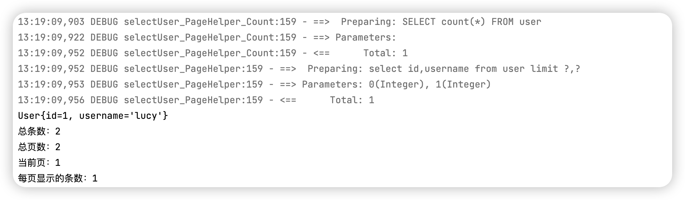

## PageHelper 分页插件

Maven pom.xml  导入坐标

```xml
<dependency>
  <groupId>com.github.pagehelper</groupId>
  <artifactId>pagehelper</artifactId>
  <version>3.7.5</version>
</dependency>
<dependency>
  <groupId>com.github.jsqlparser</groupId>
  <artifactId>jsqlparser</artifactId>
  <version>0.9.1</version>
</dependency
```

在 Mybatis 的配置文件 sqlMapConfig.xml

```xml
<plugins>
  <plugin interceptor="com.github.pagehelper.PageHelper">
    <property name="dialect" value="mysql"/>
  </plugin>
</plugins>
```

因为每个数据库的分页语句是不一样的，在配置 sqlMapConfig 时候，写明数据库类型

测试代码

```java
@Test
public void pageHelperTest(){
  PageHelper.startPage(1,1);
  List<User> users = userMapper.selectUser();
  for (User user : users) {
    System.out.println(user);
  }
  PageInfo<User> pageInfo = new PageInfo<>(users);
  System.out.println("总条数："+pageInfo.getTotal());
  System.out.println("总页数："+pageInfo.getPages());
  System.out.println("当前页："+pageInfo.getPageNum());
  System.out.println("每页显示的条数："+pageInfo.getPageSize());
}
```

