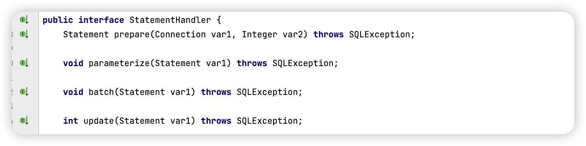

## MyBatis 插件

MyBatis 作为一个应用广泛的优秀的 ORM 开源框架，这个框架具有强大的灵活性，四大组件 **Executor、StatementHandler、ParameterHandler、ResultSetHandler** 提供了简单易用的插件扩展机制。Mybatis 对持久层的操作就是借助四大核心对象进行**拦截**。 增强功能本质上是借助于底层的动态代理实现的，换句话说，Mybatis 中的四大对象都是代理对象

Mybatis 所允许拦截的方法

+ 执行器 Executor（update、query、commit、rollback等）
+ SQL语法构造器StatementHandler（prepare、parameterize、batch、update、query等）
+ 参数处理器 ParameterHandler（getParameterObject、setParameters方法）
+ 结果集处理器 ResultSetHandler（handlerResultSets、handerOutputParameters等)

原理：使用动态代理来为原生对象生成一个代理对象


### 自定义插件

设计实现一个自定义插件

```java
@Intercepts({
        @Signature(type= StatementHandler.class,
                  method = "prepare",
                  args = {Connection.class,Integer.class})
})
public class MyPlugin implements Interceptor {
    /*
        拦截方法：只要被拦截的目标对象的目标方法被执行时，每次都会执行intercept方法
        第三个执行
     */
    @Override
    public Object intercept(Invocation invocation) throws Throwable {
        System.out.println("对方法进行了增强....");
        return invocation.proceed(); //原方法执行
    }
    /*
       主要为了把当前的拦截器生成代理存到拦截器链中
       第二个执行
     */
    @Override
    public Object plugin(Object target) {
        Object wrap = Plugin.wrap(target, this);
        return wrap;
    }
    /*
        获取配置文件的参数
        最先执行
     */
    @Override
    public void setProperties(Properties properties) {
        System.out.println("获取到的配置文件的参数是："+properties);
    }
}

```

创建类实现 Interceptor 接口，添加 `@Intercepts`、`@Signature` 注解，我们知道插件其实本身就是代理对象

**type** 和 **method** 表明拦截 **StatementHandler** 中 **prepare** 这个方法。我们也可以选另外三大对象



在 StatementHandler 中，除了 prepare 还可以选择其他方法，我们这里用 prepare 进行演示

参数用 **args** 表示

然后重写方法

最后还需要再配置文件中进行配置

```xml
<plugins>
  <plugin interceptor="com.lagou.plugin.MyPlugin">
    <property name="name" value="tom"/>
  </plugin>
</plugins>
```

这样执行测试，每次查询sql都会执行那句话


执行插件逻辑源码

Plugin 实现了 InvocationHandler 接口，因此它的 invoke 方法会拦截所有的方法调用。invoke 方法会对拦截的方法进行检测，以决定是否执行插件逻辑。该方法的逻辑如下：

```java
// - Plugin
public Object invoke(Object proxy, Method method, Object[] args) throws Throwable {
  try {
    /*
     * 获取被拦截⽅法列表，⽐如：
     * signatureMap.get(Executor.class), 可能返回 [query, update, commit]
     */
    Set<Method> methods = signatureMap.get(method.getDeclaringClass());
    //检测⽅法列表是否包含被拦截的⽅法
    if (methods != null && methods.contains(method)) {
      //执⾏插件逻辑
      return interceptor.intercept(new Invocation(target, method, args));
      //执⾏被拦截的⽅法
      return method.invoke(target, args);
    } catch(Exception e){
    }
  }
```


