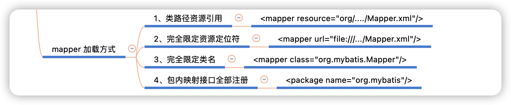
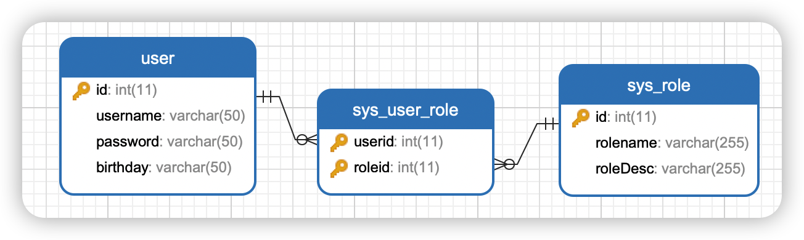
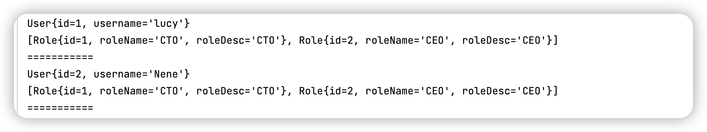

## Mybatis 复杂映射开发


今天我们来复习一下 Mybatis 框架吧

总所周知，Mybatis 是一款优秀的 基于`ORM` `半自动` `轻量化` 的 `持久层框架`

**ORM**：对象关系映射，简单的说就是表结构对应实体类

**半自动**：可灵活配置SQL，优化代码性能

**轻量化**：简单好用

**持久层框架**：把数据存储在磁盘上

我知道你都懂，我只是自己复述一下


### 一对一关系

现有订单表和用户表，要求在查询订单的同时查询该订单所属用户


查询SQL

```sql
  select * from orders o,user u where o.uid = u.id
```

实体类

```java
public class Order {
    private Integer id;
    private String orderTime;
    private Double total;
  	private User user;
}

public class User{
    private Integer id;
    private String username;
  	// 省略
}
```

Mapper 关键字：`association`

```xml
<resultMap id="orderMap" type="com.liuyuncen.Order">
  <result property="id" column="id"></result>
  <result property="orderTime" column="orderTime"></result>
  <result property="total" column="total"></result>
  <association property="user" javaType="com.liuyuncen.User">
    <result property="id" column="uid"></result>
    <result property="username" column="username"></result>
  </association>
</resultMap>


<select id="findOrderAndUser" resultMap="orderMap">
  select * from orders o,user u where o.uid = u.id
</select>
```

mapper 的加载方式有4种



如果是采用   包内映射接口注册，需要保证 xml 文件和 java 文件在同名包下。


### 一对多关系

还是刚刚的表模型，刚实验的一对一关系中，一个订单只能对应一个用户

现在要求查询**一个订单并包括其下的所有订单**

大多数情况下，一个用户肯定存在多个订单的情况，这就是一对多关系

**但也有可能有些用户一个订单都没有，这样我们就不能使用内连接的方式，应该采用左外连接或右外连接**


查询SQL是

```sql
select * from user u left join orders o on u.id = o.uid
```

修改实体类

```java
public class Order {
    private Integer id;
    private String orderTime;
    private Double total;
}

public class User {
    private Integer id;
    private String username;
		// 多个订单
		private List<Order> orderList;
}
```

Mapper 关键字`collection`

```xml
<resultMap id="userMap" type="com.liuyuncen.User">
    <result property="id" column="uid"></result>
    <result property="username" column="username"></result>
    <collection property="orderList" ofType="com.liuyuncen.Order">
        <result property="id" column="id"></result>
        <result property="orderTime" column="orderTime"></result>
        <result property="total" column="total"></result>
    </collection>
</resultMap>

<select id="findAll" resultMap="userMap">
    select * from user u left join orders o on u.id = o.uid
</select>
```


### 多对多关系

用户表和角色的关系为，一个用户有多个角色，一个角色被多个用户使用

**sys_user_role 的两个字段既作为联合主键也作为外键，这就是 多对多关系体现**

多对多查询需求：查询所有用户同时查询出该用户的所有角色



查询SQL

```sql
# 查询所有用户同时查询出该用户的所有角色
select * from user u left join sys_user_role sur on u.id = sur.userid inner join sys_role sr on sur.roleid = sr.id
```

修改实体类

```java
public class User {
    private Integer id;
    private String username;
    private List<Role> roleList;
}
```

Mapper

```xml
<resultMap id="userRoleMap" type="com.liuyuncen.User">
    <result property="id" column="userid"></result>
    <result property="username" column="username"></result>
    <collection property="roleList" ofType="com.liuyuncen.Role">
        <result property="id" column="roleid"></result>
        <result property="roleName" column="roleName"></result>
        <result property="roleDesc" column="roleDesc"></result>
    </collection>
</resultMap>


<select id="findAllUserAndRole" resultMap="userRoleMap">
    select * from user u left join sys_user_role ur on u.id = ur.userid
                   left join sys_role r on r.id = ur.roleid
</select>
```

控制台打印信息



ok 今天的分享就到这里了，既然都看到这里了，不妨透露个小秘密，明天分享基于注解的关系查询！

