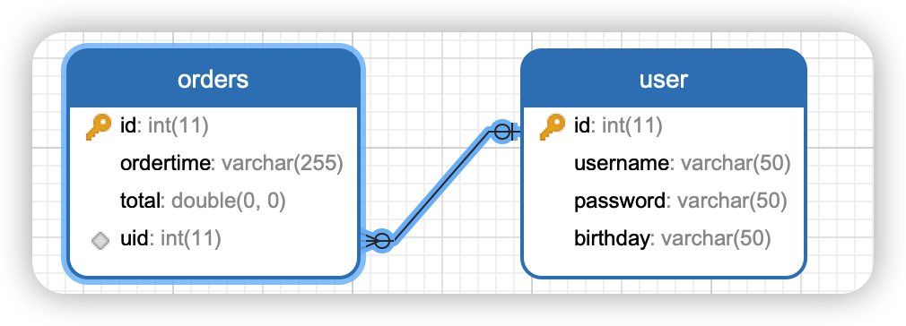
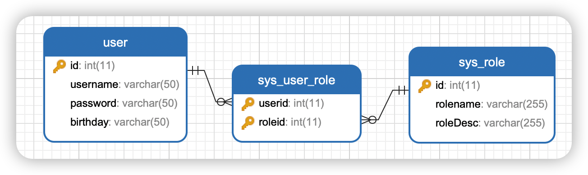

## Mybatis 注解开发

这几年基于注解开发越来越流行了，但现状是，一旦碰到复杂逻辑，还是得用XML映射的方式。Why？因为你对注解开发不够了解，Mybatis 基于注解也是可以完成 一对一、一对多结果集封装的。

+ @Insert：实现新增
+ @Update：实现更新
+ @Delete：实现删除
+ @Select：实现查询
+ @Result：实现结果集封装
+ @Results：可以和@Result一起使用，封装多个结果集
+ One：实现一对一结果封装
+ @Many：实现一对多结果封装


### CRUD

表模型


```java
//添加用户
@Insert("insert into user values(#{id},#{username})")
public void addUser(User user);

//更新用户
@Update("update user set username = #{username} where id = #{id}")
public void updateUser(User user);

//查询用户
@Select("select * from user")
public List<User> selectUser();

//删除用户
@Delete("delete from user where id = #{id}")
public void deleteUser(Integer id);
```

### 注解复杂关系映射开发

+ @Results

	+ 代替的标签 <resultMap> 该注解可以使用单个 @Result 注解，也可以使用 @Result 集合，使用格式

		```java
		@Results({@Result(),@Result()})
		@Results(@Result())
		```

+ @Result

	+ 代替了 <id> 标签和 <result> 标签
	+ column 字段名
	+ property：需要装配的实体类属性名
	+ one：需要使用@One注解 (@Result(one=@One)())
	+ many：需要使用@Many注解(@Result(many=@Many)())

###  一对一关系

查询订单并关联查询订单下用户信息



```java
@Results({
  @Result(property = "id",column = "id"),
  @Result(property = "orderTime",column = "orderTime"),
  @Result(property = "total",column = "total"),
  @Result(property = "user",column = "uid",javaType = User.class,
          one=@One(select = "com.liuyuncen.IUserMapper.findUserById"))
})
@Select("select * from orders")
public List<Order> findOrderAndUser();
```

@One（`select`） 指向 IUserMapper 中的 findUserById 方法，实现一对一查询

```java
// com.liuyuncen.IUserMapper
@Select({"select * from user where id = #{id}"})
public User findUserById(Integer id);
```


### 一对多关系

查询所有用户并查询用户下的订单信息

```java
@Select("select * from user")
@Results({
  @Result(property = "id",column = "id"),
  @Result(property = "username",column = "username"),
  @Result(property = "orderList",column = "id",javaType = List.class,
          many=@Many(select = "com.liuyuncen.IOrderMapper.findOrderByUid"))
})
public List<User> findAll();
```

同理

```java
// com.liuyuncen.IOrderMapper
@Select("select * from orders where uid = #{uid}")
public List<Order> findOrderByUid(Integer uid);
```


### 多对多关系



需求：查询所有用户同时查询每个用户所有角色

```sql
select * from user;

select * from sys_role r,sys_user_role ur where r.id = ur.roleid and ur.userid = #{id}
```


```java
@Select("select * from user")
@Results({
  @Result(property = "id",column = "id"),
  @Result(property = "username",column = "username"),
  @Result(property = "roleList",column = "id",javaType = List.class,
          many = @Many(select = "com.liuyuncen.IRoleMapper.findRoleByUid"))
})
public List<User> findAllUserAndRole();
```

```java
// com.liuyuncen.IRoleMapper
@Select("select * from sys_role r,sys_user_role ur where r.id = ur.roleid and ur.userid = #{uid}")
public List<Role> findRoleByUid(Integer uid);
```

大致逻辑是先把 user表查询出来后，把user表中的id字段房贷 IRoleMapper.findRoleByUid 方法中查询，实现注解方式多对多查询

需要注意是：**如果同时配置 xml和注解，处理不当会出现 Mapped Statements collection already contains value for xxx.xxx 异常**

而且从古至今也没有多少项目会同时使用注解和xml映射

所以如果构建新项目，你会采用那种方式呢？


ok，今天到这里，明天接着来


