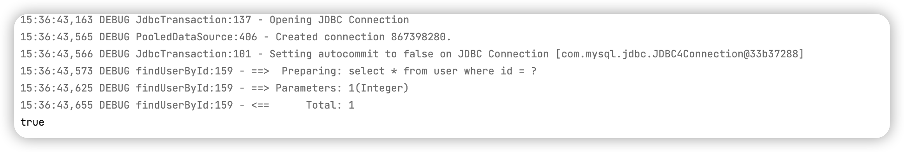
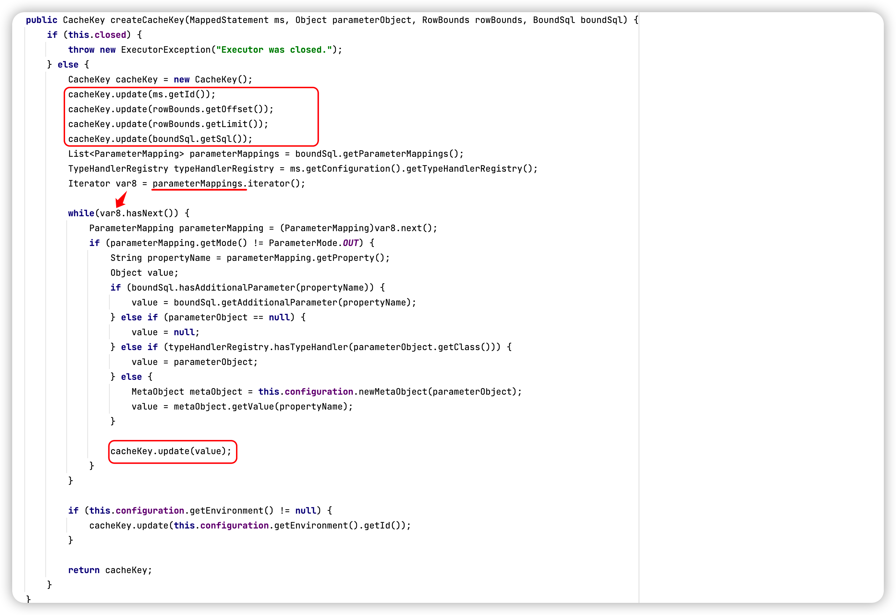
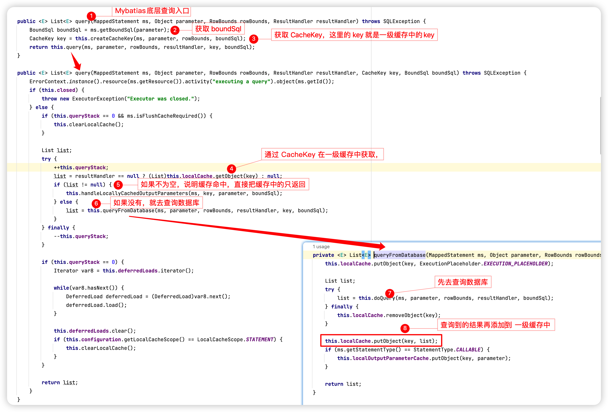
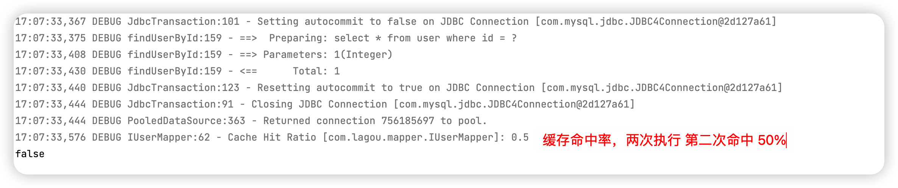
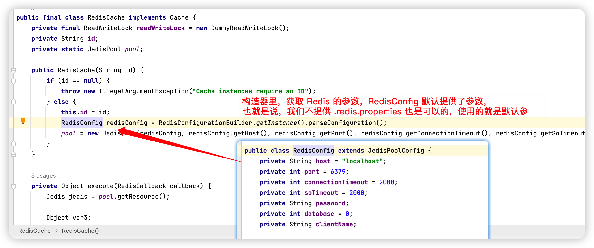
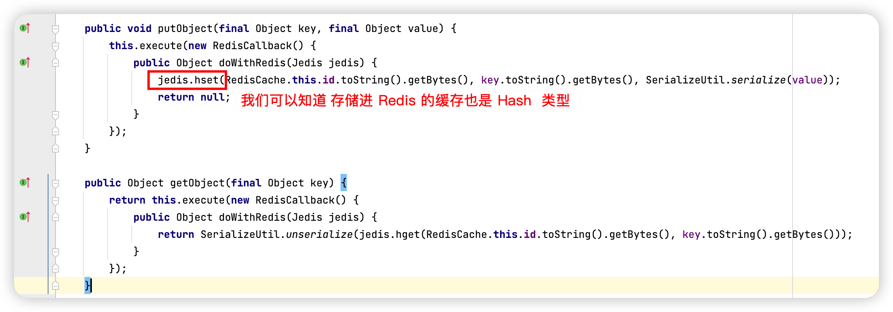

## 深入源码剖析 Mybatis 缓存机制

Mybatis 为了减轻数据库压力，提高数据库性能。提供了两级缓存机制

+ 一级缓存

	sqlSession 级别缓存，缓存的数据只在 sqlSession 内有效，一级缓存默认为我们开起来，不需要我们手动操作，而且你也关不掉，但是我们可以手动清楚缓存。

+ 二级缓存

	mapper 级别缓存，同一个 namespace 公用一个缓存，所以对 sqlSession 是共享的，需要我们手动开启。


### 一级缓存

我们先来模拟一下一级缓存的代码

```java
@Test
public void firstLevelCache(){
  // 第一次查询id为1的用户
  User user1 = userMapper.findUserById(1);
  User user2 = userMapper.findUserById(1);
  System.out.println(user1==user2);
}
```



日志输出只查询一次库，而且 `user1 == user2` 由此可以判断一级缓存默认是开启的。


一级缓存的底层就是一个 Key-Value 形式的 Map，**在执行查询操作时，去缓存中查找是否存在，如果存在就直接返回，如果不存在，就去数据库查询然后存一个到缓存里。**

缓存底层的 key 是由 **statementid、params、boundSql、rowBounds** 组成

**注意，做增删改操作并事务提交就会刷新一级缓存**

除了增删改操作，我们也可以手动刷新缓存

```java
sqlSession.clearCache();
```

#### 解读源码

通过 sqlSesson.clearCache(); 往下探查源码，最终我们找到这一段代码

```java
public class PerpetualCache implements Cache {
    private final String id;
    private Map<Object, Object> cache = new HashMap();

 		// 省略若干...
    public void clear() {
        this.cache.clear();
    }
  	// ....
}
```

所以也印证了， **Mybatis 一级缓存的底层就是一个 PerpetualCache 类下的一个 HashMap**

那他的工作流程是怎样的呢？

有Mybatis底层代码基础的人会清楚 Mybatis 的操作类都在 `Executor` 类中，我们可以在其中找到 

```java
CacheKey createCacheKey(MappedStatement var1, Object var2, RowBounds var3, BoundSql var4);
```

这个方法 返回的 CacheKey 就是一级缓存中的 Key



通过这段代码我们可以知道 这个 CacheKey 是由 **statementid、params、boundSql、rowBounds** 组成

+ statementid 可以理解为 nameSpace 的值（包路径.方法名）
+ params 参数
+ boundSql 是Myabtis底层解析的 sql 语句
+ rowBounds 分页条件

==这样，我们的 CacheKey 就这样生成了==

因为我们已经理清逻辑，在执行查询时候，就会先去查找判断 CacheKey

由此，我们可以找到 `Executor.query()` 方法




### 二级缓存

二级缓存的原理和一级缓存差不多，第一次查询会吧数据放入缓存中，然后第二次查询则会直接去缓存中取，但是一级缓存基于 sqlSession 的，而二级缓存基于 mapper 文件的 namespace ，也就是说，多个sqlSession 可以共享一个 mapper 中的二级缓存区域，并且如果两个 mapper 的namespace 相同，即使是两个 namespace，那么两个 mapper 中执行的 sql 查询到的数据也将在相同的二级缓存区存储

开启二级缓存：

和一级缓存不一样，二级缓存需要手动开启

可以在sqMapConfig.xml 加入如下代码

```xml
<settings>
	<setting name="cacheENabled" value="true"/>
</settings>
```

其次在 UserMapper.xml 中开启缓存

```xml
<cache/>
<!-- or -->
<cache eviction="FIFO" flushInterval="60000" readOnly="false" size="1024"/>
```

+ evication 缓存回收侧率 默认是 LRU
	+ LRU 最近最少使用，移除最长时间不被使用的对象
	+ FIFO 先进先出，按对象进入缓存顺序来移除它们
	+ SOFT 软引用，移除基于垃圾回收器和软引用规则对象
	+ WEAK 弱引用，更积极地移除基于垃圾收集器和弱引用规则的对象
+ flushInterval 缓存刷新间隔 单位毫秒
+ readOnly 是否只读
	+ true 只读
	+ false （读写，默认）
+ size 缓存存放多少元素
+ type 指定自定义缓存的全类名，也可以实现Cache接口 **要使用二级缓存，对应的实体类必须实例化接口**

如果是基于注解开发，就没有 UserMapper 配置文件，就可以在 IUserMapper 类上添加注解

```java
@CacheNameSpace
```

 测试二级缓存

```java
@Test
public void SecondLevelCache(){
  SqlSession sqlSession1 = sqlSessionFactory.openSession();
  SqlSession sqlSession2 = sqlSessionFactory.openSession();
  SqlSession sqlSession3 = sqlSessionFactory.openSession();

  IUserMapper mapper1 = sqlSession1.getMapper(IUserMapper.class);
  IUserMapper mapper2 = sqlSession2.getMapper(IUserMapper.class);
  IUserMapper mapper3 = sqlSession3.getMapper(IUserMapper.class);

  User user1 = mapper1.findUserById(1);
  sqlSession1.close(); //清空一级缓存
  User user2 = mapper2.findUserById(1);

  System.out.println(user1==user2);
}
```



但这里为什么是false 呢？难道不是走的缓存吗？

不是的，二级缓存和一级缓存不一样，二级缓存缓存的是数据，底层重新创建了个对象，把值给塞了进去。我们通过sql日志可以看到，只有一次查库记录。因为不是同一个对象，所以这里是false。

**注意，开启二级缓存相关的实体类是需要序列化的**

开启二级缓存之后呢，数据存储介质多种多样，不一定在内存中，可能是磁盘。如果我们要再取这个缓存，就需要反序列化了。所以 mybatis 中的 实体都要去实现  Seriablizable 接口


#### useCache和flushCache

mybatis 中还可以设置 useCache 和 flushCache 选项

+ useCache 设置是否禁用二级缓存，在 statement 中设置 useCache = false 可以禁用当前 select 语句的二级缓存，每次查询都会去查库， 默认为 true

```xml
<select id="queryAll" useCache="false" resultType="user">
  select * from user 
</select>
```

这种情况针对每次查询完都需要新的数据，禁止二级缓存

在 mapper 的同一个 namespace 中，如果有其他 insert、update、delete 操作后需要刷新缓存，如果不执行则会出现脏读

设置 statement 参数 flushCache = true 属性，默认情况为 true，即刷新缓存，如果改为 false 则不会刷新，使用缓存时如果手动修改数据库中的查询会出现脏读

```xml
<select id="queryAll" flushCache="true" useCache="false" resultType="user">
	select * from user
</select>
```

一般下执行完 commit 操作都需要刷新缓存，flushCache =ture 表示刷新，这样可以避免数据库脏读，所以我们不用设置，默认即可


#### 解读源码

二级缓存是通过 org.apache.ibatis.cache.impl.PerpetualCache 来实现的，其实就是一级缓存的类，但实际上是通过 PerpetualCache  实现的 `Cache` 接口来实现的 ，其实底层也是 HashMap

其实在 开启二级缓存的注解上可以写具体的 二级缓存实现类

```java
@CacheNamespace(implementation = PerpetualCache.class)//开启二级缓存
```

这样只是更具体一些，当然，你也可以自定义二级缓存实现类

使用默认的 `PerpetualCache` 实现类和不写 implementation 参数效果是一样的

默认的 Mybatis 二级缓存是由缺陷的

在分布式环境下，服务器之间的缓存不能共用


我们可以通过分布式缓存方案来解决这个问题，`redis`、memcached、ehcache 等

#### Mybatis与Redis整合

mybatis 自己提供了一个 cache 接口，如果要实现自己的逻辑，实现 cache 接口开发就可以了，默认用 mybatis 提供的 cache 接口 redis 实现类就行，该类在 `mybatis-redis` 包中

```xml
<dependency>
  <groupId>org.mybatis.caches</groupId>
  <artifactId>mybatis-redis</artifactId>
  <version>1.0.0-beta2</version>
</dependency>
```

配置文件 `redis.properties`

```
redis.host=localhost
redis.port=6379
redis.connectionTimeout=5000
redis.password=
redis.database=1
```

修改二级缓存的引用类

```java
import org.mybatis.caches.redis.RedisCache;
@CacheNamespace(implementation = RedisCache.class)//开启二级缓存
```

我们看一下 RedisCache 里面做了什么





这一块就是 RedisCache 对缓存数据存值和取值

由此我们可以知道 RedisCache 底层的数据类型也是 map 类型