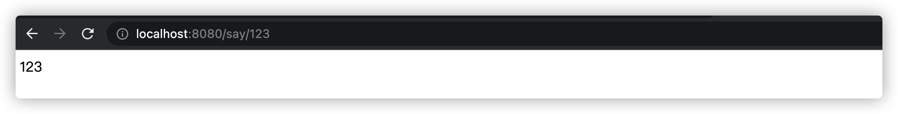

> 创建于2021年12月17日
> 		作者：想想

[toc]

# Nacos整合SpringCloud 获取配置

引入`pom`文件

```xml
            <dependency>
                <groupId>org.springframework.boot</groupId>
                <artifactId>spring-boot-starter-web</artifactId>
                <version>2.0.4.RELEASE</version>
            </dependency>
            <dependency>
                <groupId>org.springframework.cloud</groupId>
                <artifactId>spring-cloud-starter-alibaba-nacos-config</artifactId>
                <version>0.2.1.RELEASE</version>
            </dependency>
```

写入启动类

```java
package com.alibaba.nacos.example.spring.cloud;

import org.springframework.beans.factory.annotation.Value;
import org.springframework.boot.SpringApplication;
import org.springframework.boot.autoconfigure.SpringBootApplication;
import org.springframework.web.bind.annotation.PathVariable;
import org.springframework.web.bind.annotation.RequestMapping;
import org.springframework.web.bind.annotation.RequestMethod;
import org.springframework.web.bind.annotation.RestController;


@SpringBootApplication
public class NacosConfigApplication {

    public static void main(String[] args) {
        SpringApplication.run(NacosConfigApplication.class, args);
    }

    @RestController
    public class TestController {
        @Value("${useLocalCache:true}")
        private boolean cache;
        @RequestMapping(value = "/say/{str}", method = RequestMethod.GET)
        public String echo(@PathVariable String str) {
            if (cache){
                return str;
            }
            return String.valueOf(false);
        }
    }
}
```

解读一下：`@Value("${useLocalCache}")` 这个是准备要从nacos 中取数用的

配置`bootstrap.properties`

```properties
# 我本地的nacos服务改成了 8840 端口
spring.cloud.nacos.config.server-addr=127.0.0.1:8840 

# Nacos 控制台添加配置：
# Data ID：example.properties
# Group：DEFAULT_GROUP
# 配置内容：useLocalCache=true
spring.application.name=example
# 指定配置的后缀，支持 properties、yaml、yml，默认为 properties
spring.cloud.nacos.config.file-extension=properties
#spring.cloud.nacos.config.file-extension=yaml
```

Nacos配置


启动服务后 访问 `http://localhost:8080/say/123`



然后我们再将 Nacos 中的配置改成 false 

```properties
app.user.cache=false
```

重启服务后，访问 `http://localhost:8080/say/123`


配置成功

在 bootstrap.properties中还可以配置成

```properties
spring.cloud.nacos.config.ext-config[1].data-id=datasource.properties
spring.cloud.nacos.config.ext-config[1].group=multi-data-ids
```

这样表示在 nacos 中的 group中找`multi-data-ids`,DataId为`datasource.properties`的配置文件，直接加载到了 `bootstrap.properties` 文件中，可以直接使用

