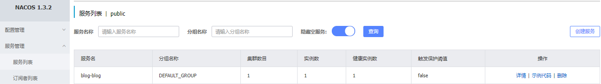
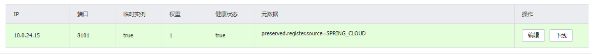

> 创建于2021年12月20日
> 作者：想想

[TOC]

# [踩坑]Nacos默认注册内网地址问题修复

### 前言

​		前一段时间写了一个博客项目，系统架构是两台云服务器分别放了多个微服务，网关和前端入口都在 A 服务器上，业务入口在 B 服务器上，当A、B服务器都成功的将自身注册到 Nacos 后，通过网关，竟然不能访	问 B 服务器上的资源，当打开 Nacos发现，注册的IP地址，完全不是我访问的IP地址，而是云服务器的内网IP地址，这样我肯定访问不到。

​		所以，只能将系统配置写死。再发布到A、B服务器上

## 查看Nacos注册IP

点开微服务 `blog-blog` 的详情



可以查看到，IP地址为 `10.0.24.15`



但是根本无法访问到内网，只能通过外网进行访问


此时我们注册的内网IP就毫无意义了

## 修改Nacos注册IP地址

```yml
spring:
  cloud:
    nacos:
      discovery:
        ip: 82.157.67.18
```

修改完成后，重新部署启动项目，IP地址就为 我们注册的地址。可以成功访问