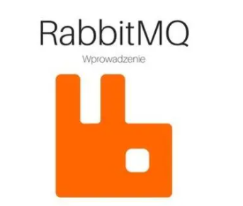
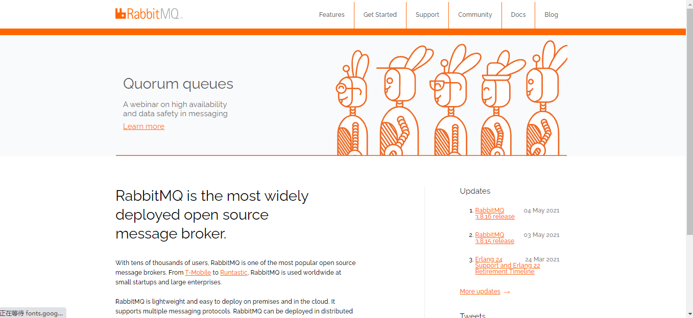
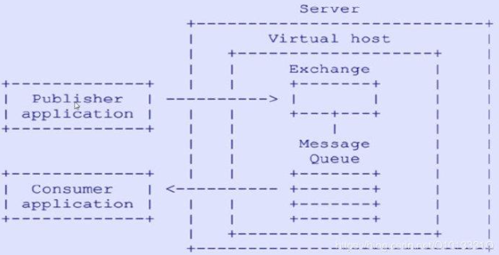
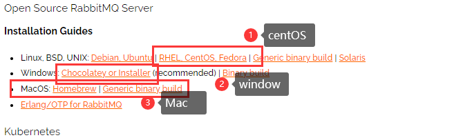
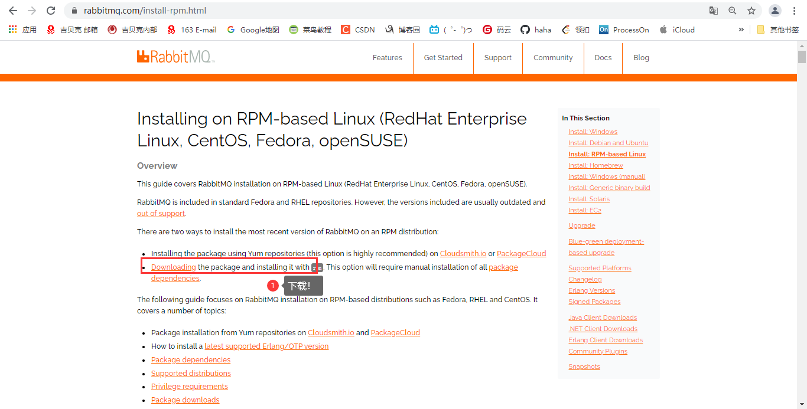

> 
>
> 创建于2021年5月24日
>
> 作者：想想

[TOC]

## RabbitMQ

### 1,1、什么是 MQ

​		`MQ`（Message Queue）：翻译为：`消息队列`，通过典型的 `生产者`和`消费者`模型，生产者不断向队列中生产数据，消费者不断从队列中获取消息，因为消息的生产者和消费者都是异步的，而且之关心消息的发送和接收，没有业务逻辑的侵入，轻松的实现系统间解耦，别名为`消息中间件` 通过利用高效可靠的消息传递机制进行平台无关的数据交流，并基于数据通信来进行分布式系统的集成



### 1.2、MQ有哪些

​		当今市面上有很多主流的消息中间件，如老牌的`ActiveMQ`、`RabbitMQ`,炙手可得的`kafka`,阿里巴巴自主开发`RocketMQ`等

### 1.3、不同MQ特点

```sh
# ActiveMQ
	ActiveMQ 是 Apache出品，最流行，能力最强的开发消息总线，它是一个完全支持JMS规范的消息中间件。丰富的API，多种集群架构模式让ActiveMQ在业界成为老牌的消息中间件，在中小型企业颇受欢迎。
    
# Kafka
	Kafka是 LinkedIn 开源的分布式发布-订阅消息系统，目前归属Apache顶级项目，kafka主要特点基于Pull的模式来处理消息消费，追求高吞吐量，一开始的目的就是用于日志收集和传输，0.8版本开始支持复制，不支持事务，对消息的重复、丢失、错误没有严格要求，适合产生大量数据的互联网数据收集服务

# RocketMQ
	RocketMQ 是阿里开源的消息中间件，它是纯Java开发，具有高吞吐量，高可用性、适合大规模分布式系统应用的特点，RocketMQ思路起源于Kafka，并不是Kafka的一个Copy，它对消息的可靠传输及事务性做优化，目前在阿里集团被广泛用于交易、充值、流计算、消息推送、日志流式处理、binglog分发等场景
	
# RabbitMQ
	RabbitMQ 是使用 Erlang语言开发的开源消息系统，基于 AMQP 协议来实现，AMQP的主要特性是面向消息，队列、路由（包括对点和发布/订阅）、可靠性、安全。AMQP协议更多用在企业系统内对数据一致性、稳定性和可靠性要求很高的场景、对性能的吞吐量要求还其次
```

> RabbitMQ 比 Kafka 更可靠，Kafka 更适合 IO 高吞吐量的处理，一般用在大数据日志处理或对实性（少量延迟）、可靠性（少量丢数据）要求稍低的场景使用，比如 ELK日志收集


## 2、RabbitMQ 引言

### 2.1、RabbitMQ

> 基于 AMQP 协议，erlang语言开发，是部署最广泛的开源消息中间件，是最受欢迎的开源消息中间件之一



[RabbitMQ官网：https://rabbitmq.com/](https://rabbitmq.com/)

[RabbitMQ教程：https://rabbitmq.com/#getstarted](https://rabbitmq.com/#getstarted)

`AMQP 协议`

​	AMQP （advance message queuing protocol) 在2003年时被提出的，最早用于解决金融领域不同平台消息传递交互问题，顾名思义，AMQP是一种协议，更准确的说是一种 binary wire-level protocol（链接协议）。这是其和 JMS 的本质差别，AMQP不从API层进行限定，而是直接定义网络交互的数据格式，这使得实现 AMQP 的provider 天然性就是跨平台的，



## 3、RabbitMQ安装

### 3.1、下载

官网地址：[https://rabbitmq.com/download.html](https://rabbitmq.com/download.html)





> 教程下载版本 CentOS    version：3.7.18