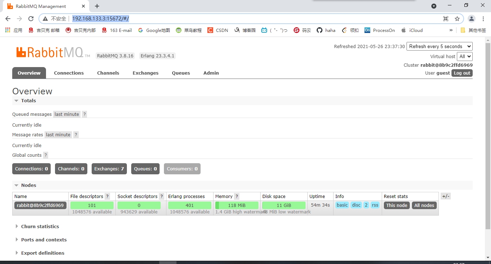

>  在经过我一段时间的努力后，找不到 RabbitMQ的安装包，但是我在 RabbitMQ 官网看到了 Docker 命令，so 我打算使用docker 构建 RabbitMQ#

[TOC]

## 执行 Docker  命令

前提条件是 必须有 Docker 环境

```sh
docker run -it -d --name rabbitmq -p 5672:5672 -p 15672:15672 rabbitmq:3-management
```

等待一会，就安装好了，这时，我们进入容器中操作配置

### 环境搭建

配置docker安装的RabbitMQ容器中，没有 vi、vim 编辑器，先整个编辑器

```sh
apt-get install vim
```

```sh
root@8b9c2ffd6969:/etc/rabbitmq# apt-get install vim
Reading package lists... Done
Building dependency tree
Reading state information... Done
E: Unable to locate package vim
```

再执行：

```sh
apt-get update
```

 这个命令的作用是：同步 /etc/apt/sources.list 和 /etc/apt/sources.list.d 中列出的源的索引，这样才能获取到最新的软件包

最后再执行：

```sh
apt-get install vim
```

vim 就安装好了

### 配置环境

```sh
root@8b9c2ffd6969:/etc/rabbitmq# vim rabbitmq.conf
loopback_users.guest = false
listeners.tcp.default = 5672
management.tcp.port = 15672
{loopback_users, []}
```

开启访客模式：

```sh
{loopback_users, []}
```

 ### 启动rabbitMq管理插件

```
rabbitmq-plugins enable rabbitmq_management
```


### 访问页面

```http
http://192.168.133.3:15672/#/
用户名：guest
密码：guest
```



| Protocol        | Bound to | Port  |                |
| :-------------- | :------- | :---- | -------------- |
| amqp            | ::       | 5672  | AMQP协议端口   |
| clustering      | ::       | 25672 | 集群使用的端口 |
| http            | ::       | 15672 | http端口       |
| http/prometheus | ::       | 15692 |                |


### 扩展

如果是使用CentOS 安装的 RabbitMQ 

启动、关闭、重启命令分别是

```sh
systemctl start rabbbitmq
systemctl status rabbbitmq
systemctl restart rabbbitmq
```

查看用户

```sh
root@8b9c2ffd6969:/# rabbitmqctl list_users;
Listing users ...
user    tags
guest   [administrator]
```

查看插件

```sh
root@8b9c2ffd6969:/# rabbitmq-plugins list
Listing plugins with pattern ".*" ...
 Configured: E = explicitly enabled; e = implicitly enabled
 | Status: * = running on rabbit@8b9c2ffd6969
 |/
[  ] rabbitmq_amqp1_0                  3.8.16
[  ] rabbitmq_auth_backend_cache       3.8.16
[  ] rabbitmq_auth_backend_http        3.8.16
。。。
。。。
```

