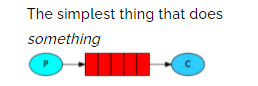
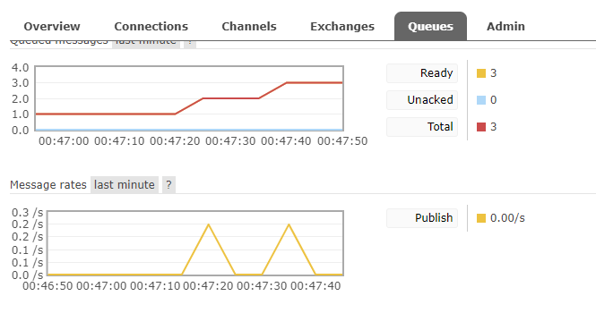
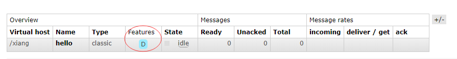
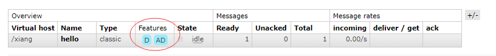
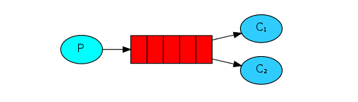
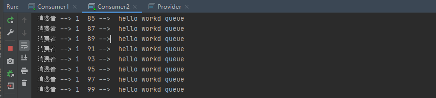
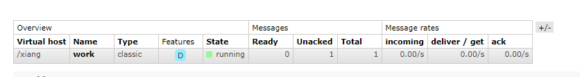

> 
[toc]

模式介绍：[https://rabbitmq.com/getstarted.html](https://rabbitmq.com/getstarted.html)

# 创建一个 Maven 工程

引入依赖

```xml
<dependency>
      <groupId>com.rabbitmq</groupId>
      <artifactId>amqp-client</artifactId>
      <version>5.7.2</version>
</dependency>
```

## 1、直连



​		在上图模式中，有以下概念

+ P 生产者，也就是发送消息的程序
+ C消费者，消息的接受者，会一直等待消息到来
+ queue：消息队列，图中红色部分，类似一个邮箱，可以缓存消息，生产者向其中投递消息，消费者从中取出消息

### 1.1、生产者：

```java
@Test
    public void testSendMessage() throws IOException, TimeoutException {
        // 创建连接 mq 的连接工厂对象
        ConnectionFactory connectionFactory = new ConnectionFactory();
        // 设置连接 rabbitmq 主机
        connectionFactory.setHost("192.168.133.3");
        // 设置端口号
        connectionFactory.setPort(5672);
        // 设置连接虚拟机
        connectionFactory.setVirtualHost("/xiang");
        // 设置访问虚拟主机的用户名和密码
        connectionFactory.setUsername("xiang");
        connectionFactory.setPassword("xiang");

        // 创建连接对象
        Connection connection = connectionFactory.newConnection();

        // 获取连接中通道
        Channel channel = connection.createChannel();
        // 通道绑定消息队列
        // 参数1：queue 队列名称，如果队列不存在会自动创建
        // 参数2：durable 用来定义队列是否要持久化 true 持久化
        // 参数3：exclusive 是否独占队列 ture 代表独占队列
        // 参数4：autoDelete 是否在消费完成后自动删除队列 true 自动删除
        // 参数5：额外参数...
        channel.queueDeclare("hello",false,false,false,null);

        // 发布消息
        // 参数1：交换机名称
        // 参数2：队列名称
        // 参数3：传递消息的额外设置
        // 参数4：消费的具体内容
        channel.basicPublish("","hello",null,"hello rabbitmq".getBytes());
        channel.close();
        connection.close();
    }
```

执行三次：



### 1.2、消费者

```java
 public static void main(String[] args) throws IOException, TimeoutException {
        ConnectionFactory connectionFactory = new ConnectionFactory();
        connectionFactory.setHost("192.168.133.3");
        connectionFactory.setPort(5672);
        connectionFactory.setVirtualHost("/xiang");
        connectionFactory.setUsername("xiang");
        connectionFactory.setPassword("xiang");

        Connection connection = connectionFactory.newConnection();
        Channel channel = connection.createChannel();
        channel.queueDeclare("hello",false,false,false,null);
        // 消费消息
        // 参数1：消息队列
        // 参数2：开始消费自动确认机制
        // 参数3：消费时的回调接口
        channel.basicConsume("hello",true,new DefaultConsumer(channel){

            // 最后一个参数 body 消息队列中取出的参数
            @Override
            public void handleDelivery(String consumerTag, Envelope envelope, AMQP.BasicProperties properties, byte[] body) throws IOException {
                System.out.println(new String(body));
            }
        });

        channel.close();
        connection.close();
    }
```

> 直连：可以用于注册，注册成功后，发短信，将消息放到队列中，让短信服务在另一端消费使用

### 1.3、细化直连

```java
package com.xiang.utils;


import com.rabbitmq.client.Channel;
import com.rabbitmq.client.Connection;
import com.rabbitmq.client.ConnectionFactory;


public class RabbitMQUtils {

    private static ConnectionFactory connectionFactory;

    static {
        connectionFactory = new ConnectionFactory();
        connectionFactory.setHost("192.168.133.3");
        connectionFactory.setPort(5672);
        connectionFactory.setVirtualHost("/xiang");
        connectionFactory.setUsername("xiang");
        connectionFactory.setPassword("xiang");
    }

    // 提供连接对象的方法
    public static Connection getConnection(){
        try {
            return connectionFactory.newConnection();
        } catch (Exception e) {
            e.printStackTrace();
            return null;
        }
    }

    // 关闭通道关闭连接的工具
    public static void closeConnectionAndChanel(Channel channel,Connection connection){
        try {
            if (channel!=null) channel.close();
            if (connection!=null)  connection.close();
        } catch (Exception e) {
            e.printStackTrace();
        } 
    }
}

```

### 1.4、参数详解

```
channel.queueDeclare("hello",false,false,false,null);
```

+ 参数1：队列名称，当使用 queueDeclare 时，及时没有队列，也会创建一个队列出来 ，创建的队列名叫 "hello" 

  > 场景：
  >
  > ```java
  > channel.queueDeclare("a",false,false,false,null);
  > channel.basicPublish("","hello",null,"hello rabbitmq".getBytes());
  > ```
  >
  > 我们修改了 queueDeclare 队列中的名称，执行后，会发现 a 队列被创建，但是消息却发送到了 hello中，这是因为 `basicPublish`  才是真正发送消息的地方

+ 参数2：durable 是否持久化 true 表示持久化，如果我们以 第二个参数为 false 的情况下 也就是不持久化的情况下 发送消息到 队列中，在我们重启 RabbitMQ后，非持久化的数据就会丢失，如果设置为 true 发送消息后，可以在 web 页面看到  `Features` 为 `D`

  + 此时 队列持久化，但消息没有持久化

    ```java
    channel.basicPublish("","hello", MessageProperties.PERSISTENT_TEXT_PLAIN,"hello rabbitmq".getBytes());
    ```

    配置消息持久化的配置：在 basicPublish 的第三个参数 `MessageProperties.PERSISTENT_TEXT_PLAIN` 注意：因为推送的消息是持久化的，所以必须要保证这个队列是持久化的

    ==注意：在取出的时候也应该设置为真确的队列== 第二个参数 设置为 true

    ```java
    channel.queueDeclare("hello",true,false,false,null);
    ```

    ==在接收的时候，不要把连接关闭了，否则会输出不出来东西==



+ 参数3：exclusive 是否独占队列，如果是true 代表独占队列，其他连接如果再使用这个队列的话，直接报错

+ 参数4：autoDelete 是否自动删除，true 删除，如果这个队列没有任何消息，就会自动删除这个队列

  ```java
  channel.queueDeclare("hello",true,false,true,null);
  ```

  此时去除队列的时候也需要保持一致，否则会报

  ```sh
  Caused by: com.rabbitmq.client.ShutdownSignalException: channel error; protocol method: #method<channel.close>(reply-code=406, reply-text=PRECONDITION_FAILED - inequivalent arg 'auto_delete' for queue 'hello' in vhost '/xiang': received 'false' but current is 'true', class-id=50, method-id=10)
  	at com.rabbitmq.utility.ValueOrException.getValue(ValueOrException.java:66)
  	at com.rabbitmq.utility.BlockingValueOrException.uninterruptibleGetValue(BlockingValueOrException.java:36)
  	at com.rabbitmq.client.impl.AMQChannel$BlockingRpcContinuation.getReply(AMQChannel.java:502)
  	at com.rabbitmq.client.impl.AMQChannel.privateRpc(AMQChannel.java:293)
  	at com.rabbitmq.client.impl.AMQChannel.exnWrappingRpc(AMQChannel.java:141)
  	... 3 more
  ```

  此时我们重新执行后发现，队列并没有删除，原因是，我们没有与队列彻底断开连接，我们停止程序运行，等于断开连接，此时队列立刻就消失了

  

## 2、工作队列 [Work queues](https://rabbitmq.com/tutorials/tutorial-two-python.html)

​		`Work queues` ，也被称为 (Task queues) ,任务模型，当消息处理比较耗时的时候，可能生产消息的速度会远远大于消息的消费速度，长此以往，消息就会堆积的越来越多，无法及时处理，此时就可以使用work 模型，让多个消费者绑定到一个队列，共同消费队列中的消息，队列中的消息一旦消费，就会消失，因此任务是不会重复执行的。



角色：

+ P 生产者：任务的发布者
+ C1消费者：领取任务并完成任务，假设完成速度较慢
+ C2消费者：领取任务并完成任务，假设完成较快

### 2.1、开发生产者

```java
Connection connection = RabbitMQUtils.getConnection();
assert connection != null;
Channel channel = connection.createChannel();
channel.queueDeclare("work",true,false,false,null);
for (int i = 0; i < 100; i++) {
    channel.basicPublish("","work",null,(i+" -->  hello workd queue").getBytes());
}
RabbitMQUtils.closeConnectionAndChanel(channel,connection);
```

### 2.2、两个消费者

```java
Connection connection = RabbitMQUtils.getConnection();
assert connection != null;
Channel channel = connection.createChannel();
channel.queueDeclare("work",true,false,false,null);
channel.basicConsume("work",true,new DefaultConsumer(channel){
    @Override
    public void handleDelivery(String consumerTag, Envelope envelope, AMQP.BasicProperties properties, byte[] body) throws IOException {
        System.out.println("消费者 -->   "+new String(body));
    }
});
```

> 总结：默认情况下，RabbitMQ 将按顺序将每条消息发送给下一个消费者。平均而言，每个消费者都会收到相同数量的信息。这种分发消息的方式称为循环。尝试与三个或三个以上的工人。



==即使有消费者，消费的比较慢，也是均分消息== 我们可以用 Thread.sleep 测试，发现结果和之前的一样


```java
channel.basicConsume("work",true,new DefaultConsumer(channel){。。。}
```

+ 参数1：队列

+ 参数2：消息自动确认 true，表示自动确认， 消费者自动向 RabbitMQ 确认消息消费

  + 消费者开启自动确认后，MQ 不管 消费者处理逻辑的复杂，直接分发了所有的消息给消费者，假设分发了10个消息，消费者在执行到第2个的时候，宕机了，后面8个消息都会丢失。==官方不推荐 自动确认== 

  + 如果关闭自动确认，当第二个宕机了，只会丢失第二个，后面的会交给其他消费者处理

    ```java
    channel.basicQos(1);
    ```

    ==同时开启，每一次只能消费一个消息==

    ```java
    channel.basicAck(envelope.getDeliveryTag(),false);
    ```

    同时下面还要配置确认机制，确认收到了消息，==MQ在收到消息后才会删除队列里的消息，确保消息永不丢失== 如果有一个 consumer 没有配置，在 MQ web 页面会出现 1个还未被确认的状态

    + 第一个参数：确定队列中那个具体消息
    + 参数2：是否开启多个消息同步确定

    


