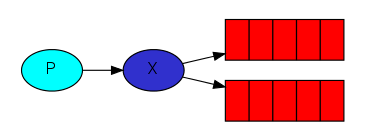
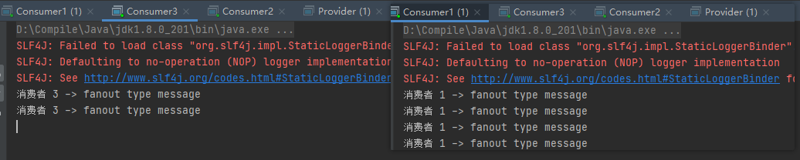
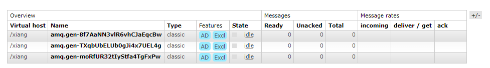

> 创建于2021年5月28日
>
> 作者：想想

[TOC]

## fanout

`fanout 扇形也称为广播`

Putting it all together



在广播模式下，消息发送流程是这样的

+ 可以有多个消费者
+ 每个消费者有自己的 queue（队列）
+ 每个队列都要绑定到 Exchange（交换机）
+ 生产者发送消息，只能发送到交换机，交换机来决定要发送给哪个队列，生产者无法决定
+ 交换机把消息发送给绑定过的队列
+ 队列的消费者都能拿到消息，实现一条消息被多个消费者消费

### 1、开发生产者

```java
Connection connection = RabbitMQUtils.getConnection();
Channel channel = connection.createChannel();
// 将通道声明指定交换机
channel.exchangeDeclare("logs","fanout");
// 发送消息
channel.basicPublish("logs","",null,"fanout type message".getBytes());
RabbitMQUtils.closeConnectionAndChanel(channel,connection);
```

### 2、开发消费者

消费者 1、2、3 都是这个代码

```java
Connection connection = RabbitMQUtils.getConnection();
Channel channel = connection.createChannel();
// 通道绑定交换机
channel.exchangeDeclare("logs","fanout");
// 临时队列
String queue = channel.queueDeclare().getQueue();
// 绑定交换机和队列
channel.queueBind(queue,"logs","");
// 消费消息
channel.basicConsume(queue,true,new DefaultConsumer(channel){
    @Override
    public void handleDelivery(String consumerTag, Envelope envelope, AMQP.BasicProperties properties, byte[] body) throws IOException {
        System.out.println("消费者 1 -> "+new String(body));
    }
});
```

执行一遍产者，三个消费者都会接收到消息



