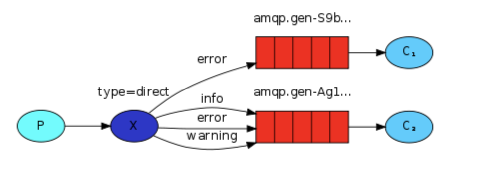

> ·创建于2021年5月28日
>
> 作者：想想

[toc]

## Routing 路由模型

### 1、Routing之订阅模式-Direct（直连）

​		在`Fanout模式中，一条消息，会被所有订阅的队列都消费。但是，在某些场景下，我们希望不同的消息被不同的队列消费，这时就要用到 Direct 类的Exchange`

在Direct 模型下：

+ 队列与交换机的绑定，不是任意绑定，而是要制定一个 `RoutingKey` (路由Key)
+ 消息的发送方在向 Exchange 发送消息时，也必须制定消息的 Routingkey
+ Exchange 不再把消息交给每个绑定的队列，而是根据消息的 Routing key进行判断，只有队列 RoutingKey 与消息的 Routing key 完全一致，才会接受到消息流程



图解：

+ P：生产者，向Exchange发送消息，会指定一个 routing key
+ X：Exchange（交换机），接收到生产者消息，然后把消息传递给 routing key 完全匹配的队列
+ C1：消费者，其所在队列指定了需要 routing key 为 error 的消息
+ C2：消费者，其所在队列指定了需要 routing key 为 info 、error、warring 的消息

#### 1.1、开发生产者

```java
Connection connection = RabbitMQUtils.getConnection();
Channel channel = connection.createChannel();
// 通过通道声明交换机 参数1：交换机名称 参数2：路由模式
channel.exchangeDeclare("exchange_xiang","direct");
// 发送
String routingKey = "info";
channel.basicPublish("exchange_xiang",routingKey,null,("这时 direct 模型基于 route key:["+routingKey+"]").getBytes());
RabbitMQUtils.closeConnectionAndChanel(channel,connection);
```

#### 1.2、消费者1

```java
Connection connection = RabbitMQUtils.getConnection();
Channel channel = connection.createChannel();
// 声明交换机名称及类型
channel.exchangeDeclare("exchange_xiang","direct");
// 创建一个临时队列
String queue = channel.queueDeclare().getQueue();
// 基于 route key绑定队列和交换机
channel.queueBind(queue,"exchange_xiang","error");
// 获取消息
channel.basicConsume(queue, true, new DefaultConsumer(channel){
    @Override
    public void handleDelivery(String consumerTag, Envelope envelope, AMQP.BasicProperties properties, byte[] body) throws IOException {
        System.out.println("消费者 1 -> "+new String(body));
    }
});
```

#### 1.3、消费者2

```java
Connection connection = RabbitMQUtils.getConnection();
Channel channel = connection.createChannel();
// 声明交换机名称及类型
channel.exchangeDeclare("exchange_xiang","direct");
// 创建一个临时队列
String queue = channel.queueDeclare().getQueue();
// 基于 route key绑定队列和交换机
channel.queueBind(queue,"exchange_xiang","info");
channel.queueBind(queue,"exchange_xiang","error");
channel.queueBind(queue,"exchange_xiang","warning");
// 获取消息
channel.basicConsume(queue, true, new DefaultConsumer(channel){
    @Override
    public void handleDelivery(String consumerTag, Envelope envelope, AMQP.BasicProperties properties, byte[] body) throws IOException {
        System.out.println("消费者 2 -> "+new String(body));
    }
});
```


当生产者发送的消息为 `error` 消息时，

```java
String routingKey = "error";
```

此时 消费者1与消费者2 中，都绑定了 `error` 

```java
channel.queueBind(queue,"exchange_xiang","error");
```

此时，两个消费者都会消费这个信息

so 如果发送的是 info、warring 时，此时只有 消费者2才能消费消息。

如果 发送的是 hello，二则都没有绑定的消息时，那就都不能消费消息了