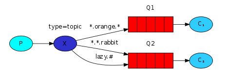
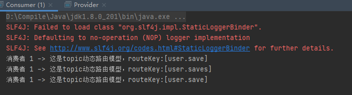

> 创建于 2021年5月31日
>
> 作者：想想

[toc]

## Topic 动态路由


​		`Topic`类型的`Exchange 和 Direct ` 相比，都是可以根据 RoutingKey 把消息路由到不同队列，只不过 `Topic` 类型 `Exchange` 可以让队列绑定 `Routing key` 的时候通过通配符！这种模型 `Routingkey` 一般都是由一个或多个单词组成，多个单词之间以 ”.“ 分割，例如 `item.inser`



```markdown
# 通配符
	*（star） can substitute for exactly one word 匹配1个词
	# （hash） can substitute for zero or more word 匹配0个或多个词
# 如：
	audit.# 匹配 audit.irs.cou 或者 audit.good 等
	audit.* 匹配 audit.hello
```


### 1、生产者

```java
Connection connection = RabbitMQUtils.getConnection();
Channel channel = connection.createChannel();

// 声明交换机类型 topic
channel.exchangeDeclare("hello","topic");
// 发布消息
String routeKey = "user.save";
channel.basicPublish("hello",routeKey,null,("这是topic动态路由模型，routeKey:["+routeKey+"]").getBytes());
RabbitMQUtils.closeConnectionAndChanel(channel,connection);
```

### 2、消费者

```java
Connection connection = RabbitMQUtils.getConnection();
Channel channel = connection.createChannel();
channel.exchangeDeclare("hello","topic");
String queue = channel.queueDeclare().getQueue();
channel.queueBind(queue,"hello","user.*");
channel.basicConsume(queue,true,new DefaultConsumer(channel){
    @Override
    public void handleDelivery(String consumerTag, Envelope envelope, AMQP.BasicProperties properties, byte[] body) throws IOException {
        System.out.println("消费者 1 -> "+new String(body));
    }
});
```

