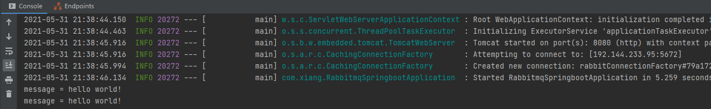
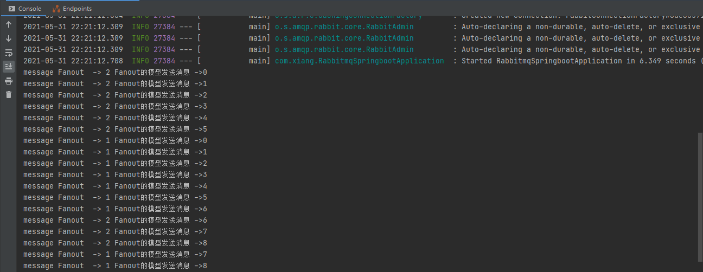

> 创建于 2021年5月31日
>
> 作者：想想

[toc]


## 搭建环境

​		快速搭建 SpringBoot 项目，勾选 Web 及 Spring for RabbitMQ

依赖：

```xml
<dependency>
    <groupId>org.springframework.boot</groupId>
    <artifactId>spring-boot-starter-amqp</artifactId>
</dependency>
```

配置文件

```yml
# 应用名称
spring:
  application:
    name: rabbitmq_springboot
  rabbitmq:
    host: 192.144.233.95
    username: xiang
    password: xiang
    virtual-host: /xiang
# 应用服务 WEB 访问端口
server:
  port: 8080
```

`RabbitTemplate` 用来操作 RabbitMQ 简化操作


### Hello模型

#### 1、生产者

```java
@SpringBootTest(classes = RabbitmqSpringbootApplication.class)
@RunWith(SpringRunner.class)
public class TestRabbitMQ {

    @Autowired
    private RabbitTemplate rabbitTemplate;

    @Test
    public void test(){
        rabbitTemplate.convertAndSend("hello","hello world!");
    }

}
```

我们直接执行 Test ,RabbitMQ 是不做任何反应的，因为没有消费者

#### 2、消费者

```java
Component
@RabbitListener(queuesToDeclare = @Queue(value = "hello",declare = "true",autoDelete = "true"))
public class HelloConsumer {

    @RabbitHandler
    public void receive(String message){
        System.out.println("message = "+message);
    }
}
```

有了消费者，再启动生产者，这时就能看到 RabbitMQ 中新建了队列



### Work模式

#### 生产者

```java
rabbitTemplate.convertAndSend("work","work模型 -->"+i+"   Good");
```

#### 消费者

```java
@RabbitListener(queuesToDeclare = @Queue("work"))
public void receive(String message){
    System.out.println("message work 1 ->"+message);
}

@RabbitListener(queuesToDeclare = @Queue("work"))
public void receive1(String message){
    System.out.println("message work 2 ->"+message);
}
```

### Fanout模型

#### 生产者

```java
rabbitTemplate.convertAndSend("logs","","Fanout的模型发送消息 ->"+i);
```

在SpringBoot 中，无论生产者执行多少次，如果没有消费者，RabbitMQ 都不会接收到消息

#### 消费者

```java
 @RabbitListener(bindings = {
     @QueueBinding(
         value = @Queue,     // 绑定临时队列
         exchange = @Exchange(value = "logs",type = "fanout")    // 绑定的交换机
     )
 })
public void receive(String message){
    System.out.println("message Fanout  -> 1 "+message);
}


@RabbitListener(bindings = {
    @QueueBinding(
        value = @Queue,     // 绑定临时队列
        exchange = @Exchange(value = "logs",type = "fanout")    // 绑定的交换机
    )
})
public void receive1(String message){
    System.out.println("message Fanout  -> 2 "+message);
}
```




### Routing模型

```java
rabbitTemplate.convertAndSend("directs","info","发送info的key信息");
```

消费者：

```java
@RabbitListener(bindings = {
    @QueueBinding(
        value = @Queue,//创建临时队列
        exchange = @Exchange(value = "directs",type = "direct"),
        key = {"info","error","warn"}
    )
})
public void receive(String message){
    System.out.println("message  1-> "+message);
}


@RabbitListener(bindings = {
    @QueueBinding(
        value = @Queue,//创建临时队列
        exchange = @Exchange(value = "directs",type = "direct"),
        key = {"info"}
    )
})
public void receive2(String message){
    System.out.println("message  2-> "+message);
}
```

### Topic模型

```java
rabbitTemplate.convertAndSend("topics","user.del.good","user.save 路由消息");
```

消费者：

```java
@RabbitListener(bindings = {
    @QueueBinding(
        value = @Queue,
        exchange = @Exchange(type = "topic",name = "topics"),
        key = {"user.save","user.*"}
    )
})
public void receive(String message){
    System.out.println("message 1-> " + message);
}


@RabbitListener(bindings = {
    @QueueBinding(
        value = @Queue,
        exchange = @Exchange(type = "topic",name = "topics"),
        key = {"user.del","user.#"}
    )
})
public void receive2(String message){
    System.out.println("message 2-> " + message);
}
```

