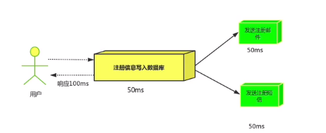

> 创建于 2021年6月2日
>
> 作者：想想

[toc]

## MQ的应用场景

​		==场景说明，用户注册，需要发注册邮件和注册短信，传统做法有两种，1、串行的方式，2、并行的方式==

+ 串行方式：将注册信息写入数据库后，发送注册邮件，再发送注册短信，以上三个任务完成后才返回客户端，这有一个问题是，邮件，短信并不是必须的，它只是一个通知，而这种做法没法让客户端等待没有必要的东西。

+ 并行方式：将注册消息写入数据库后，发送邮件的同时，发送短信，以上三个任务完成后，返回客户端，并行的方式提高处理时间

+ 消息队列：假设三个业务节点分别使用 50ms，串行方式使用时间 150ms，并行使用 100ms。虽然并行已经提高了处理时间，但是前面说过，邮件和短信对我们正常的使用网站没有任何影响，客户端没必要等着其他发送完成才显示注册成功，应该写入数据库后就返回，`消息队列`：引入消息队列后，把发邮件、短信不是必须的业务逻辑异步进行处理

由此可以看出，引入消息队列后，用户的影响时间就等于写入数据库的时间+写入消息队里的时间（可以忽略不计），引入消息队里处理后，响应时间是串行的三倍、是并行两倍。

### 1、应用解耦

​		==场景：双11是购物节，用于下单后，订单需要通知库存系统，传统的做法就是订单系统调库存系统的接口==

这样做法有个缺点：当库存系统出现故障时，订单就会失败。订单系统和库存系统高耦合，引入消息队列

+ `订单系统`：用户下单后，订单系统完成持久化处理，将消息写入消息队列，返回用户订单下单成功
+ `库存系统`：订阅下单的消息，获取下单消息，进行库操作，就算库存系统出现鼓掌，消息队列也可以保证消息的可靠投递，不会导致消息丢失

### 2、流量削峰

​		==场景：秒杀活动，一般会因为流量过大，导致应用挂掉，为了解决个问题，一般在应用前端加入消息队列==

​		`作用`：

1. 可以控制活动人数，超过此一定阈值的订单直接丢失
2. 可以缓解短时间的高流量压垮应用

1. 用户的请求，服务器接收到之后，先写入消息队列，加入消息队列超过最大值，则直接抛弃用户请求或者跳转错误页面，
2. 秒杀业务根据消息队列中的请求消息，再做后续处理

------

