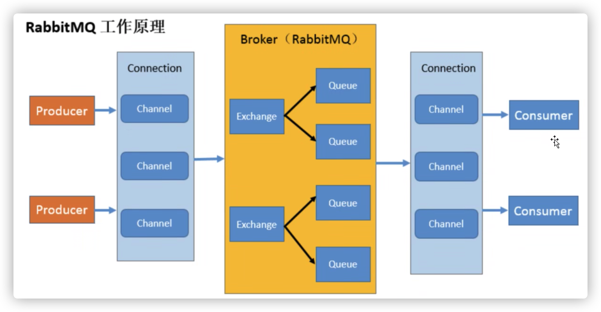

> 四大核心：生产者、队列、交换机、消费者

## 一、概念

消息队列，遵守 FIFO（先进先出）

三大功能：

1. 流量削峰
2. 应用解耦
3. 异步操作

## 一、名称介绍

+ Broker：接收和分发消息的引用，RabbitMQ Server 就是 Message Broker
+ Connection（连接）：发布消息和接收消息和 broker 之间的 TCP 接收
+ Channel（信道）：每一次访问 RabbitMQ 都建立一个 Connection，在消息量大的时候耗费资源（这里有点像数据库链接池）创建一个连接后，一个连接中包括多个信道，信道之间完全隔离。
+ Virtual host（多租户）：每个租户下又不同的交换机
+ Exchange（交换机）：一方面接收来自生产者的消息，另一方面将消息推送到队列中
+ Queen（队列）：消息最终送到这里等待消费者取走
+ Binding（绑定）：减缓及

