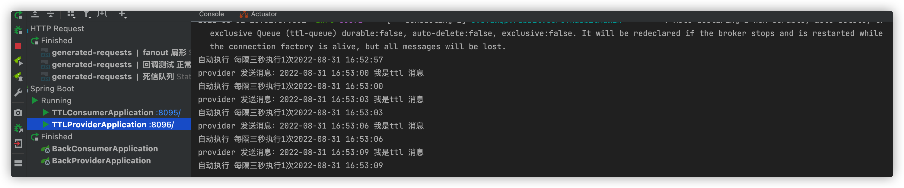

> 创建时间 2022年8月31日
>
> 标签：Java、SpringBoot、RabbitMQ、队列
>
> 注释：RabbiMQ TTL 消息过期、死信队列
>
> 来源：https://www.cnblogs.com/lonely-wolf/p/14225132.html

阅读这篇文章之前！确保你已经对 RabbitMQ 有了基础的理解，了解 Direct、Fanout 模式，使用SpringBoot整合过 RabbitMQ。如果没有！请不要轻易尝试此文章

**浪费别人的时间就是在谋财害命**

正文开始

简单的发消息我们已经会了，难道就要止步于此吗？显然是不能的，要玩就要玩一点高级的，所以我们来给RabbitMQ加点佐料

## T T L

TTL （Time-To-Live）即一条消息在队列中最大存活时间，在一条队列中超过配置的 TTL 消息称为已死消息，但是要注意的事，已死掉的消息不能立即从队列中删除的，但是能保证已死的消息不会被投递出去。

设置 TTL 的方式有两种

1. 给队列设置x-message-ttl，此时所有投递到队列 消息，都会在达到 TTL 时称为已死消息

	这种情况就会出现当一条消息同时路由到 N 个带TTL 时间的队列，而由于每个队列的 TTL 不一定相同，所以同一条消息在不同的队列中可能会在不同的时间死亡，或者不死亡（没设置TTL）所以一个队列的消息死亡不会影响到其他队列中的消息

2. 单独给某一条消息设置过期时间

	此时需要注意的是，当消息达到 TTL 时，可能不会马上被丢弃，因为只有处于队列头部消息过期才会被丢弃，假如队列头部的消息没有设置 TTL，而第二条设置了 TTL，那么即使第2条已经死亡，也要等到头部消息被消费之后才会被丢弃。而已死消息在呗丢弃之前也会被计入统计数据（total）所以为了更好的利用 TTL 特性，建议让消费者在线消费消息，这样才能保证消息更快的被丢弃，防止消费堆积。

消息过期可能在发送途中（还没到消费者那）就就过期了

### 队列生存

和 TTL 针对消息不同的是，我们可以通过设置过期时间属性 'x-expries' 来处理队列，当在指定过期时间内未使用队列时，服务器保证将删除队列

上代码

在 Provider 上配置 RabbitConfig 配置类

```java
package com.liuyuncen.config;

import org.springframework.amqp.core.Binding;
import org.springframework.amqp.core.BindingBuilder;
import org.springframework.amqp.core.DirectExchange;
import org.springframework.amqp.core.Queue;
import org.springframework.beans.factory.annotation.Qualifier;
import org.springframework.context.annotation.Bean;
import org.springframework.context.annotation.Configuration;

import java.util.HashMap;
import java.util.Map;

/**
 * @belongsProject: rabbitmq_springboot
 * @belongsPackage: com.liuyuncen.config
 * @author: Xiang想
 * @createTime: 2022-08-31  16:16
 * @description: TODO
 * @version: 1.0
 */
@Configuration
public class RabbitConfig {

    //直连交换机
    @Bean
    public DirectExchange directExchange(){
        return new DirectExchange("ttl-exchange");
    }

    @Bean
    public Queue ttlQueue(){
        Map<String,Object> map = new HashMap<>();
        // 队列中所有消息5秒后过期
        map.put("x-message-ttl",5000);
        // 队列闲置 10 秒后被删除
        map.put("x-expires",10000);
        // durable：是否持久
        // exclusive: 是否排他，如果为true时，只对当前队列有效，一旦断开，队列立刻删除
        // autoDelete：是否自动删除，前提是必须呀喔有一个消费者先连上，然后所有消费者断开，就自己删除
        return new Queue("ttl-queue",false,false,false,map);
    }

    @Bean
    public Binding ttlBindExchange(@Qualifier("ttlQueue") Queue queue, @Qualifier("directExchange")DirectExchange directExchange){
        return BindingBuilder.bind(queue).to(directExchange).with("ttl");
    }
}
```

然后再写一个接口

```java
package com.liuyuncen.controller;

import org.springframework.amqp.rabbit.core.RabbitTemplate;
import org.springframework.beans.factory.annotation.Autowired;
import org.springframework.web.bind.annotation.GetMapping;
import org.springframework.web.bind.annotation.RequestMapping;
import org.springframework.web.bind.annotation.RestController;

import java.time.LocalDateTime;
import java.time.format.DateTimeFormatter;

/**
 * @belongsProject: rabbitmq_springboot
 * @belongsPackage: com.liuyuncen.controller
 * @author: Xiang想
 * @createTime: 2022-08-31  16:27
 * @description: TODO
 * @version: 1.0
 */
@RestController
@RequestMapping("/ttl")
public class TTLConroller {

    @Autowired
    RabbitTemplate rabbitTemplate;

    @GetMapping("/sendTtl")
    public String sendTtl(){
        String time = LocalDateTime.now().format(DateTimeFormatter.ofPattern("yyyy-MM-dd HH:mm:ss"));
        String msg = time + " 我是ttl 消息";
        System.out.println("provider 发送消息：" + msg);
        rabbitTemplate.convertAndSend("ttl-exchange","ttl",msg);
        return "ok";
    }

}
```

因为这里设置的是10秒闲时删除队列，所以我们要写一个定时任务，让他3秒跑一次，记得在启动类上添加 `@EnableScheduling`

```java
@Component
public class AutoTask {
    @Autowired
    private TTLConroller ttlConroller;

    @Scheduled(cron = "*/3 * * * * ?")
    public void task(){
        String nowTime = LocalDateTime.now().format(DateTimeFormatter.ofPattern("yyyy-MM-dd HH:mm:ss"));
        ttlConroller.sendTtl();
        System.out.println("自动执行 每隔三秒执行1次" + nowTime);
    }
}
```

接下来写消费者

```java
package com.liuyuncen.receiver;

import org.springframework.amqp.rabbit.annotation.RabbitHandler;
import org.springframework.amqp.rabbit.annotation.RabbitListener;
import org.springframework.stereotype.Component;

/**
 * @belongsProject: rabbitmq_springboot
 * @belongsPackage: com.liuyuncen.receiver
 * @author: Xiang想
 * @createTime: 2022-08-31  16:25
 * @description: TODO
 * @version: 1.0
 */
@Component
public class TTLRecevier {

    @RabbitHandler
    @RabbitListener(queues = "ttl-queue")
    public void ttlConsumer(String message){
        System.out.println("message = " + message);
    }
}
```

这里要注意启动顺序，如果是先启动消费者，消费者会报一个找不到队列的异常，一段时间找不到后，程序就会终止


所以我们要先启动生产者，然后快速的启动消费者



看到此时生产者正在自动生成数据，消费者也在一直消费数据


我们的队列也在 rabbitMQ中，此时，我们把消费者停掉，让数据无法消费

大概过了10秒，ttl-queue 就队列里找不到了。

### 其他属性

队列中还有其他一些属性可以设置，在这里我们就不一一举例了：

- x-message-ttl：队列中消息的存活时间（毫秒），达到TTL的消息可能会被删除。
- x-expires：队列在多长时间（毫秒）没有被访问以后会被删除。
- x-max-length：队列中的最大消息数。
- x-max-length-bytes：队列的最大容量（bytes）。
- overflow：队列溢出之后的策略。主要可以配置如下参数：`reject-publish` - 直接丢弃最近发布的消息，如若启用了`publisher confirm`（发布者确认），发布者将通过发送 `basic.nack` 消息通知拒绝，如果当前队列绑定有多个消费者，则消息在收到 `basic.nack` 拒绝通知后，仍然会被发布到其他队列；`drop-head` - 丢弃队列头部消息（集群模式下只支持这种策略） `reject-publish-dlx` - 最近发布的消息会进入死信队列。
- x-dead-letter-exchange：队列的死信交换机。
- x-dead-letter-routing-key：死信交换机的路由键。
- x-single-active-consumer：true/false。表示是否最多只允许一个消费者消费，如果有多个消费者同时绑定，则只会激活第一个，除非第一个消费者被取消或者死亡，才会自动转到下一个消费者。
- x-max-priority：队列中消息的最大优先级， 消息的优先级不能超过它。
- x-queue-mode：`3.6.0` 版本引入的，主要是为了实现惰性加载。队列将收到的消息尽可能快的进行持久化操作到磁盘上，然后只有在用户请求的时候才会加载到 `RAM` 内存。这个参数支持两个值：`default` 和 `lazy`。当不进行设置的时候，就是默认为 `default`，不做任何改变；当设置为 `lazy` 就会进行懒加载。
- x-queue-master-locator：为了保证消息的 `FIFO`，所以在高可用集群模式下需要选择一个节点作为主节点。这个参数主要有三种模式：`min-masters`- 托管最小数量的绑定主机的节点；`client-local`- 选择声明的队列已经连接到客户端的节点；`random`- 随机选择一个节点。

## 死信队列

上面参数中有个词 `死信队列` 这是个啥，好像很好玩的样子。

其实是指已死的消息，或者说无家可归的消息。有个消息进入死信队列，主要有三个条件

1. 消息被下方在拒绝并未设置重回队列
2. 消息过期了，即设置了 TTL
3. 消息达到长度了，超过了 Max length 或 Max length bytes，则队列头部会被送到死信队列


```java
package com.liuyuncen.config;

import org.springframework.amqp.core.*;
import org.springframework.beans.factory.annotation.Qualifier;
import org.springframework.context.annotation.Bean;
import org.springframework.context.annotation.Configuration;

/**
 * @belongsProject: rabbitmq_springboot
 * @belongsPackage: com.liuyuncen.config
 * @author: Xiang想
 * @createTime: 2022-08-31  17:41
 * @description: TODO
 * @version: 1.0
 */
@Configuration
public class RabbitConfig {

    // 定义正常交换机和正常队列信息(交换机名、队列名、路由key)
    public static final String queue_name = "xj_natural_queue";
    public static final String exchange_name = "xj_natural_exchange";
    public static final String routing_key = "xj_natural_routingKey";

    // 定义死信交换机名、死信队列名、路由key
    public static final String queue_name_dead = "xj_dead_queue";
    public static final String exchange_name_dead = "xj_dead_exchange";
    public static final String routing_key_dead = "xj_dead_routingKey";

    /**
     * 设置正常的消息队列；
     * 正常的消息队列具备以下几种功能：
     * 1、消息正常消费，需要绑定对应的消费者(这里为了测试死信，不创建消费者)
     * 2、当消息失效后，需要将指定的消息发送至 死信交换机 中
     * @return
     */
    @Bean(value = "getNaturalQueue")
    public Queue getNaturalQueue(){
        return QueueBuilder.durable(queue_name)
                // 正常的队列，在消息失效后，需要将消息丢入 死信 交换机中
                // 这里只需要针对名称进行绑定
                .withArgument("x-dead-letter-exchange",exchange_name_dead)
                // 丢入 死信交换机，需要设定指定的 routingkey
                .withArgument("x-dead-letter-routing-key",routing_key_dead)
                // 设置正常队列中消息的存活时间为 10s，当然也可以针对单个消息进行设定不同的过期时间
                .withArgument("x-message-ttl",10000)
                // 设定当前队列中，允许存放的最大消息数目
                .withArgument("x-max-length",10)
                .build();
    }

    /**
     * 设定正常的消息交换机
     * @return
     */
    @Bean(value = "getNaturalExchange")
    public Exchange getNaturalExchange(){
        // 这里为了测试，采取 direct exchange
        return ExchangeBuilder.directExchange(exchange_name)
                .durable(true) // 设定持久化
                .build();
    }

    /**
     * 将正常的消息交换机和正常的消息队列进行绑定
     * @param queue
     * @param directExchange
     * @return
     */
    @Bean
    public Binding bindNaturalExchangeAndQueue(
            @Qualifier(value = "getNaturalQueue") Queue queue,
            @Qualifier(value = "getNaturalExchange") Exchange directExchange
    ){

        return BindingBuilder
                // 绑定消息队列
                .bind(queue)
                // 至指定的消息交换机
                .to(directExchange)
                // 匹配 routingkey
                .with(routing_key)
                // 无参数，不加会报错提示
                .noargs();
    }

    /**
     * 定义死信队列
     * @return
     */
    @Bean(value = "getDealQueue")
    public Queue getDealQueue(){
        return QueueBuilder.durable(queue_name_dead).build();
    }

    /**
     * 定义死信交换机
     * @return
     */
    @Bean(value = "getDeadExchange")
    public Exchange getDeadExchange(){
        return ExchangeBuilder.directExchange(exchange_name_dead).durable(true).build();
    }

    /**
     * 将死信交换机和死信队列进行绑定
     * @param deadQueue
     * @param directDeadExchange
     * @return
     */
    @Bean
    public Binding bindDeadExchangeAndQueue(
            @Qualifier(value = "getDealQueue") Queue deadQueue,
            @Qualifier(value = "getDeadExchange") Exchange directDeadExchange
    ){
        return BindingBuilder.bind(deadQueue).to(directDeadExchange).with(routing_key_dead).noargs();
    }
}
```

```java
package com.liuyuncen.service;

import org.springframework.amqp.core.Message;
import org.springframework.amqp.rabbit.connection.CorrelationData;
import org.springframework.amqp.rabbit.core.RabbitTemplate;
import org.springframework.beans.factory.annotation.Autowired;
import org.springframework.stereotype.Service;

/**
 * @belongsProject: rabbitmq_springboot
 * @belongsPackage: com.liuyuncen.service
 * @author: Xiang想
 * @createTime: 2022-08-31  17:43
 * @description: TODO
 * @version: 1.0
 */
@Service
public class RabbitService implements RabbitTemplate.ConfirmCallback,RabbitTemplate.ReturnCallback {


    @Autowired
    RabbitTemplate rabbitTemplate;

    /**
     * 直接发送消息
     * @param exchange
     * @param routingKey
     * @param msg
     */
    public void sendMessage(String exchange,String routingKey,Object msg) {
        // 设置交换机处理失败消息的模式     true 表示消息由交换机 到达不了队列时，会将消息重新返回给生产者
        // 如果不设置这个指令，则交换机向队列推送消息失败后，不会触发 setReturnCallback
        rabbitTemplate.setMandatory(true);
        //消息消费者确认收到消息后，手动ack回执
        rabbitTemplate.setConfirmCallback(this);

        // return 配置
        rabbitTemplate.setReturnCallback(this);
        //发送消息
        rabbitTemplate.convertAndSend(exchange,routingKey,msg);
    }


    /**
     * 交换机并未将数据丢入指定的队列中时，触发
     *  channel.basicPublish(exchange_name,next.getKey(), true, properties,next.getValue().getBytes());
     *  参数三：true  表示如果消息无法正常投递，则return给生产者 ；false 表示直接丢弃
     * @param message   消息对象
     * @param replyCode 错误码
     * @param replyText 错误信息
     * @param exchange 交换机
     * @param routingKey 路由键
     */
    @Override
    public void returnedMessage(Message message, int replyCode, String replyText, String exchange, String routingKey) {
        System.out.println("---- returnedMessage ----replyCode="+replyCode+" replyText="+replyText+" ");
    }

    /**
     * 消息生产者发送消息至交换机时触发，用于判断交换机是否成功收到消息
     * @param correlationData  相关配置信息
     * @param ack exchange 交换机，判断交换机是否成功收到消息    true 表示交换机收到
     * @param cause  失败原因
     */
    @Override
    public void confirm(CorrelationData correlationData, boolean ack, String cause) {
        System.out.println("---- confirm ----ack="+ack+"  cause="+String.valueOf(cause));
        System.out.println("correlationData -->"+correlationData.toString());
        if(ack){
            // 交换机接收到
            System.out.println("---- confirm ----ack==true  cause="+cause);
        }else{
            // 没有接收到
            System.out.println("---- confirm ----ack==false  cause="+cause);
        }
    }
}

```

```java
package com.liuyuncen.task;

import com.liuyuncen.config.RabbitConfig;
import com.liuyuncen.service.RabbitService;
import org.springframework.beans.factory.annotation.Autowired;
import org.springframework.scheduling.annotation.Scheduled;
import org.springframework.stereotype.Component;

import java.time.LocalDateTime;
import java.time.format.DateTimeFormatter;

/**
 * @belongsProject: rabbitmq_springboot
 * @belongsPackage: com.liuyuncen.task
 * @author: Xiang想
 * @createTime: 2022-08-31  17:46
 * @description: TODO
 * @version: 1.0
 */
@Component
public class RabbitTask {

    @Autowired
    RabbitService rabbitService;


    @Scheduled(cron = "*/3 * * * * ?")
    public void task(){
        String time = LocalDateTime.now().format(DateTimeFormatter.ofPattern("yyyy-MM-dd HH:mm:ss"));
        String msg = time + " 我是 xdl 消息";
        System.out.println(msg);
        rabbitService.sendMessage(RabbitConfig.exchange_name,RabbitConfig.routing_key,msg);
    }
}
```


下课！