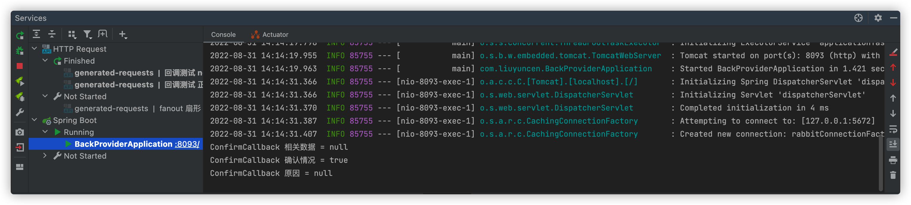

> 创建时间 2022年8月29日
>
> 标签：Java、SpringBoot、RabbitMQ、队列
>
> 注释：新建SpringBoot项目实操RabbitMQ实现消息回调、手动确认
>
> 来源：[CSDN博主：小目标青年](https://blog.csdn.net/qq_35387940/article/details/100514134)

[toc]

> 本文涉及的所有代码均已上传至 Gitee 链接：https://gitee.com/Array_Xiang/spring-boot-rabbit-mq.git

# SpringBoot 整合 RabbitMQ 回调确认模式

上一期我们讲过了 direct、topic、fanout 三种模式，这一期我们来探究一下RabbitMQ 的消息回调和手动确认，在看文章之前，首先要确保您对 SpringBoot 和 RabbitMQ 有一定的理解能力，如果两者只熟悉其中的一种，或者都不熟悉，还请您不要过早阅读此文章。有名人云：浪费别人的时间就是在谋财害命

前期准备工作：IDEA、Jdk8、RabbitMQ

## 生产者推送消息回调

老样子，直接上代码

```yml
server:
  port: 8093

spring:
  application:
    name: back-provider
  rabbitmq:
    host: 127.0.0.1
    port: 5672
    username: guest
    password: guest
    virtual-host: XiangHost
    #确认消息已发送到交换机(Exchange)
    publisher-confirm-type: correlated
    #确认消息已发送到队列(Queue)
    publisher-returns: true
```

如果你们在配置确认回调，测试发现无法触发回调函数，那么存在原因也许是因为SpringBoot版本导致的配置项不起效，可以把 publisher-confirms: true 替换为 publisher-confirm-type: correlated

配置消息确认的回调函数：RabbitConfig

```java
package com.liuyuncen.config;

import org.springframework.amqp.core.Message;
import org.springframework.amqp.rabbit.connection.ConnectionFactory;
import org.springframework.amqp.rabbit.connection.CorrelationData;
import org.springframework.amqp.rabbit.core.RabbitTemplate;
import org.springframework.context.annotation.Bean;
import org.springframework.context.annotation.Configuration;


/**
 * @belongsProject: rabbitmq_springboot
 * @belongsPackage: com.liuyuncen.config
 * @author: Xiang想
 * @createTime: 2022-08-31  13:38
 * @description: TODO
 * @version: 1.0
 */
@Configuration
public class RabbitConfig {

    @Bean
    public RabbitTemplate createRabbitTemplate(ConnectionFactory factory){
        RabbitTemplate rabbitTemplate = new RabbitTemplate();
        rabbitTemplate.setConnectionFactory(factory);
        // 只有开启了 Mandatory 才能出发回调函数,无论消息吐送结果怎样都强制调用回调函数
        rabbitTemplate.setMandatory(true);

        rabbitTemplate.setConfirmCallback(new RabbitTemplate.ConfirmCallback() {
            @Override
            public void confirm(CorrelationData correlationData, boolean b, String s) {
                System.out.println("ConfirmCallback 相关数据 = " + correlationData);
                System.out.println("ConfirmCallback 确认情况 = " + b);
                System.out.println("ConfirmCallback 原因 = " + s);
            }
        });

        rabbitTemplate.setReturnCallback(new RabbitTemplate.ReturnCallback() {
            @Override
            public void returnedMessage(Message message, int i, String s, String s1, String s2) {
                System.out.println("ReturnCallback 消息 = " + message);
                System.out.println("ReturnCallback 回应码 = " + i);
                System.out.println("ReturnCallback 回应信息 = " + s);
                System.out.println("ReturnCallback 交换机 = " + s1);
                System.out.println("ReturnCallback 路由键 = " + s2);
            }
        });
        return rabbitTemplate;
    }
}

```

可以看到我们配置了两个回调函数 ConfirmCallback 和 ReturnCallback，他们在什么情况下会触发呢？

我们大致模拟这几种情况

1. 消息推送到 server ，但是 server 里找不到交换机
2. 消息推送到 server，找到交换机，没有找到队列
3. 消息推送到 server，交换机和队列里啥都没找到
4. 消息推送成功

我们分别根据这几种情况来写测试案例

### 1、消息推送到server，但是server里找不到交换机

写个测试接口，把消息推送到 `not-existent-exchange` 

```java
package com.liuyuncen.collection;

import org.springframework.amqp.rabbit.core.RabbitTemplate;
import org.springframework.beans.factory.annotation.Autowired;
import org.springframework.web.bind.annotation.GetMapping;
import org.springframework.web.bind.annotation.RestController;

import java.time.LocalDateTime;
import java.time.format.DateTimeFormatter;
import java.util.HashMap;
import java.util.Map;
import java.util.UUID;

/**
 * @belongsProject: rabbitmq_springboot
 * @belongsPackage: com.liuyuncen.collection
 * @author: Xiang想
 * @createTime: 2022-08-31  13:48
 * @description: TODO
 * @version: 1.0
 */
@RestController
public class NotExistentExchange {

    @Autowired
    RabbitTemplate rabbitTemplate;

    @GetMapping("/notExistentMessage")
    public String notExistentMessage(){
        Map<String,Object> map = new HashMap<>();
        map.put("code",String.valueOf(UUID.randomUUID()));
        map.put("time", LocalDateTime.now().format(DateTimeFormatter.ofPattern("yyyy-MM-dd HH:mm:ss")));
        map.put("message","hi 你肯定找不到这个交换机");
        // 指向交换机和路由键
        rabbitTemplate.convertAndSend("not-existent-exchange","routingKey",map);
        return "ok";
    }
}
```

调用接口，查看控制台，这里说没有找到交换机


结论：这种情况触发 ConfirmCallback 回调函数

### 2、下次推送到 server，找到交换机，但是没有找到队列

这种情况就需要新增一个交换机了，但是不给交换机绑定队列，在 RabbitConfig 配置类添加如下

```java
    @Bean
    DirectExchange callBackDirectExchange(){
        return new DirectExchange("callBackDirectExchange");
    }
```

添加了一个 callBackDirectExchange 交换机，但是没有绑定队列

```java
package com.liuyuncen.collection;

import org.springframework.amqp.rabbit.core.RabbitTemplate;
import org.springframework.beans.factory.annotation.Autowired;
import org.springframework.web.bind.annotation.GetMapping;
import org.springframework.web.bind.annotation.RestController;

import java.time.LocalDateTime;
import java.time.format.DateTimeFormatter;
import java.util.HashMap;
import java.util.Map;
import java.util.UUID;

/**
 * @belongsProject: rabbitmq_springboot
 * @belongsPackage: com.liuyuncen.collection
 * @author: Xiang想
 * @createTime: 2022-08-31  13:56
 * @description: TODO
 * @version: 1.0
 */
@RestController
public class NotQueueController {
    @Autowired
    RabbitTemplate rabbitTemplate;

    @GetMapping("/notQueue")
    public String notQueue(){
        Map<String,Object> map = new HashMap<>();
        map.put("code",String.valueOf(UUID.randomUUID()));
        map.put("time", LocalDateTime.now().format(DateTimeFormatter.ofPattern("yyyy-MM-dd HH:mm:ss")));
        map.put("message","hi 你肯定找不到队列");
        // 指向交换机和路由键
        rabbitTemplate.convertAndSend("callBackDirectExchange","routingKey",map);
        return "ok";
    }
}

```

调用接口，查看控制台情况


可以看到这种情况，两个函数都被调用了，这种情况下，消息是推送到服务器的，所以 ConfirmCallback 确认了成功，而在 ReturnCallback 回调函数的打印参数里看到，消息到交换机成功了，但是分发给队列时候，找不到队列，报 NO_ROUTE 错误

结论：这种情况出发 ConfirmCallback 和 ReturnCallback 两个回调函数

### 3、消息推送到server，交换机和队列啥都没找到

这种情况就和案例1很像了，3和1 的回调是一致的，这里不做说明了

结论：这种情况触发 ConfirmCallabck 回调函数

### 4、消息推送成功

那么测试下，按正常调用之前的消息推送接口就可以了

在 rabbitConfig 配置类中补充配置

```java
    @Bean
    public Queue callBackQueue(){
        // 队列名叫 DirectQueue
        return new Queue("callBackQueue",true);
    }

    @Bean
    Binding bindingDirect(){
        // 绑定并且指定 路由键
        return BindingBuilder.bind(callBackQueue()).to(callBackDirectExchange()).with("routingKey");
    }
```

```java
package com.liuyuncen.collection;

import org.springframework.amqp.rabbit.core.RabbitTemplate;
import org.springframework.beans.factory.annotation.Autowired;
import org.springframework.web.bind.annotation.GetMapping;
import org.springframework.web.bind.annotation.RestController;

import java.time.LocalDateTime;
import java.time.format.DateTimeFormatter;
import java.util.HashMap;
import java.util.Map;
import java.util.UUID;

/**
 * @belongsProject: rabbitmq_springboot
 * @belongsPackage: com.liuyuncen.collection
 * @author: Xiang想
 * @createTime: 2022-08-31  14:03
 * @description: TODO
 * @version: 1.0
 */
@RestController
public class NormalController {

    @Autowired
    RabbitTemplate rabbitTemplate;

    @GetMapping("/normal")
    public String normal(){
        Map<String,Object> map = new HashMap<>();
        map.put("code",String.valueOf(UUID.randomUUID()));
        map.put("time", LocalDateTime.now().format(DateTimeFormatter.ofPattern("yyyy-MM-dd HH:mm:ss")));
        map.put("message","hi 你又能看见我了");
        // 指向交换机和路由键
        rabbitTemplate.convertAndSend("callBackDirectExchange","routingKey",map);
        return "ok";
    }
}

```



结论：这种情况触发 ConfirmCallback 回调函数


## 消费者收到消息确认

和生产的消息确认机制不同，因为消息接收本来就在监听信息，符合条件的消息就消费下来，所以，消息接收确认机制主要三种模式

1. 自动确认，这也是默认的消息确认情况 AcknowledgeMode.NONE

	RabbitMQ 成功将消息发出立即认为本次投递已经被正确处理，不管消费者端是否成功处理本次投递，所以这种情况如果消费者抛出异常，也就是消费者没有成功处理这条消息，那么就相当于消息丢失，一般这种情况我们都是使用 try-catch 捕捉异常，打印日志用于追踪数据，这样找出对应数据后在做处理

2. 根据情况确认，这个不做介绍

3. 手动确认，这个比较关键，也就是我们配置接收消息确认机制时，多数选择的模式，消费者在收到消息后，手动调用 basic.ack、basic.nack、basic.reject 后，rabbitMQ收到这些消息，才认为本次投递成功

	1. basic.ack 用于确认
	2. basic.nack 用于否确认，（这是AMQP 0-9-1 的 RabbitMQ扩展）
	3. basic.reject 用于否确认，但是和 basic.nack 不同的是，一次只能拒绝一条消息

	

这里重点说一下 reject，因为有时候一些场景是需要重新入列的

channel.basicReject（deliveryTag,true）；拒绝消费当前消息，如果第二个参数传入 true，就是将数据重新丢回队列里，那么下次还会消费这个消息。如果第二个参数设置 false，那就告诉服务器，他已经知道这个数据是因为什么原因被拒绝的，下次一次就不会再消费这个消息了

这样就出现了一个问题，如果设置为 False，被拒绝的数据就一直在队列里，如果被拒绝的越来越多，就会导致消息积压，一定要及时清理出去

再捎带脚说一下 nack 吧，这个也是相当于设置不消费某消息

channel.basicNack（deliveryTag，false，true）；第一个参数依然是当前小消息到数据唯一id，第二个参数是指是否针对多条消息，如果是true，也就是说一次性针对当前通道的消息tagId小于这个消息的都拒绝，第三个参数是指是否重新入列（这里要注意，你这一次被拒绝了，下一次还是会被拒绝，所以还是会导致消息积压）

罗里吧嗦说了一大堆，上手吧

在 rabbitmq-callback 服务下的 consumer 中添加接收类

```java
package com.liuyuncen.receiver;

import com.rabbitmq.client.Channel;
import org.springframework.amqp.core.Message;
import org.springframework.amqp.rabbit.listener.api.ChannelAwareMessageListener;
import org.springframework.stereotype.Component;

import java.io.ByteArrayInputStream;
import java.io.ObjectInputStream;
import java.util.Map;

/**
 * @belongsProject: rabbitmq_springboot
 * @belongsPackage: com.liuyuncen
 * @author: Xiang想
 * @createTime: 2022-08-31  14:35
 * @description: TODO
 * @version: 1.0
 */
@Component
public class HandAffirmReceiver implements ChannelAwareMessageListener {

    @Override
    public void onMessage(Message message, Channel channel) throws Exception {
        long deliveryTag = message.getMessageProperties().getDeliveryTag();
        System.out.println("消息唯一ID值 = " + deliveryTag);
        try{
            byte[] body = message.getBody();
            ObjectInputStream ois = new ObjectInputStream(new ByteArrayInputStream(body));
            Map<String ,String> map = (Map<String,String>)ois.readObject();
            String code = map.get("code");
            String time = map.get("time");
            String msg = map.get("message");
            ois.close();
            System.out.println("手动确认消息：code："+code+" time："+time+", msg："+msg);
            System.out.println("消费的主题消息来自："+message.getMessageProperties().getConsumerQueue());
            //  第二个参数，手动确认可以被批处理，当该参数为 true 时，则可以一次性确认 delivery_tag 小于等于传入值的所有消息
            channel.basicAck(deliveryTag,true);
        }catch (Exception e){
            channel.basicReject(deliveryTag,false);
            e.printStackTrace();
        }
    }
}
```

启动好消费者后，我们还是用刚刚的 NormalController.normal（）接口再推一条消息


成功消费下来，我们也可以把 HandAffirmReceiver 低 38行的代码改为

```java
channel.basicReject(deliveryTag, true);
```

强行把所有的消息从新放回队列里


印证了我们在上诉的说法，当值设置为 true 时候，消息重新丢回队列，但是还是会重新进行消费，再被拒绝再被消费，一直被循环

我们也把 HandAffirmReceiver 低 38行的代码改为

```java
channel.basicReject(deliveryTag, false);
```

拒绝消费，rabbitmq会把这条消息丢掉，可以看到消息打印之后，rabbitmq 的队列里，也没有多余的消息


**到这里，我们已经掌握了怎么去使用消息消费的手动确认了**

但是这个场景往往是不够的，他们需要这个消费者项目里面，监听了好几个队列都变成手动确认模式，而且处理消息业务逻辑也不一样了。

那我们就添加队列


然后我们的手动消费确认确认监听类就可以把设置的队列都消费下来

随后在不同的业务逻辑里处理不同的分区即可

```java
package com.liuyuncen.receiver;

import com.rabbitmq.client.Channel;
import org.springframework.amqp.core.Message;
import org.springframework.amqp.rabbit.listener.api.ChannelAwareMessageListener;
import org.springframework.stereotype.Component;

import java.io.ByteArrayInputStream;
import java.io.ObjectInputStream;
import java.util.Map;

/**
 * @belongsProject: rabbitmq_springboot
 * @belongsPackage: com.liuyuncen
 * @author: Xiang想
 * @createTime: 2022-08-31  14:35
 * @description: TODO
 * @version: 1.0
 */
@Component
public class HandAffirmReceiver implements ChannelAwareMessageListener {

    @Override
    public void onMessage(Message message, Channel channel) throws Exception {
        long deliveryTag = message.getMessageProperties().getDeliveryTag();
        System.out.println("消息唯一ID值 = " + deliveryTag);
        try{
            byte[] body = message.getBody();
            ObjectInputStream ois = new ObjectInputStream(new ByteArrayInputStream(body));
            Map<String ,String> map = (Map<String,String>)ois.readObject();
            String code = map.get("code");
            String time = map.get("time");
            String msg = map.get("message");
            ois.close();
            System.out.println("手动确认消息：code："+code+" time："+time+", msg："+msg);
            System.out.println("消费的主题消息来自："+message.getMessageProperties().getConsumerQueue());
            String consumerQueue = message.getMessageProperties().getConsumerQueue();
            if ("fanout.A".equals(consumerQueue)) {
                System.out.println("执行 fanout.A 中的消息的业务处理流程......");
            }
            if ("callBackQueue".equals(consumerQueue)){
                System.out.println("执行 callBackQueue 中的消息的业务处理流程......");
            }
            //  第二个参数，手动确认可以被批处理，当该参数为 true 时，则可以一次性确认 delivery_tag 小于等于传入值的所有消息
            channel.basicAck(deliveryTag,true);
        }catch (Exception e){
            channel.basicReject(deliveryTag,false);
            e.printStackTrace();
        }
    }
}
```

我们在根据不同的消息队列来判断执行逻辑，

这时再调用 /fanoutMessage 和 /normal 接口


