> 创建时间 2022年8月29日
>
> 标签：Java、SpringBoot、RabbitMQ、队列
>
> 注释：新建SpringBoot项目实操RabbitMQ实现多种模式
>
> 来源：[CSDN博主：小目标青年](https://blog.csdn.net/qq_35387940/article/details/100514134)

[toc]


本文为实操性文章，更适合初学 RabbitMQ 的朋友一边操作一边阅读，在阅读之前，请保证你对SpringBoot有一定了解。

**浪费别人的时间就是在谋财害命**


> 本文涉及的所有代码均已上传至 Gitee 链接：https://gitee.com/Array_Xiang/spring-boot-rabbit-mq.git

# SpringBoot 整合 RabbitMQ

## 1、交换机类型

相信看到这篇文章时，大部分人都对 RabbitMQ 有所了解，所以具体的 RabbitMQ 是干啥的，有啥用我就不做多赘述了，本文实操 SpringBootWeb 工程操作 RabbitMQ 实现，消息推送、消费，Direct、Topic、Fanout的使用

前期准备工作：IDEA、Jdk8、RabbitMQ

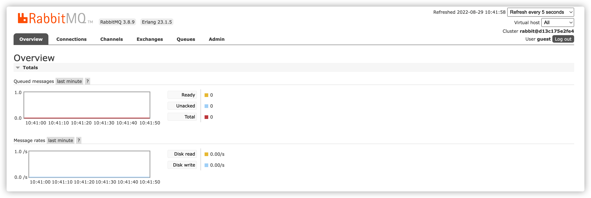

访问  localhost:15672 登录 guest 用户看到 RabbitMQ 后台管理页面

操作前先说明三种模型

### 1.1、直连交换机 Direct

直连形交换机，根据消息携带的路由键将消息投递到对应队列。大致流程就是一个队列绑定到一个直连交换机，同时赋上一个路由键 routingkey，消息进入rabbitmq后，根据路由键找到绑定的队列

### 1.2、扇形交换机 Fanout

这个交换机没有路由键概念，就算你绑定了路由键也是无视的，交换机在接收到消息后会转发到绑定的队列里

### 1.3、主题交换机 Topic

这个交换机跟直流交换机差不多，但是他的特点就是路由键和绑定建之间是有规则的

* `*` **(星号) 用来表示一个单词 (必须出现的)**
* `#` **(井号) 用来表示任意数量（零个或多个）单词**

> 举个🌰
>
> 队里A 绑定 `Hello*`,队列B 绑定 `Hi#`
>
> HelloX 会进入队列A。Hi 和 HiMoney 会进入队列B

主题交换机非常强大，这个队列无视路由消息的路由键，接收所有消息当 `#` 、`*` 都未绑定时，此时的主题交换机拥有了直连交换机的行为，即可实现扇形也可以实现直连

> 此外还有 Header 头交换机、Default 默认交换机、Dead Letter 死信交换机，这篇不做讲述

## 2、SpringBoot 编码

> 项目已上传至 Gitee 且持续更新，感谢关注
>
> https://gitee.com/Array_Xiang/spring-boot-rabbit-mq.git

使用 IDE SpringInit 工具初始化项目

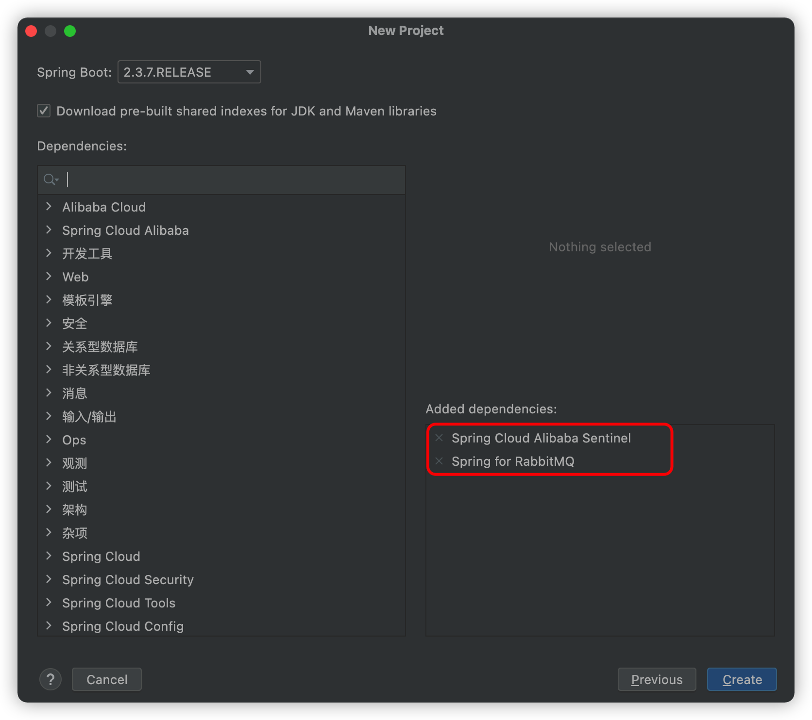

添加这两个就够了，或者也可以直接用依赖

```xml
        <!--rabbitmq-->
        <dependency>
            <groupId>org.springframework.boot</groupId>
            <artifactId>spring-boot-starter-amqp</artifactId>
        </dependency>
        <dependency>
            <groupId>org.springframework.boot</groupId>
            <artifactId>spring-boot-starter-web</artifactId>
        </dependency>
```

创建一个消费者和生产者，代码结构如下：rabbitmq-consumer 消费者，rabbitmq-provider 生产者

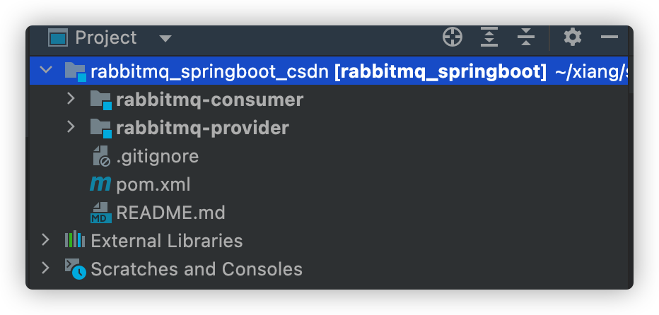

然后 application.yml 配置文件，注意生产者和消费者的端口区分

```yml
server:
  port: 8091
spring:
  application:
    name: rabbitmq_provider
  rabbitmq:
    host: 127.0.0.1
    port: 5672
    username: guest
    password: guest
    # 虚拟 Host，可以不设置，不设置默认使用/
    virtual-host: XiangHosts
```

新建虚拟 host：

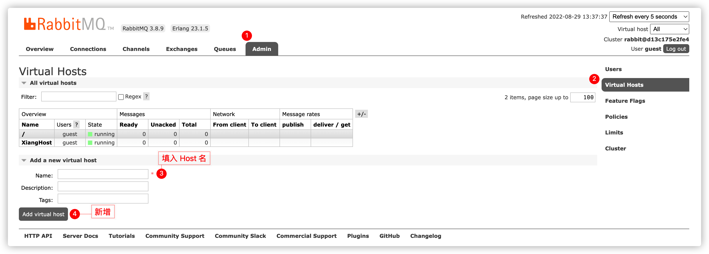

### 2.1、直连 direct

#### 2.1.1、一对一

在provider生产者，中创建 DirectRabbitConfig进行配置，配置及说明在注释里头

```java
package com.liuyuncen.config;

import org.springframework.amqp.core.Binding;
import org.springframework.amqp.core.BindingBuilder;
import org.springframework.amqp.core.DirectExchange;
import org.springframework.amqp.core.Queue;
import org.springframework.context.annotation.Bean;
import org.springframework.context.annotation.Configuration;


/**
 * @belongsProject: rabbitmq_springboot
 * @belongsPackage: com.liuyuncen.config
 * @author: Xiang想
 * @createTime: 2022-08-29  13:49
 * @description: TODO
 * @version: 1.0
 */
@Configuration
public class DirectRabbitConfig {

    /**
     *  Queue(String name, boolean durable, boolean exclusive, boolean autoDelete)
     *  durable:是否持久化,默认是false,持久化队列：会被存储在磁盘上，当消息代理重启时仍然存在，暂存队列：当前连接有效
     *  exclusive:默认也是false，只能被当前创建的连接使用，而且当连接关闭后队列即被删除。此参考优先级高于durable
     *  autoDelete:是否自动删除，当没有生产者或者消费者使用此队列，该队列会自动删除
     * @description:
     * @author: Xiang想
     * @date: 2022/8/29 1:52 PM
     * @param: []
     * @return: org.springframework.amqp.core.Queue
     **/
    @Bean
    public Queue TestDirectQueue(){
        // 队列名叫 DirectQueue
        return new Queue("DirectQueue",true);
    }

    @Bean
    DirectExchange TestDirectExchange(){
        // 交换机名叫 directExchange
        // 如果没有叫这个的交换机 rabbitmq 会自己创建
        return new DirectExchange("directExchange",true,false);
    }

    @Bean
    Binding bindingDirect(){
        // 绑定并且指定 路由键
        return BindingBuilder.bind(TestDirectQueue()).to(TestDirectExchange()).with("routingKey");
    }

}

```

简单的写一个接口，进行消息推送

```java
package com.liuyuncen.controller;

import org.springframework.amqp.rabbit.core.RabbitTemplate;
import org.springframework.beans.factory.annotation.Autowired;
import org.springframework.web.bind.annotation.GetMapping;
import org.springframework.web.bind.annotation.RestController;

import java.time.LocalDateTime;
import java.time.format.DateTimeFormatter;
import java.util.HashMap;
import java.util.Map;
import java.util.UUID;

/**
 * @belongsProject: rabbitmq_springboot
 * @belongsPackage: com.liuyuncen.controller
 * @author: Xiang想
 * @createTime: 2022-08-29  13:55
 * @description: TODO
 * @version: 1.0
 */
@RestController
public class DirectController {
    @Autowired
    RabbitTemplate rabbitTemplate;

    @GetMapping("/sendDirectMessage")
    public String sendDirectMessage(){
        Map<String,Object> map = new HashMap<>();
        map.put("code",String.valueOf(UUID.randomUUID()));
        map.put("time", LocalDateTime.now().format(DateTimeFormatter.ofPattern("yyyy-MM-dd HH:mm:ss")));
        map.put("message","hi 我是 直连 Direct Exchange");
        rabbitTemplate.convertAndSend("directExchange","routingKey",map);
        return "ok";
    }
}
```

启动创建一个 http 请求


点击运行

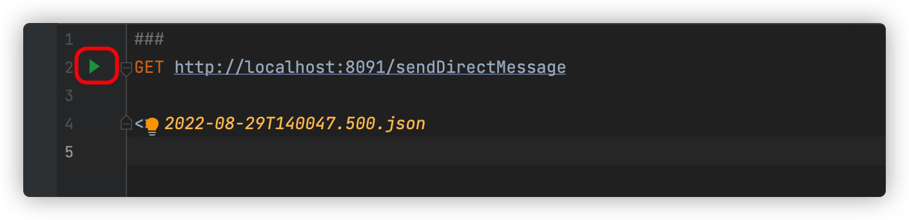

结果返回成功

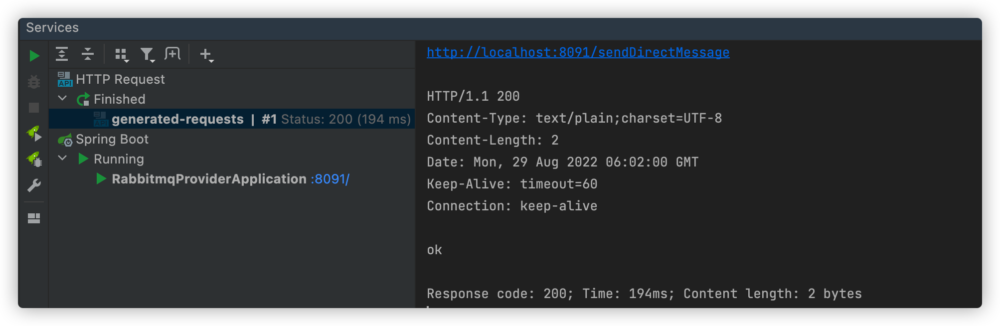

次数就有1条消息进入 rabbitmq中了

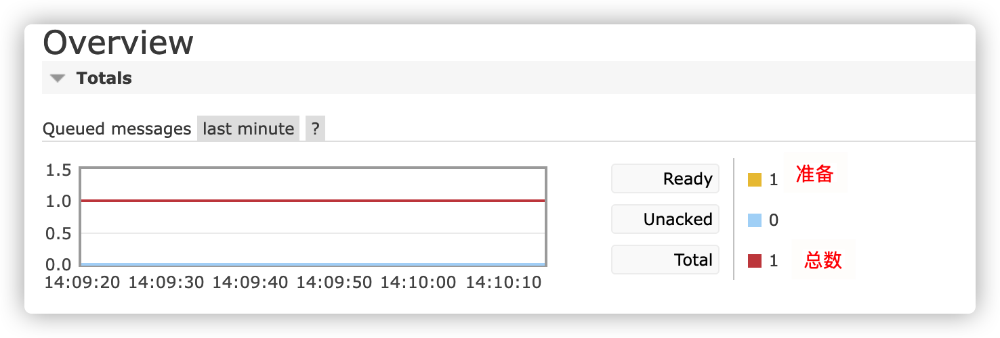

这个全英文的界面，说实话还是有点难度的，见到不认识的单词，多去查阅，不要懒！我们再去看一下交换机和队列

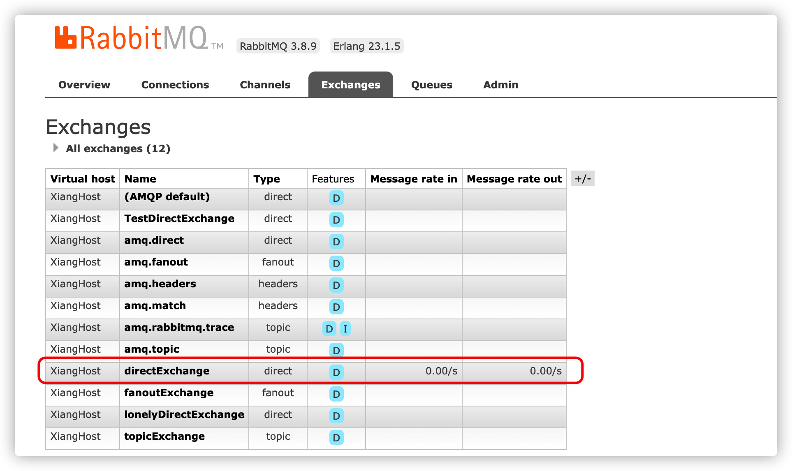

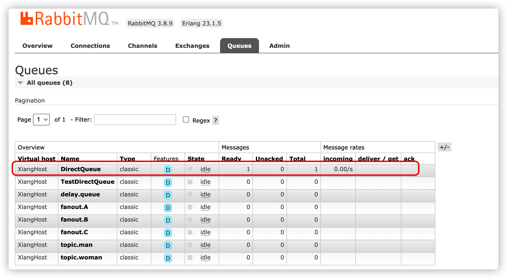

我们可以看到队列和交换机都在rabbitMQ中了。接下来写消费者 consumer

其实引用 pom 文件，添加一个 application.yml 的配置文件就可以了

```yml
server:
  port: 8092

spring:
  application:
    name: rabbitmq_consumer
  rabbitmq:
    host: 127.0.0.1
    port: 5672
    username: guest
    password: guest
    virtual-host: XiangHost
```

至于 `DirectRabbitConfig.java` 其实没必要创建，单纯的消费者监听就好了。配置上了，其实消费者也是生产者身份，也可以推送消息

创建 消费者监听类 `DirectReceiver`

```java
package com.liuyuncen.receiver;

import org.springframework.amqp.rabbit.annotation.RabbitHandler;
import org.springframework.amqp.rabbit.annotation.RabbitListener;
import org.springframework.stereotype.Component;

import java.util.Map;

/**
 * @belongsProject: rabbitmq_springboot
 * @belongsPackage: com.liuyuncen.receiver
 * @author: Xiang想
 * @createTime: 2022-08-29  14:16
 * @description: TODO
 * @version: 1.0
 */
@Component
@RabbitListener(queues = "DirectQueue") // 监听队列名称
public class DirectReceiver {

    /**
     * @description:
     * @author: Xiang想
     * @date: 2022/8/29 2:17 PM
     * @param: [message] 如果推送是 Map 类型，同一个队列接收也一定要是 Map 类型
     * @return: void
     **/
    @RabbitHandler
    public void process(Map message){
        System.out.println("directReceiver 接收到了消息 :"+message.toString());
    }
}
```

启动消费者，我们就可以看到程序在运行成功后，立即把消息消费了下来

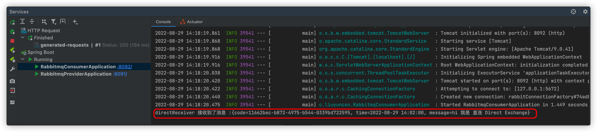

然后我们可以一直调用 生产者 provider 消息推送接口，可以看到

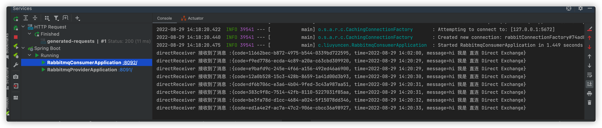

#### 2.1.2、一对多

那么直连交换机既然是一对一，如果我们配置多个监听绑定同一个直连交互的同一个队列会怎样

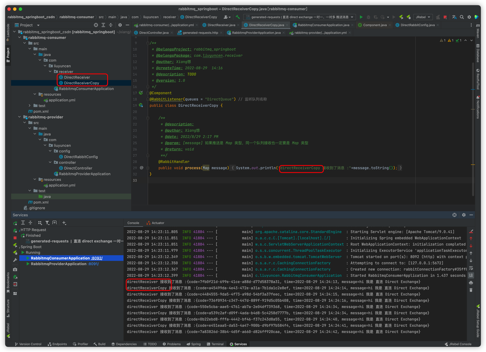

可以看到实现了轮询方式消费，而不是重复消费

### 2.2、主题 Topic

生产者创建 TopicRabbitConfig，之前创建的 DirectRabbitConfig 不用删

```java
package com.liuyuncen.config;

import org.springframework.amqp.core.Binding;
import org.springframework.amqp.core.BindingBuilder;
import org.springframework.amqp.core.Queue;
import org.springframework.amqp.core.TopicExchange;
import org.springframework.context.annotation.Bean;
import org.springframework.context.annotation.Configuration;

/**
 * @belongsProject: rabbitmq_springboot
 * @belongsPackage: com.liuyuncen.config
 * @author: Xiang想
 * @createTime: 2022-08-29  14:28
 * @description: TODO
 * @version: 1.0
 */
@Configuration
public class TopicRabbitConfig {
    // 绑定键
    public final static String TOPIC_A = "topic.A";
    public final static String TOPIC_B = "topic.B";

    @Bean
    public Queue aQueue(){
        return new Queue(TOPIC_A);
    }

    @Bean
    public Queue bQueue(){
        return new Queue(TOPIC_B);
    }

    @Bean
    TopicExchange topicExchange(){
        return new TopicExchange("topicExchange");
    }

    /**
     * @description: 只有消息携带的路由键为
     * @author: Xiang想
     * @date: 2022/8/29 2:33 PM
     * @param: []
     * @return: org.springframework.amqp.core.Binding
     **/
    @Bean
    Binding bindingTopicAExchangeMessage(){
        return BindingBuilder.bind(aQueue()).to(topicExchange()).with(TOPIC_A);
    }

    @Bean
    Binding bindingTopicBExchangeMessage(){
        return BindingBuilder.bind(bQueue()).to(topicExchange()).with("topic.#");
    }
}

```

然后添加2个接口，用于推送不同的主题交换机

```java
package com.liuyuncen.controller;

import org.springframework.amqp.rabbit.core.RabbitTemplate;
import org.springframework.beans.factory.annotation.Autowired;
import org.springframework.web.bind.annotation.GetMapping;
import org.springframework.web.bind.annotation.RestController;

import java.time.LocalDateTime;
import java.time.format.DateTimeFormatter;
import java.util.HashMap;
import java.util.Map;
import java.util.UUID;

/**
 * @belongsProject: rabbitmq_springboot
 * @belongsPackage: com.liuyuncen.controller
 * @author: Xiang想
 * @createTime: 2022-08-29  14:31
 * @description: TODO
 * @version: 1.0
 */
@RestController
public class TopicController {
    @Autowired
    RabbitTemplate rabbitTemplate;

    @GetMapping("/sendTopicA")
    public String sendTopicA(){
        Map<String,Object> map = new HashMap<>();
        map.put("code",String.valueOf(UUID.randomUUID()));
        map.put("time", LocalDateTime.now().format(DateTimeFormatter.ofPattern("yyyy-MM-dd HH:mm:ss")));
        map.put("message","我是 topic A");
        // 指向交换机和路由键
        rabbitTemplate.convertAndSend("topicExchange","topic.A",map);
        return "ok";
    }

    @GetMapping("/sendTopicB")
    public String sendTopicB(){
        Map<String,Object> map = new HashMap<>();
        map.put("code",String.valueOf(UUID.randomUUID()));
        map.put("time", LocalDateTime.now().format(DateTimeFormatter.ofPattern("yyyy-MM-dd HH:mm:ss")));
        map.put("message","我是 topic B");
        // 指向交换机和路由键
        rabbitTemplate.convertAndSend("topicExchange","topic.B",map);
        return "ok";
    }
}

```

生产者这边已经创建完了，不急着启动，先把消费者 consumer上创建监听消息 topic.TopicA 和 topic.TopicB

```java
package com.liuyuncen.receiver.topic;

import org.springframework.amqp.rabbit.annotation.RabbitHandler;
import org.springframework.amqp.rabbit.annotation.RabbitListener;
import org.springframework.stereotype.Component;

import java.util.Map;

/**
 * @belongsProject: rabbitmq_springboot
 * @belongsPackage: com.liuyuncen.receiver.topic
 * @author: Xiang想
 * @createTime: 2022-08-29  14:47
 * @description: TODO
 * @version: 1.0
 */
@Component
@RabbitListener(queues = "topic.A")
public class TopicA {

    @RabbitHandler
    public void process(Map message){
        System.out.println("Topic A 接收消息："+message.toString());
    }
}
```

```java
package com.liuyuncen.receiver.topic;

import org.springframework.amqp.rabbit.annotation.RabbitHandler;
import org.springframework.amqp.rabbit.annotation.RabbitListener;
import org.springframework.stereotype.Component;

import java.util.Map;

/**
 * @belongsProject: rabbitmq_springboot
 * @belongsPackage: com.liuyuncen.receiver.topic
 * @author: Xiang想
 * @createTime: 2022-08-29  14:47
 * @description: TODO
 * @version: 1.0
 */
@Component
@RabbitListener(queues = "topic.B")
public class TopicB {

    @RabbitHandler
    public void process(Map message){
        System.out.println("Topic B 接收消息："+message.toString());
    }
}
```

消费者这里还需要创建 TopicRabbitConfig 吗？其实是不用的，道理之前说过了

我们启动消费者和生产者

调用 topic A

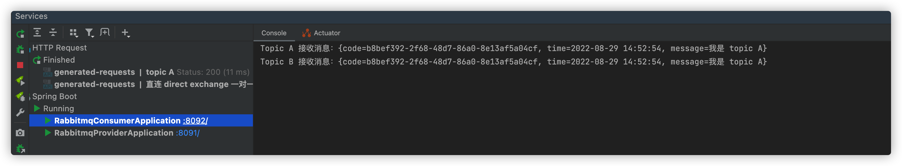

发现 topic A、topic B都接收到了消息，原因是 Topic B 绑定的路由键是 topic.#

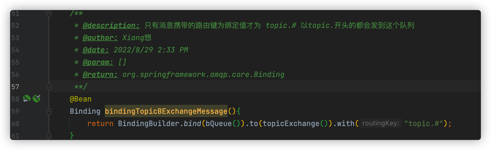

接下来，我们调用 topic B

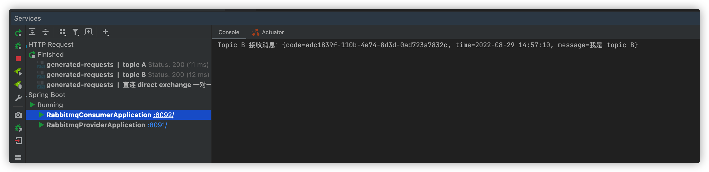

老铁，没毛病

### 2.3、扇型 Fanout

按部就班，创建 FanoutRabbiConfig

```java
package com.liuyuncen.config;

import org.springframework.amqp.core.Binding;
import org.springframework.amqp.core.BindingBuilder;
import org.springframework.amqp.core.FanoutExchange;
import org.springframework.amqp.core.Queue;
import org.springframework.context.annotation.Bean;
import org.springframework.context.annotation.Configuration;

/**
 * @belongsProject: rabbitmq_springboot
 * @belongsPackage: com.liuyuncen.config
 * @author: Xiang想
 * @createTime: 2022-08-29  14:59
 * @description: TODO
 * @version: 1.0
 */
@Configuration
public class FanoutRabbitConfig {

    /**
     *  创建三个队列 ：fanout.A   fanout.B  fanout.C
     *  将三个队列都绑定在交换机 fanoutExchange 上
     *  因为是扇型交换机, 路由键无需配置,配置也不起作用
     */

    @Bean
    public Queue queueA(){
        return new Queue("fanout.A");
    }

    @Bean
    public Queue queueB(){
        return new Queue("fanout.B");
    }

    @Bean
    public Queue queueC(){
        return new Queue("fanout.C");
    }

    @Bean
    FanoutExchange fanoutExchange(){
        return new FanoutExchange("fanoutExchange");
    }

    @Bean
    Binding bindingExchangeA(){
        return BindingBuilder.bind(queueA()).to(fanoutExchange());
    }

    @Bean
    Binding bindingExchangeB(){
        return BindingBuilder.bind(queueB()).to(fanoutExchange());
    }

    @Bean
    Binding bindingExchangeC(){
        return BindingBuilder.bind(queueC()).to(fanoutExchange());
    }
}

```

推送接口

```java
package com.liuyuncen.controller;

import org.springframework.amqp.rabbit.core.RabbitTemplate;
import org.springframework.beans.factory.annotation.Autowired;
import org.springframework.web.bind.annotation.GetMapping;
import org.springframework.web.bind.annotation.RestController;

import java.time.LocalDateTime;
import java.time.format.DateTimeFormatter;
import java.util.HashMap;
import java.util.Map;
import java.util.UUID;

/**
 * @belongsProject: rabbitmq_springboot
 * @belongsPackage: com.liuyuncen.controller
 * @author: Xiang想
 * @createTime: 2022-08-29  15:07
 * @description: TODO
 * @version: 1.0
 */
@RestController
public class FanoutController {

    @Autowired
    RabbitTemplate rabbitTemplate;

    @GetMapping("/fanoutMessage")
    public String fanoutMessage(){
        Map<String,Object> map = new HashMap<>();
        map.put("code",String.valueOf(UUID.randomUUID()));
        map.put("time", LocalDateTime.now().format(DateTimeFormatter.ofPattern("yyyy-MM-dd HH:mm:ss")));
        map.put("message","我是 Fanout");
        // 扇形给了路由键也没用
        rabbitTemplate.convertAndSend("fanoutExchange",null,map);
        return "ok";
    }

}
```

consumer 消费者来个三个消费者 fanout.FanoutA、fanout.FanoutB、fanout.FanoutC

```java
package com.liuyuncen.receiver.fanout;

import org.springframework.amqp.rabbit.annotation.RabbitHandler;
import org.springframework.amqp.rabbit.annotation.RabbitListener;
import org.springframework.stereotype.Component;

import java.util.Map;

/**
 * @belongsProject: rabbitmq_springboot
 * @belongsPackage: com.liuyuncen.receiver.fanout
 * @author: Xiang想
 * @createTime: 2022-08-29  15:11
 * @description: TODO
 * @version: 1.0
 */
@Component
@RabbitListener(queues = "fanout.A")
public class FanoutA {
    @RabbitHandler
    public void process(Map message){
        System.out.println("Fanout A 接收到消息 " + message.toString());
    }
}
```

我这里就写了一个，另外两个按部就班

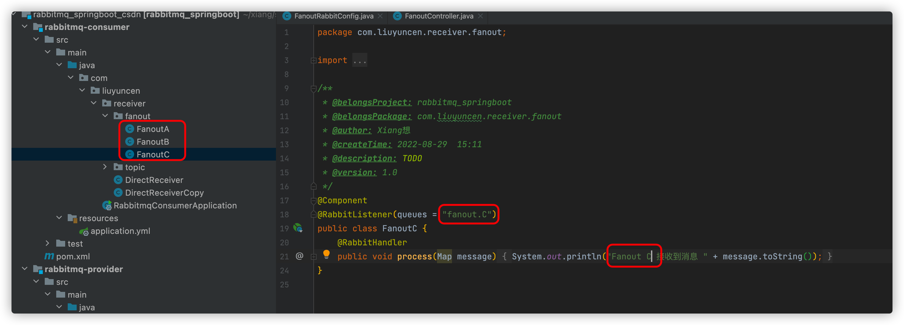

启动项目，调用 /fanoutMessage 接口

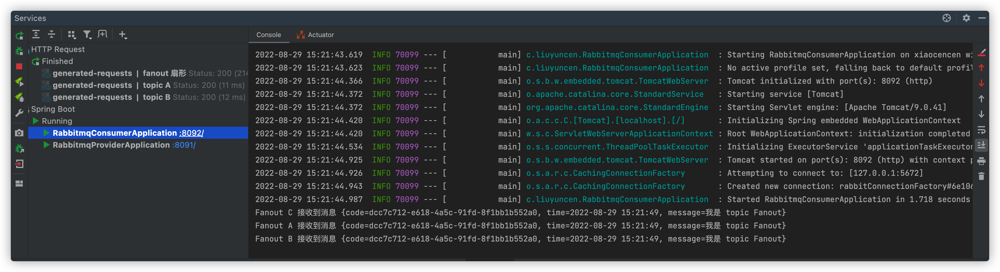

可以看到三个队列都绑定这个交换机，所以三个消息接收类都监听到了消息