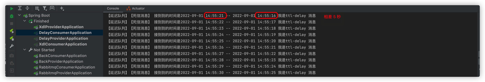
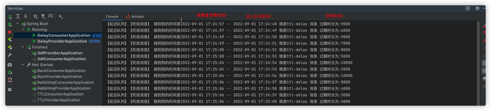
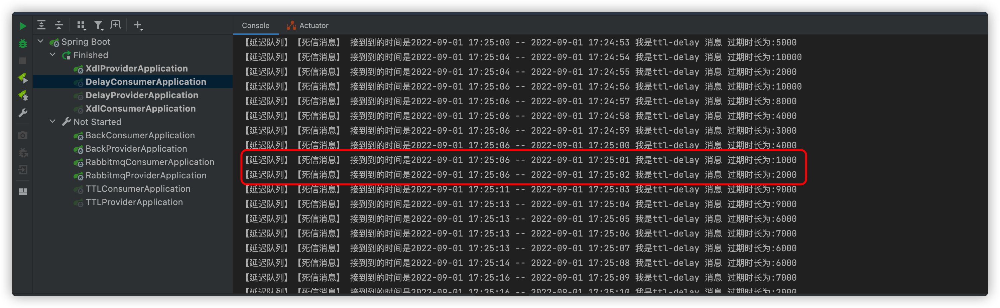
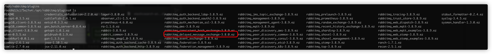
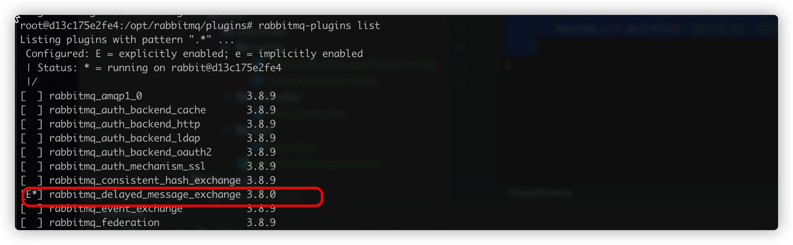
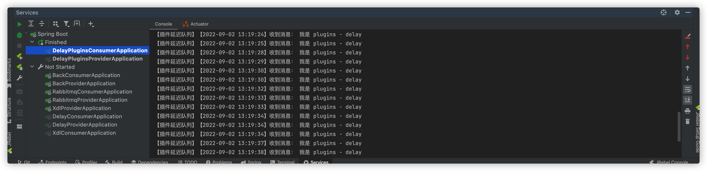

> 创建时间 2022年9月1日
>
> 标签：Java、SpringBoot、RabbitMQ、队列
>
> 注释：RabbiMQ  实现延迟队列
>
> 来源：[博客园-双子孤狼](https://www.cnblogs.com/lonely-wolf/p/14368920.html)

阅读这篇文章之前！确保你已经对 RabbitMQ 有了基础的理解，了解 Direct、Fanout 模式，使用SpringBoot整合过 RabbitMQ。如果没有！请不要轻易尝试此文章

**浪费别人的时间就是在谋财害命**

先说一个场景，网购情况下，用户发起一个订单，如果不付款，15分钟就把此订单关闭。如果是直接用定时任务，那要起太多的定时任务了。此时，就可以用到延迟队列了。

## 什么是延迟队列

延迟队列本身也是队列，只不过这个队列是有延迟的，意思是当我们把一条消息放到延迟队列里，消息并不会立即出队，而是会在达到指定时间之后才会出队，从而被消费者消费。

利用死信队列实现延迟队列

RabbitMQ 中死信队列就是用来存储特定条件下的消息，那么假如我们把这个条件设定时间过期（设置带TTL 的消息或者队列），就可以用来实现延迟队列的功能。

上代码！

delay-provder 生产者 TtlDealyRabbitConfig 配置类

```java
package com.liuyuncen.config;

import org.springframework.amqp.core.Binding;
import org.springframework.amqp.core.BindingBuilder;
import org.springframework.amqp.core.DirectExchange;
import org.springframework.amqp.core.Queue;
import org.springframework.context.annotation.Bean;
import org.springframework.context.annotation.Configuration;

import java.util.HashMap;
import java.util.Map;

/**
 * @belongsProject: rabbitmq_springboot
 * @belongsPackage: com.liuyuncen.config
 * @author: Xiang想
 * @createTime: 2022-09-01  14:26
 * @description: TODO
 * @version: 1.0
 */
@Configuration
public class TtlDelayRabbitConfig {

    @Bean
    public DirectExchange directExchange(){
        return new DirectExchange("ttl-delay-exchange");
    }

    @Bean
    public Queue ttlQueue(){
        Map<String,Object> map = new HashMap<>();
        map.put("x-message-ttl",5000);
        // 过期后进入死信队列
        map.put("x-dead-letter-exchange","ttl-delay-dead-letter-exchange");
        return new Queue("ttl-delay-queue",false,false,false,map);
    }

    @Bean
    public Binding bindTtlDirectExchange(){
        return BindingBuilder.bind(ttlQueue()).to(directExchange()).with("ttlRouting");
    }

    @Bean
    public DirectExchange ttlDelayDeadLetterExchange(){
        return new DirectExchange("ttl-delay-dead-letter-exchange");
    }

    @Bean
    public Queue ttlDelayDeadLetterQueue(){
        return new Queue("ttl-delay-dead-letter-queue");
    }

    @Bean
    public Binding dealLetterQueueBindExchange(){
        return BindingBuilder.bind(ttlDelayDeadLetterQueue()).to(ttlDelayDeadLetterExchange()).with("ttlRouting");
    }

}
```

dealy-provider 发送消息的接口 DealyController

```java
package com.liuyuncen.controller;

import org.springframework.amqp.rabbit.core.RabbitTemplate;
import org.springframework.beans.factory.annotation.Autowired;
import org.springframework.web.bind.annotation.GetMapping;
import org.springframework.web.bind.annotation.RequestMapping;
import org.springframework.web.bind.annotation.RestController;

import java.time.LocalDateTime;
import java.time.format.DateTimeFormatter;

/**
 * @belongsProject: rabbitmq_springboot
 * @belongsPackage: com.liuyuncen.controller
 * @author: Xiang想
 * @createTime: 2022-09-01  14:34
 * @description: TODO
 * @version: 1.0
 */
@RestController
@RequestMapping("/delay")
public class DelayController {

    @Autowired
    RabbitTemplate rabbitTemplate;

    @GetMapping("/delayMessage")
    public String delayMessage(){
        String time = LocalDateTime.now().format(DateTimeFormatter.ofPattern("yyyy-MM-dd HH:mm:ss"));
        String msg = time + " 我是ttl-delay 消息";
        System.out.println("provider 发送消息：" + msg);
        rabbitTemplate.convertAndSend("ttl-delay-exchange","ttlRouting",msg);
        return "ok";
    }
}
```

Dealy-consumer 消费者的接收器

```java
package com.liuyuncen.receive;

import org.springframework.amqp.rabbit.annotation.RabbitHandler;
import org.springframework.amqp.rabbit.annotation.RabbitListener;
import org.springframework.stereotype.Component;

import java.time.LocalDateTime;
import java.time.format.DateTimeFormatter;

/**
 * @belongsProject: rabbitmq_springboot
 * @belongsPackage: com.liuyuncen.recive
 * @author: Xiang想
 * @createTime: 2022-09-01  14:38
 * @description: TODO
 * @version: 1.0
 */
@Component
public class DelayReceive {

    @RabbitHandler
    @RabbitListener(queues = "ttl-delay-dead-letter-queue")
    public void getTtlDelayProcess(String message){
        String time = LocalDateTime.now().format(DateTimeFormatter.ofPattern("yyyy-MM-dd HH:mm:ss"));
        System.out.println("【延迟队列】【死信消息】 接到到的时间是"+ time+" -- "+message);
    }
}

```

这里只接收死信队列

同时启动两个服务，我们可以看到



假如我们实际中，有的消息是 10 分钟过期，有的是 20 分钟过期，这时候我们就需要建立多个队列，一旦时间唯独非常庞大，我们就需要维护非常多的队列。

但实际上我们可以针对单条信息设置过期时间，大可不必去定义多个队列？然而事实真的如此吗？

新建了一个 dealy-provider TtlDelayByMessageRabbitConfig 配置类

```java
package com.liuyuncen.config;

import org.springframework.amqp.core.Binding;
import org.springframework.amqp.core.BindingBuilder;
import org.springframework.amqp.core.DirectExchange;
import org.springframework.amqp.core.Queue;
import org.springframework.context.annotation.Bean;
import org.springframework.context.annotation.Configuration;

import java.util.HashMap;
import java.util.Map;

/**
 * @belongsProject: rabbitmq_springboot
 * @belongsPackage: com.liuyuncen.config
 * @author: Xiang想
 * @createTime: 2022-09-01  14:26
 * @description: TODO
 * @version: 1.0
 */
@Configuration
public class TtlDelayByMessageRabbitConfig {

    @Bean
    public DirectExchange directByMessageExchange(){
        return new DirectExchange("ttl-delay-by-message-exchange");
    }

    @Bean
    public Queue ttlByMessageQueue(){
        Map<String,Object> map = new HashMap<>();
        // 过期后进入死信队列
        map.put("x-dead-letter-exchange","ttl-delay-by-message-dead-letter-exchange");
        return new Queue("ttl-delay-by-message-queue",false,false,false,map);
    }

    @Bean
    public Binding bindTtlByMessageDirectExchange(){
        return BindingBuilder.bind(ttlByMessageQueue()).to(directByMessageExchange()).with("ttlRouting");
    }

    @Bean
    public DirectExchange ttlDelayByMessageDeadLetterExchange(){
        return new DirectExchange("ttl-delay-by-message-dead-letter-exchange");
    }

    @Bean
    public Queue ttlDelayByMessageDeadLetterQueue(){
        return new Queue("ttl-delay-by-message-dead-letter-queue");
    }

    @Bean
    public Binding dealByMessageLetterQueueBindExchange(){
        return BindingBuilder.bind(ttlDelayByMessageDeadLetterQueue()).to(ttlDelayByMessageDeadLetterExchange()).with("ttlRouting");
    }

}

```

新增一个发送的接口

```java
    @GetMapping("/delayByMessage")
    public String delayByMessage(String millTimes){

        String time = LocalDateTime.now().format(DateTimeFormatter.ofPattern("yyyy-MM-dd HH:mm:ss"));
        String msg = time + " 我是ttl-delay 消息 过期时长为:"+millTimes;
        MessageProperties messageProperties = new MessageProperties();
        // 设置单条过期时间,单位毫秒
        messageProperties.setExpiration(millTimes);
        Message message = new Message(msg.getBytes(), messageProperties);
        System.out.println("provider 发送消息：" + msg);
        rabbitTemplate.convertAndSend("ttl-delay-by-message-exchange","ttlRouting",message);
        return "ok";
    }
```

定时任务也要改一下

```java
    @Autowired
    DelayController delayController;

    @Scheduled(cron = "*/1 * * * * ?")
    public void task(){
        Random random = new Random();
        int i = random.nextInt(10);
        String millTimes = String.valueOf(i * 1000);
        delayController.delayByMessage(millTimes);
    }
```

新增一个消费接口

```java
    @RabbitHandler
    @RabbitListener(queues = "ttl-delay-by-message-dead-letter-queue")
    public void getTtlByMessageDelayProcess(String message){
        String time = LocalDateTime.now().format(DateTimeFormatter.ofPattern("yyyy-MM-dd HH:mm:ss"));
        System.out.println("【延迟队列】【死信消息】 接到到的时间是"+ time+" -- "+message);
    }
```

同时启动，我们可以清楚的看到，进入队列时间 + 延迟时间 = 出队列的时间



但是有些时候也会出现不对的情况



是巧合吗？并不是，因为 RabbitMQ 中的机制就是前面消息没有出队，那么即使后面一条消息也就失效，也必须要等前面一条消息出队，所以这就是为什么一般避免同一个队列单挑消息设置不同过期的做法了。

### 死信队列实现延迟队列的缺点

通过上面的例子，我们可以看到几个很明显的去点

1. 如果有非常多的时间点，（有10分钟过期的，有20分钟过期的....等）需要创建不同的交换机队列来实现消息路由
2. 单独设置消息的 TTL可能会造成消息阻塞，因为当一条消息没有出队，后一条消息及时到期也不能出队
3. 消息可能会有一定的延迟

为了避免 TTL 和死信队列可能造成的问题，所以就非常有必要用更好的方式来代替，这就是延时队列插件

### 利用插件实现延时队列

在 RabbitMQ 的 3.5.7 版本后，提供了一个插件 rabbitmq-delayed-message-exchange 来实现延迟队列，但同时需保证 Erlang/OPT 版本在 18.0 之后

安装延迟队列插件

1. RabbitMQ 版本在 3.5.7 - 3.7.x 可以执行命令进行下载

	```sh
	wget https://bintray.com/rabbitmq/community-plugins/download_file?file_path=rabbitmq_delayed_message_exchange-0.0.1.ez
	```

2. 如果是 RabbitMQ 是3.8 版本以后的，找到延迟队列版本插件，然后下载

3. 下载好之后，将插件传到 plugings 目录执行 rabbitmq-plugins enable rabbitmq_delayed_message_exchange 命令启动插件，如果要禁止插件，可以执行 rabbitmq-plugings disable rabbitmq_delayed_message_exchange（启用插件后需要重启 rabbitMQ）



查看插件状态

```sh
rabbitmq-plugins list
```


有 E* 或* e 标志的则为启用的插件，E 显式启用，e 隐式启用



配置完成后，老样子，直接上代码，配置文件

```java
package com.liuyuncen.config;

import org.springframework.amqp.core.Binding;
import org.springframework.amqp.core.BindingBuilder;
import org.springframework.amqp.core.CustomExchange;
import org.springframework.amqp.core.Queue;
import org.springframework.context.annotation.Bean;
import org.springframework.context.annotation.Configuration;

import java.util.HashMap;
import java.util.Map;

/**
 * @belongsProject: rabbitmq_springboot
 * @belongsPackage: com.liuyuncen.config
 * @author: Xiang想
 * @createTime: 2022-09-01  18:03
 * @description: TODO
 * @version: 1.0
 */
@Configuration
public class PluginDelayRabbitConfig {

    @Bean
    public CustomExchange pluginDelayExchange(){
        Map<String,Object> map = new HashMap<>();
        map.put("x-delayed-type","direct");
        return new CustomExchange("plugin-delay-exchange","x-delayed-message",false,false,map);
    }

    @Bean
    public Queue pluginDelayQueue(){
        return new Queue("plugin-delay-queue");
    }

    @Bean
    public Binding pluginDelayBinding(){
        return BindingBuilder.bind(pluginDelayQueue()).to(pluginDelayExchange()).with("delay").noargs();
    }
}

```

发送消息的接口

```java
package com.liuyuncen.controller;

import org.springframework.amqp.core.Message;
import org.springframework.amqp.core.MessageProperties;
import org.springframework.amqp.rabbit.core.RabbitTemplate;
import org.springframework.beans.factory.annotation.Autowired;
import org.springframework.web.bind.annotation.RequestMapping;
import org.springframework.web.bind.annotation.RestController;

import java.text.SimpleDateFormat;
import java.util.Date;

/**
 * @belongsProject: rabbitmq_springboot
 * @belongsPackage: com.liuyuncen.controller
 * @author: Xiang想
 * @createTime: 2022-09-01  18:53
 * @description: TODO
 * @version: 1.0
 */
@RestController
@RequestMapping("/plugin/delay")
public class PluginDelayController {

    @Autowired
    RabbitTemplate rabbitTemplate;

    @RequestMapping("/pluginDelayMessage")
    public String pluginDelayMessage(Integer millTimes){
        MessageProperties messageProperties = new MessageProperties();
        messageProperties.setHeader("x-delay",millTimes);//延迟5秒被删除
        String msg = " 我是 plugins - delay";
        Message message = new Message(msg.getBytes(), messageProperties);
        rabbitTemplate.convertAndSend("plugin-delay-exchange","delay",message);
        SimpleDateFormat sdf = new SimpleDateFormat("yyyy-MM-dd HH:mm:ss");
        System.out.println("消息发送成功【" + sdf.format(new Date()) + "】");
        return "succ";
    }

}

```

再写一个定时任务

```java
package com.liuyuncen.task;

import com.liuyuncen.controller.PluginDelayController;
import org.springframework.beans.factory.annotation.Autowired;
import org.springframework.scheduling.annotation.Scheduled;
import org.springframework.stereotype.Component;

import java.util.Random;

/**
 * @belongsProject: rabbitmq_springboot
 * @belongsPackage: com.liuyuncen.task
 * @author: Xiang想
 * @createTime: 2022-09-01  14:44
 * @description: TODO
 * @version: 1.0
 */
@Component
public class DelayTask {


    @Autowired
    PluginDelayController pluginDelayController;

    @Scheduled(cron = "*/1 * * * * ?")
    public void task(){
        Random random = new Random();
        int i = random.nextInt(10)+1;
        int result = i * 1000;
        pluginDelayController.pluginDelayMessage(result);
    }

}

```

消费者

```java
package com.liuyuncen.receive;

import org.springframework.amqp.rabbit.annotation.RabbitHandler;
import org.springframework.amqp.rabbit.annotation.RabbitListener;
import org.springframework.stereotype.Component;

import java.text.SimpleDateFormat;
import java.util.Date;

/**
 * @belongsProject: rabbitmq_springboot
 * @belongsPackage: com.liuyuncen.receive
 * @author: Xiang想
 * @createTime: 2022-09-01  18:52
 * @description: TODO
 * @version: 1.0
 */
@Component
public class PluginDelayReceive {

    @RabbitHandler
    @RabbitListener(queues = "plugin-delay-queue")
    public void delayProcess(String message){
        SimpleDateFormat sdf = new SimpleDateFormat("yyyy-MM-dd HH:mm:ss");
        System.out.println("【插件延迟队列】【" + sdf.format(new Date()) + "】收到消息：" + message);
    }
}

```



这样就可以解决TTL 死信队列造成的延迟问题啦。