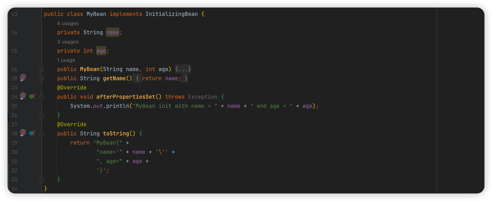
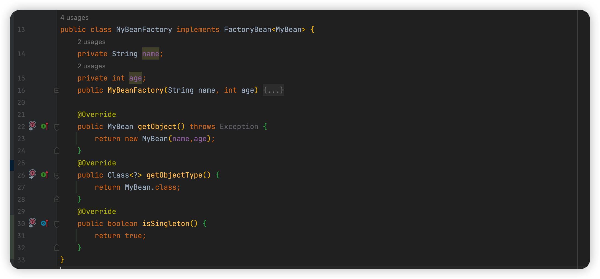
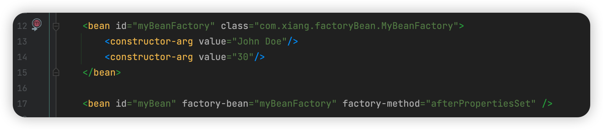
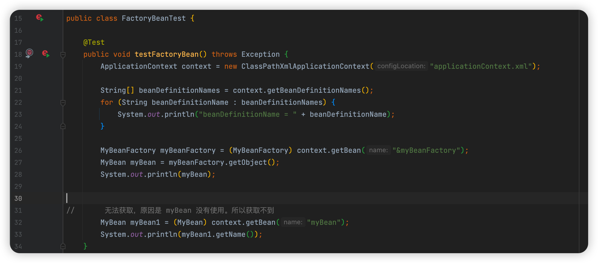
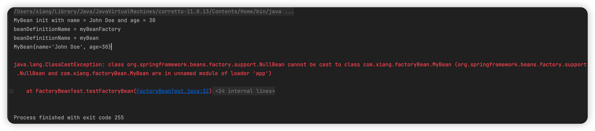

### 什么是FactoryBean

FactoryBean 是 Spring 的一个接口，用于生产和管理 Bean 对象，它相当于工厂类的一个模版，可以创建 Bean 实例时执行自定义逻辑。

FactoryBean 包含两个方法，getObject()、getObjectType() ，分别返回Bean实例和Bean类型。

FactoryBean 的作用是允许开发人员在创建 Bean 实例时执行一些自定义逻辑，通过实现 FactoryBean 接口，开发人员可以自定义Bean的创建过程，从而更灵活的可定制化 Bean 管理。例如，可以基于某些条件动态创建不同类型的 Bean 实例。或者对创建出来的 Bean 实例进行额外的操作。

使用 FactoryBean 需要分为两步：

1. 实现 FactoryBean 接口，重写 getObject()、getObjectType() 方法，并在 getObject() 方法中编写自定义 Bean 创建逻辑
2. 将实现 FactoryBean 接口的类注入到 Spring 容器中，并通过 Bean 的名称或 ID 获取实例

如何获取 FactoryBean 呢？Spring 容器中获取 FactoryBean 需要在ID前面加 "&"前缀，这是因为 Spring 将 FactoryBean 和它创建的对象区分开来。使用 FactoryBean 可以实现很多有意思的功能，"惰性初始化"、"条件逻辑化"```








测试类





这里涉及到几个知识点：

1. 如果要通过 BeanName 要从Spring容器中获取 FactoryBean ，需要通过 & 前缀获取
2. 及时 FactoryBeanName 注册到 BeanDefinitionNames 中，也因为 FactoryBean 特殊性，只有在访问该Bean时才会被创建，否则会为null