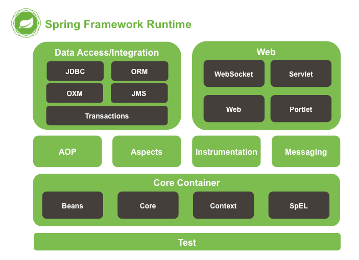

## 1、Spring 介绍

1. 主要发明者：Rod  Johnson
2. 轮子理论推崇者：
     1. 轮子理论：不用重复发明轮子
     2. IT 行业：直接使用写好的代码
3. Spring 框架宗旨：不重新发明，让原有技术使用起来更加方便。
4. Spring 几大核心功能：
     1. IOC   /   DI       控制翻转   /   依赖注入
     2. AOP                  面向切面编程
     3. 声明式事务

5. Spring 框架的 runtime

     1. test 测试功能
     2. Core Container:核心容器.Spring 启动最基本的框架
          1. Beans ：Spring  负责管理对象并管理对象
          2. Core：核心类
          3. Context：上下文参数，获取外部资源或者管理注解等
          4. SpEL：express.jar
     3. AOP：实现AOP 功能需要依赖
     4. Aspects：切面 AOP 依赖的包
     5. DataAccess/Intergation ：Sprnig 整合数据访问层相关内容
          1. JDBC：Spring 对 JDBC 封装后的代码
          2. ORM ：封装了一些持久层的框架，例如 Hibernate
          3. transactions：对应 spring-tx.jar 声明式事务使用
     6. WEB：需要 spring 完成 web 相关功能需要，
          1. 例如：由 tomcat 加载 spring 配置文件时需要有 spring-web 包

     

6. Spring 框架中重要的概念
     1. 容器 (Container) :Spring  当做一个大容器
     2. BeanFactory 接口.老版本
          1. 新版本  ApplicationContext 接口，是BeanFactory子接口.BeanFacotory 的功能在 ApplicationContext 中都有
     3. 从 Spring 3.x  开始Spring框架的功能拆分成多个  jar
          1. Spring  2 及以前就一个 jar

## 2、IOC

1. 中文名称：控制反转
2. 英文名字：（Inversion of Control）
3. IOC 是什么？
     1. IOC 完成的事情原先由程序员主要通过 new 实例化对象事情交给 Spring 负责
     2. 控制反转中控制 指的是：控制类的对象
     3. 控制反转中反转指的是转交给 Spring 负责.
     4. IoC 最大的作用：==**解耦**==
          1. 程序员不需要管理对象，解除了对象管理和程序员之间的解耦

## 3、Spring 环境搭建

1. 导入 jar 包

     1. 四个核心包
          1. spring-beans
          2. spring-context
          3. spring-core
          4. spring-expression
     2. 一个日志包
          1. commons-logging

2. 在 src 下新建 applicationContext.xml 

     1. 文件名称和路径自定义

     2. 记住  Spring 容器 ApplicationContext，applicationContext.xml 配置的信息都存储到了  ApplicationContext容器中

     3. Spring 配置文件是基于 schema

          1. schema 文件扩展名 .xsd
          2. 把 schema  理解成 DTD 的升级版
               1. 比 DTD 具有更好的扩展性
          3. 每次引入 xsd 文件是一个 namespace （xml）

     4. 配置文件中只需要引入基本scheam

          1. 通过 <bean/> 标签创建对象

          2. 默认配置文件被加载时创建对象

               ```xml
               <?xml version="1.0" encoding="UTF-8"?>
               <beans xmlns="http://www.springframework.org/schema/beans"
                      xmlns:xsi="http://www.w3.org/2001/XMLSchema-instance"
                      xsi:schemaLocation="http://www.springframework.org/schema/beans
                       http://www.springframework.org/schema/beans/spring-beans.xsd">
               
                   <!--
                       id 表示获取到对象标识
                       class 创建哪个类的对象
                   -->
                   <bean id="peo"  class="com.bjsxt.pojo.People"/>
               
               </beans>
               ```

          3. 编写测试方法

               ```java
               ApplicationContext ac = new ClassPathXmlApplicationContext("applicationContext.xml");
                       People peo = ac.getBean(People.class);
                       peo.setName("你好");
                       System.out.println(peo);
               
               		// 第二种方式
               		People people = ac.getBean("peo",People.class);
               		System.out.println(people);
               ```

               > ```java
               > ac.getBeanDefinitionNames(); //获取spring 容器中所有对象
               > ```

               1. getBean （"<bean>标签id值"，返回值类型）；如果没有第二参数，默认是Object
               2. getBeanDefinitionNames 管理所有的对象

## 4、Spring创建对象的三种方式

1. 通过构造方法创建

     1. 无参构造创建：默认情况

     2. 有参构造创建：需要明确配置

          1. 需要在类中提供有参构造方法
          2. 在 applicationContext.xml  中设置调用哪个构造方法创建对象
               1. 如果设定的条件匹配多个构造方法 执行最后的构造方法
               2. index：参数的索引，从 0 开始
               3. name：参数名
               4. type：类型（区分关键字和封装类 int 和 Interger）

          ```xml
          <?xml version="1.0" encoding="UTF-8"?>
          <beans xmlns="http://www.springframework.org/schema/beans"
                 xmlns:xsi="http://www.w3.org/2001/XMLSchema-instance"
                 xsi:schemaLocation="http://www.springframework.org/schema/beans
                  http://www.springframework.org/schema/beans/spring-beans.xsd">
              <bean id="peo" class="com.bjsxt.pojo.People">
                  <constructor-arg index="0" name="id" type="int" value="123"></constructor-arg>
                  <constructor-arg index="1" name="name" type="java.lang.String" value="张三"></constructor-arg>
              </bean>
          </beans>
          ```
          
          > 允许 只存在 `value` 一个属性的情况，前提是，需要安装构造参数的顺序来注入值

2. 实例工厂

     1. 工厂设计模式：帮助创建类对象。一个工厂可以生产多个对象

     2. 实例工厂：需要先创建工厂，才能生产对象

     3. 实现步骤：

          1. 必须要有一个实例工厂

          ```java
          public class PeopleFactory {
          
              public People newInstance(){
                  System.out.println("工厂");
                  return new People(1,"测试");
              }
          }
          ```

          2. 在applicationContext.xml 中配置工厂对象和需要创建的对象

          ```xml
          <bean id="facotry" class="com.bjsxt.pojo.PeopleFactory"></bean>
          <bean id="peo1" factory-bean="facotry" factory-method="newInstance"></bean>
          ```

3. 静态工厂

     1. 不需要创建工厂，可以快速创建对象

     2. 实现步骤

          1. 编写一个静态工厂（在方法上添加 static）

          ```java
          public class PeopleFactory {
          
              public static People newInstance(){
                  System.out.println("工厂");
                  return new People(1,"测试");
              }
          }
          ```

          2. 在applicationContext.xml 中配置工厂对象和需要创建的对象

          ```xml
          <bean id="peo2" class="com.bjsxt.pojo.PeopleFactory" factory-method="newInstance"></bean>
          ```
          
          > ==会两次调用构造器和工厂方法，第一次是bean对象，第二次是上下文参数==

## 5、如何给 Bean 的属性注入

1. 通过构造方法设置值
2. set   设置注入，（通过  set   方法）

### 5.1、简单类型注入

```xml
<bean id="peo" class="com.bjsxt.pojo.People">
    <property name="name" value="张三"/>
    <property name="id" value="123"/>
</bean>
```

#### 	5.1.1 等同于

```xml
<bean id="peo" class="com.bjsxt.pojo.People">
    <property name="id">
        <value>123</value>
    </property>
    <property name="name">
        <value>张三</value>
    </property>
</bean>
```

### 5.2、集合类型

```xml
<property name="set">
    <set>
        <value>1</value>
        <value>2</value>
    </set>
</property>
<property name="list">
    <set>
        <value>1</value>
        <value>2</value>
    </set>
</property>
<property name="arrays">
    <array>
        <value>1</value>
        <value>2</value>
        <value>3</value>
    </array>
</property>
<property name="map">
    <map>
        <entry key="a" value="b">
        </entry>
        <entry key="b" value="c">
        </entry>
    </map>
</property>
```

### 5.3 、Properties 类型

```xml
<property name="properties">
    <props>
        <prop key="key1">value1</prop>
        <prop key="key2">value2</prop>
    </props>
</property>
```

## 6、依赖注入（DI）

Deoendency Injection

### 6.1、DI是什么

1. DI 和 IOC 是一样的
2. 当一个类（A)中，需要依赖另一个类（B)对象时，给 B 赋值给 A 的过程就叫 依赖注入

> 面试题：IOC 和  DI 的区别
>
> 答：IOC，中文名叫控制反转，原由程序员主动实例化对象的过程转交给Spring管理
>
> DI，当我们一个类需要依赖于另一个对象，把这个对象实例化后，再注入到这个类里的过程叫 DI


## 7、使用 Spring 简化 MyBatis

1. 导入 mybatis 所有的  jar 包 和 Spring 基本包，Spring -jdbc，spring-tx，spring-aop，spring-web，spring 整合mybatis jar包


2. 编写 Spring 配置文件 applicationContext.xml  配置文件

     ```xml
     <?xml version="1.0" encoding="UTF-8"?>
     <beans xmlns="http://www.springframework.org/schema/beans"
            xmlns:xsi="http://www.w3.org/2001/XMLSchema-instance"
            xsi:schemaLocation="http://www.springframework.org/schema/beans
             http://www.springframework.org/schema/beans/spring-beans.xsd">
         <!-- 数据源封装类 获取数据库连接 Spring-jdbc -->
         <bean id="dataSource" class="org.springframework.jdbc.datasource.DriverManagerDataSource">
             <property name="driverClassName" value="com.mysql.jdbc.Driver"/>
             <property name="url" value="jdbc:mysql://localhost:3306/ssm"/>
             <property name="username" value="root"/>
             <property name="password" value="root"/>
         </bean>
         <!-- 创建SqlSessionFactory 对象 -->
         <bean id="factory" class="org.mybatis.spring.SqlSessionFactoryBean">
             <!-- 数据库连接信息来源于 dataSource -->
             <property name="dataSource" ref="dataSource"/>
         </bean>
         <!-- 扫描器，相当于  mybatis.xml 中 mappers 下面package标签 扫描以下的包 -->
         <bean class="org.mybatis.spring.mapper.MapperScannerConfigurer">
             <!-- 要扫描哪个包 -->
             <property name="basePackage" value="com.bjsxt.mapper"/>
             <!-- 和 factory 产生关系 -->
             <property name="sqlSessionFactory" ref="factory"/>
         </bean>
         <!-- 由Spring 来管理 service 实现类 -->
         <bean id="teacherService" class="com.bjsxt.service.impl.TeacherServiceImpl">
             <property name="teacherMapper" ref="teacherMapper"/>
         </bean>
     </beans>
     ```

3. 编写 代码

     1. 正常编写 pojo
     2. 编写 mapper 包下必须使用接口绑定或注解方案（必须有接口）
     3. 正常编写 Service 接口和 Service 实现类
          1. 需要在Service 实现类中声明 Mapper 接口对象，并生成 get/set方法 
     4. spring 无法管理 Servlet


> validCode 项目
>
> ​	Spring + Mybatis 实现验证码表单登录

