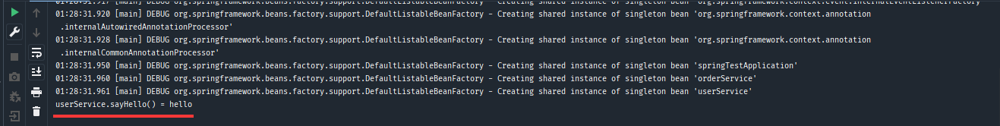
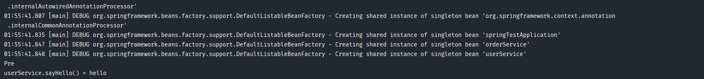
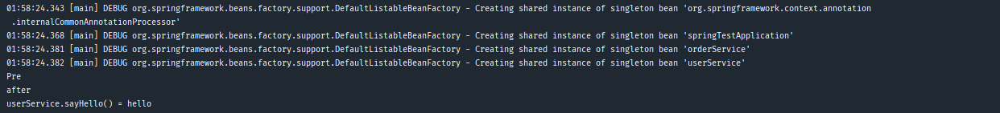
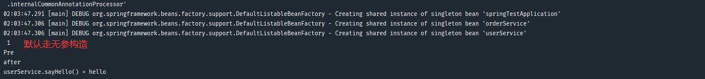
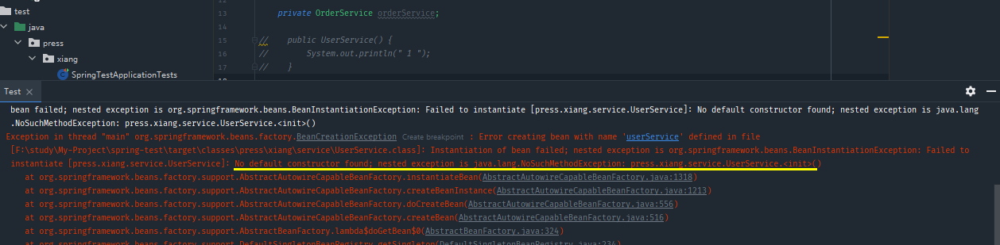
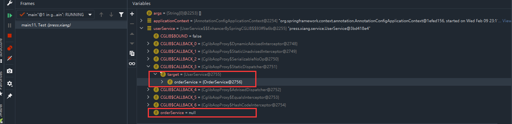
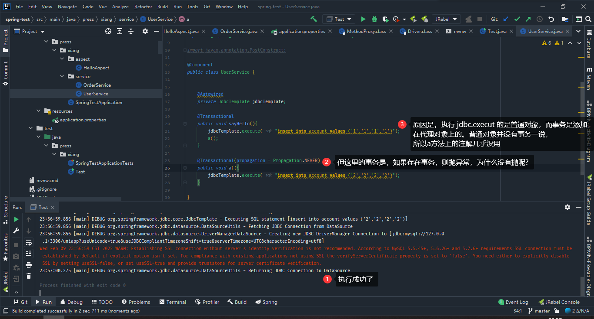
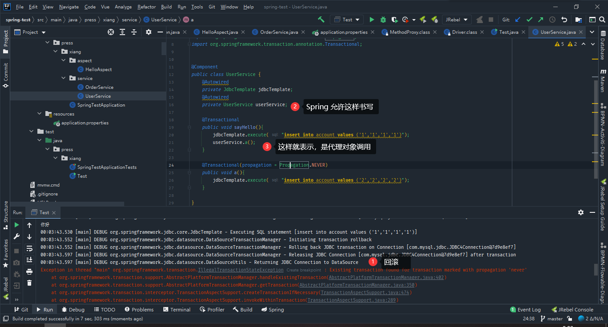

> 创建于2022年2月8日
> 作者：想想

[toc]

# Spring 的初始化过程

首先搭建小环境

```
press     
├── xiang
│	├── service
│	│	├── OrderService
│	│	└── UserService   
│	├─— SpringTestApplication
│	└—— Test
```

```java
// OrderService
@Component
public class OrderService {
}
```

```java
// UserService
@Component
public class UserService {
    public String sayHello(){
        return "hello";
    }
}
```

```java
@ComponentScan("press.xiang.*")
public class SpringTestApplication {
}
```

```java
public class Test {
    public static void main(String[] args) {
        AnnotationConfigApplicationContext applicationContext = new AnnotationConfigApplicationContext(SpringTestApplication.class);
        UserService userService =(UserService) applicationContext.getBean("userService");
        System.out.println("userService.sayHello() = " + userService.sayHello());
    }
}
```

### 简单运行

利用反射获取userService的bean对象，再实例化后执行其内部方法



由此可知

> UserService.class --> 无构造方法 --> 普通对象 --> 依赖注入 --> 初始化 --> 放入Map中单利池 --> Bean对象
>
> 1、无构造方法：默认无参构造
>
> 2、放入Map中单利池：Spring默认单利

### 添加初始化前动作

在 UserService 类中添加方法 a（），并给方法 a（）一个注解 `@PostConstruct`，这样Spring就知道注入这个bean之前，需要先执行这个方法

```java
    @PostConstruct
    public void a(){
        System.out.println("Pre");
    }
```



### 添加后置方法


在 UserService 实现一个类 `InitializingBean` 要求必须重写 `afterPropertiesSet（）` 方法

```java
@Component
public class UserService implements InitializingBean  {
	public String sayHello(){
        return "hello";
    }

    @PostConstruct
    public void a(){
        System.out.println("Pre");
    }
    
	@Override
    public void afterPropertiesSet() throws Exception {
        System.out.println("after");
    }
}
```



> 由此可知
>
> UserService.class --> 无构造方法 --> 普通对象 --> 依赖注入 --> 初始化前(@PostConstruct)  --> 初始化(afterPropertiesSet)  --> 初始化后 --> 放入Map中单利池 --> Bean对象
>
> 1、Spring早起版本是没有 初始化前(@PostConstruct） 这一步骤的

### 改变构造函数

假设一下，当我们有多个构造函数的时候，Spring会选择那个构造器呢？

我们添加三个构造器，分别为无参构造，有参构造，多参数构造。

```java
    private OrderService orderService;
	public UserService() {
        System.out.println(" 1 ");
    }

    public UserService(OrderService orderService) {
        this.orderService = orderService;
        System.out.println(" 2 ");
    }

    public UserService(OrderService orderService,OrderService orderServices) {
        this.orderService = orderService;
        System.out.println(" 3 ");
    }
```



当无参构造，有参构造，多参数构造同时存在时，Spring默认选择无参构造，==当我们把无参构造注释掉后再执行==



我们发现Spring无法找到构造器了，直接报错了。但是我们可以用`@Autowired`，指定某个构造函数，让Spring不迷路，但是需要注意的是，不要给多个，不然Spring还是会迷路，一迷路，就报错

>UserService.class --> 推断构造方法 --> 普通对象 --> 依赖注入 --> 初始化前(@PostConstruct)  --> 初始化(afterPropertiesSet)  --> 初始化后 --> 放入Map中单利池 --> Bean
>
>1、推断构造方法：根据定义推断，让Spring不迷路
>
>==（重点）：==
>
>```java
>public UserService(OrderService orderService){}
>```
>
>当Spring在注入这个方法的时候，会先找到 OrderService 这个参数的实例，也就是先会去 BeanFactory 里找 orderService 这个bean，找的顺序是有讲究的，==先 byType 后byName==，他会在Map里，找到 OrderService 这个类。
>
>```java
>@Bean
>public OrderService orderService1(){}
>```
>
>我们可以用这种方法，模拟出多个 OrderService 类出来，这个时候，Spring 会找到 @Component 和 @Bean 两个类，接下来就来对比后面参数的名字 `orderService` 如果名字对上了，就获取这个实例，如果对不上，就抛上述的异常
>
>那，当我们去掉其他的@Bean注解，只留下一个 @Component 时，在参数的名字上随便写一个没有的，此时Spring 是可以找到的，因为先根据类型找到了，就不需要再根据Name找了。

### AOP（后续细分）

假设我们增加了AOP切面，此时放入 Map中的单利池就不是原先的普通对象了，就是代理对象了，以为代理对象配置了增强啊，如果还用原来的普通对象，代理对象的增强不就白写了嘛。这一块... 挺复杂的，后面细分

> 如果增加AOP的话
>
> UserService.class --> 推断构造方法 --> 普通对象 --> 依赖注入 --> 初始化前(@PostConstruct)  --> 初始化(afterPropertiesSet)  --> 初始化后（AOP） --> 代理对象 --> 放入Map中单利池 --> Bean

```java
UserServiceProxy对象 --> UserService代理对象
UserService代理对象.test()
    
class UserServiceProxy extends UserService{
    
 	UserService target;
    public void test(){
        // @Before切面逻辑
        // target.test();  -->  普通对象.test()
    }
}
```



> UserServiceProxy对象 --> UserService代理对象 --> UserService代理对象 .target = 普通对象 ---> 放入 Map中单利池

`SpringTestApplication`

```java
@ComponentScan("press.xiang.*")
@EnableAspectJAutoProxy
@Configuration
public class SpringTestApplication {

    @Bean
    public JdbcTemplate jdbcTemplate(){
        return new JdbcTemplate(dataSource());
    }

    @Bean
    public PlatformTransactionManager transactionManager(){
        DataSourceTransactionManager transactionManager = new DataSourceTransactionManager();
        transactionManager.setDataSource(dataSource());
        return transactionManager;
    }

    @Bean
    public DataSource dataSource(){
        DriverManagerDataSource dataSource = new DriverManagerDataSource();
        dataSource.setDriverClassName("com.mysql.jdbc.Driver");
        dataSource.setUrl("jdbc:mysql://127.0.0.1:3306/uniapp?useUnicode=true&useJDBCCompliantTimezoneShift=true&serverTimezone=UTC&characterEncoding=utf8");
        dataSource.setUsername("uniapp");
        dataSource.setPassword("uniapp");
        return dataSource;
    }
}
```

`UserService`

```java
    @Transactional
    public void sayHello(){
        System.out.println("hello ");
        jdbcTemplate.execute("insert into account values ('1','1','1','1')");
        throw new NullPointerException();
    }
```

因为配置了 Transcatio ，所以在插入后抛出异常，事务进行回滚

```java
UserServiceProxy对象 --> UserService代理对象
UserService代理对象.test()
    
class UserServiceProxy extends UserService{
    
 	UserService target;
    public void test(){
        // 1、@Transcational
        // 2、事务管理器新建一个数据库链接conn
        // 3、conn.autocommit = false
        // target.test();  -->  普通对象.test()
        
        // 没有异常， conn.commit 、异常了，conn.rouback
    }
}
```



但是，我们就想要 a（） 有事务，要如何呢，只需要在上面添加

