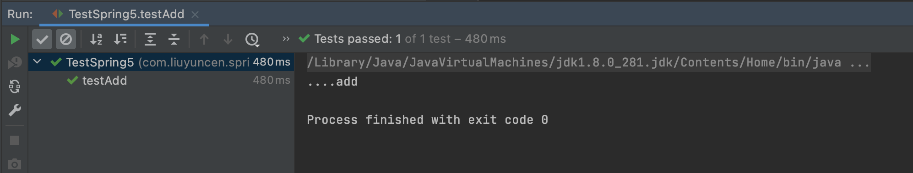

> 2022年5月18日

Spring 是轻量级的开源的 JavaEE 框架，Spring 有两个核心部分，IOC：控制反转，把创建对象过程交给Spring进行管理，AOP：切面编程，不修改源代码进行增强。Spring特点：1、方便解耦，简化开发。2、AOP编程支持。3、方便程序测试。4、方便进行其他框架整合。5、方便事务操作。6、降低API开发难度

创建项目 项目路径   `/Users/xiang/xiang/study/Project/project/Spring/1_Spring5.x-demo`

导入pom

```xml
<dependency>
  <groupId>org.springframework</groupId>
  <artifactId>spring-context</artifactId>
  <version>5.2.6.RELEASE</version>
</dependency>
<dependency>
  <groupId>junit</groupId>
  <artifactId>junit</artifactId>
  <version>4.10</version>
  <scope>test</scope>
</dependency>
```

创建 user 类

```java
public class User {
    public void add(){
        System.out.println("....add");
    }
}
```

创建 bean_1 文件

```xml
    <!-- 配置User对象 -->
    <bean id="user" class="com.liuyuncen.spring5.User"></bean>
```

创建测试类

```java
    @Test
    public void testAdd(){
        ApplicationContext context = new ClassPathXmlApplicationContext("bean_1.xml");
        User user = context.getBean("user", User.class);
        user.add();

    }
```

执行后输出结果

